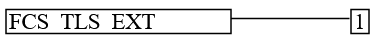
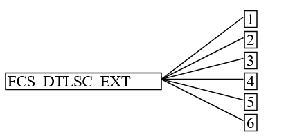
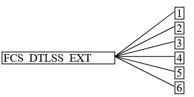
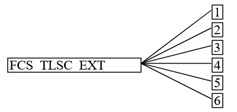
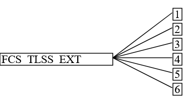

:toc:
:toclevels: 3
:toc-title!:
:toc-placement!:
:data-uri: {docdir}
:imagesdir: {docdir}/images

= Network Device iTC Functional Package for Transport Layer Security (TLS)

Version: 1.0 draft +

Date: TBD +

=== Revision History

[cols=",,",]
|===
|Version |Date |Comment

|1.0 |TBD |First publication

|===

=== Contents

toc::[]

== 1 Introduction

=== 1.1 Acknowledgements
This Functional Package (FP) was developed by the Network Device international Technical Community (ND iTC) with representatives from industry, Government agencies, Common Criteria Test Laboratories, and members of academia.

=== 1.2 Overview

Transport Layer Security (TLS) and the closely-related Datagram TLS (DTLS) are cryptographic protocols designed to provide communications security over IP networks. Several versions of the protocol are in widespread use in software that provides functionality such as web browsing, email, instant messaging, and voice-over-IP (VoIP). Organizations use TLS to protect communications to their syslog servers. TLS is also used to protect communications between hosts and network infrastructure devices for administration. The underlying platform often provides the actual TLS implementation. The primary goal of the TLS protocol is to provide confidentiality and integrity of data transmitted between two communicating endpoints, as well as authentication of at least the server endpoint.

TLS supports many different methods for exchanging keys, encrypting data, and authenticating message integrity. These methods are dynamically negotiated between the client and server when the TLS connection is established. As a result, evaluating the implementation of both endpoints is typically necessary to provide assurance for the operating environment.

This "Network Device iTC Functional Package for Transport Layer Security" (short name "ND_iTC_TLS-PKG") defines functional requirements for the implementation of the TLS and DTLS protocols on Network Devices. The requirements are intended to improve the security of products by enabling their evaluation.

=== 1.3 Terms

The following sections list Common Criteria and technology terms used in this document.

==== 1.3.1 Common Criteria Terms

[width="100%",cols="50%,50%",]
|===
a|

Assurance

|Grounds for confidence that a TOE meets the SFRs [CC].

a|

Base Protection Profile (Base-PP)

|Protection Profile used as a basis to build a PP-Configuration.

a|

Collaborative Protection Profile (cPP)

|A Protection Profile developed by international technical communities and approved by multiple schemes.

a|
Common Criteria (CC)

|Common Criteria for Information Technology Security Evaluation (International Standard ISO/IEC 15408).

a|
Common Criteria Testing Laboratory

|Within the context of the Common Criteria Evaluation and Validation Scheme (CCEVS), an IT security evaluation facility accredited by the National Voluntary Laboratory Accreditation Program (NVLAP) and approved by the NIAP Validation Body to conduct Common Criteria-based evaluations.

a|
Common Evaluation Methodology (CEM)

|Common Evaluation Methodology for Information Technology Security Evaluation.

a|

Distributed TOE

|A TOE composed of multiple components operating as a logical whole.

a|

Extended Package (EP)

|A deprecated document form for collecting SFRs that implement a particular protocol, technology, or functionality. See Functional Packages.

a|
Functional Package (FP)

|A document that collects SFRs for a particular protocol, technology, or functionality.

a|
Operational Environment (OE)

|Hardware and software that are outside the TOE boundary that support the TOE functionality and security policy.

a|
Protection Profile (PP)

|An implementation-independent set of security requirements for a category of products.

a|
Protection Profile Configuration (PP-Configuration)

|A comprehensive set of security requirements for a product type that consists of at least one Base-PP and at least one PP-Module.

a|
Protection Profile Module (PP-Module)

|An implementation-independent statement of security needs for a TOE type complementary to one or more Base-PPs.

a|

Security Assurance Requirement (SAR)

|A requirement to assure the security of the TOE.

a|

Security Functional Requirement (SFR)

|A requirement for security enforcement by the TOE.

a|

Security Target (ST)

|A set of implementation-dependent security requirements for a specific
product.

a|

Target of Evaluation (TOE)

|The product under evaluation.

a|

TOE Security Functionality (TSF)

|The security functionality of the product under evaluation.

a|

TOE Summary Specification (TSS)

|A description of how a TOE satisfies the SFRs in an ST.
|===

==== 1.3.2 Technical Terms

[width="100%",cols="50%,50%",]
|===
a|

Certificate Authority (CA)

|Issuer of digital certificates.

a|

Datagram Transport Layer Security (DTLS)

|Cryptographic network protocol, based on TLS, which provides communications security for datagram protocols.

a|
Transport Layer Security (TLS)

|Cryptographic network protocol for providing communications security over a TCP/IP network.
|===

=== 1.4 Compliant Targets of Evaluation

The Target of Evaluation (TOE) in this Package is a product that acts as a (D)TLS client, a (D)TLS server, or both. This Package describes the security functionality of TLS and DTLS in terms of [CC].

The contents of this Package must be appropriately combined with a cPP, PP, or PP-Module. When this Package is instantiated by a cPP, PP, or PP-Module, the Package must include selection-based requirements in accordance with the selections or assignments indicated in the cPP, PP, or PP-Module. These may be expanded by the ST author.

The cPP, PP, or PP-Module which instantiates this Package must typically include the following components in order to satisfy dependencies of this Package. It is the responsibility of the cPP, PP, or PP-Module author who instantiates this Package to

ensure that dependence on these components is satisfied: +

[width="100%",cols="50%,50%",]
|===
|Component |Explanation

|FCS_CKM.1 |To support TLS ciphersuites that use RSA, DHE or ECDHE for key exchange, the cPP, PP, or PP-Module must include FCS_CKM.1 and specify the corresponding key generation algorithm. +

|FCS_CKM.2 |To support TLS ciphersuites that use RSA, DHE or ECDHE for key exchange, the cPP, PP, or PP-Module must include FCS_CKM.2 and specify the corresponding algorithm. +

|FCS_COP.1 |To support TLS ciphersuites that use AES for encryption and decryption, the cPP, PP, or PP-Module must include FCS_COP.1 (iterating as needed) and specify AES with corresponding key sizes and modes. To support TLS ciphersuites that use SHA for hashing, the cPP, PP, or PP-Module must include FCS_COP.1 (iterating as needed) and specify SHA with corresponding digest sizes. +

|FCS_RBG_EXT.1 |To support random bit generation needed for the TLS handshake, the cPP, PP, or PP-Module must include FCS_RBG_EXT.1. +

|FIA_X509_EXT.1/Rev, FIA_X509_EXT.1/ITT |To support validation of certificates needed during TLS connection setup, the cPP, PP, or PP-Module must include FIA_X509_EXT.1/Rev and/or FIA_X509_EXT.1/ITT. +

|FIA_X509_EXT.2 |To support the use of X509 certificates for authentication in TLS connection setup, the cPP, PP, or PP-Module must include FIA_X509_EXT.2. +
|===

An ST must identify the applicable version of the cPP, PP, or PP-Module and this Package in its conformance claims.

== 2 Conformance Claims

Conformance Statement::
  An ST must claim exact conformance to this PP-Package, as defined in the CC and CEM addenda for Exact Conformance, Selection-based SFRs, and Optional SFRs (dated May 2017).
CC Conformance Claims::
  This PP-Package is conformant to Parts 2 (extended) and 3 (conformant) of Common Criteria Version 3.1, Revision 5.
PP Claim::
  This Functional Package does not claim conformance to any PP.
  PP-Configurations do not require enumeration of Functional Packages; this Functional Package can be claimed in any  
  PP-Configuration that includes a cPP, PP, or PP-Module that permits the Functional Package to be claimed as part of it. 
Package Claim::
  This Functional Package does not claim conformance to any other Functional Packages. 

== 3 Security Functional Requirements

This chapter describes the security requirements which have to be fulfilled by the product under evaluation. Those requirements comprise functional components from Part 2 of [CC]. The following conventions are used for the completion of operations:

* *Refinement* operation (denoted by *bold text* or [line-through]*strikethrough text*): Is used to add details to a requirement (including replacing an assignment with a more restrictive selection) or to remove part of the requirement that is made irrelevant through the completion of another operation, and thus further restricts a requirement.
* *Selection* (denoted by _italicized text_): Is used to select one or more options provided by the [CC] in stating a requirement.
* *Assignment* operation (denoted by [.assignable-content]#italicized text#): Is used to assign a specific value to an unspecified parameter, such as the length of a password. Showing the value in square brackets indicates assignment.
* *Iteration* operation: Is indicated by appending the SFR name with a slash and unique identifier suggesting the purpose of the operation, e.g. "/EXAMPLE1."

=== 3.1 Auditable Events for Mandatory SFRs

The auditable events specified in this Functional Package are included in a Security Target if the incorporating cPP, PP, or PP-Module supports audit event reporting through FAU_GEN.1 and all other criteria in the incorporating cPP, PP, or PP-Module are met.

[.text-center]
*Table 1: Auditable Events for Mandatory Requirements*
[cols=",,",]
|===
|Requirement |Auditable Events |Additional Audit Record Contents
|FCS_TLS_EXT.1 |No events specified | N/A
|===

=== 3.2 Cryptographic Support (FCS)

*FCS_TLS_EXT.1 TLS Protocol*

*FCS_TLS_EXT.1.1* The TSF shall implement [selection:

* _TLS as a client_

* _TLS as a server_

* _DTLS as a client_

* _DTLS as a server_

].

*_Application Note {counter:appnote_count}_*

If _TLS as a client is selected_, then the ST must include the requirements from FCS_TLSC_EXT.1 and FCS_TLSC_EXT.4.

If _TLS as a server is selected_, then the ST must include the requirements from FCS_TLSS_EXT.1 and FCS_TLSS_EXT.4.

If _DTLS as a client_ is selected, then the ST must include the requirements from FCS_DTLSC_EXT.1 and FCS_DTLSC_EXT.4.

If _DTLS as a server_ is selected, then the ST must include the requirements from FCS_DTLSS_EXT.1 and FCS_DTLSS_EXT.4. 

.*Evaluation Activities*
[%collapsible]
====

FCS_TLS_EXT.1

*_TSS_*

_The evaluator shall examine the TSS to verify that the TLS and DTLS claims are consistent with
those selected in the SFR._

*_Guidance_*

_The evaluator shall ensure that the selections indicated in the ST are consistent with selections in the dependent components._

*_Tests_*

_There are no test activities for this SFR; the following information is provided as an overview of the expected functionality and test environment for all subsequent SFRs._

*Test Environment:*

_Tests for TLS 1.2 and TLS 1.3 include examination of the handshake messages and behavior of the TSF when presented with unexpected or invalid messages.  For TLS 1.2 and below, previous versions of this Functional Package only required visibility of network traffic and the ability to modify a valid handshake message sent to the TSF._

image::Figure1.png[align="center"]
[.text-center]
*_Figure 1: Test environment for TLS 1.2 using network traffic visibility and control tools_*

_TLS 1.3 introduces the encryption of handshake messages subsequent to the server hello exchange which prevents visibility and control using midpoint capabilities. To achieve equivalent validation of TLS 1.3 requires the ability to modify the traffic underlying the encryption applied after the server hello message. This can be achieved by introducing additional control of the messages sent, and visibility of messages received by the test TLS client, (when validating TLS server functionality) or the test server (when validating TLS client functionality)._

image::Figure2.png[align="center"]
[.text-center]
*_Figure 2:  Test environment for TLS 1.3 using custom endpoint capabilities for visibility and control_*

_Typically, a compliant TLS 1.3 library modified to provide visibility and control of the handshake messages prior to
encryption suffices for all tests. Such modification will require the test client, test server, or both to be validated._

_Since validations of products supporting only TLS 1.2 are still expected under this Package, the test environment for TLS 1.2-only validations may include network sniffers and man-in-the-middle products that do not require such modifications to a compliant TLS 1.2 library. For consistency, a compliant TLS client (or TLS server) together with the network sniffers and man-in-the-middle capabilities will also be referred to as a test TLS client (or test TLS server, respectively) in the following evaluation activities._

image::Figure3.png[align="center"]
[.text-center]
*_Figure 3:  Combined test environment for TLS 1.2 and TLS 1.3 using both network tools and custom endpoint capabilities_*
====

== Appendix A - Optional Requirements

As indicated in the introduction to this PP-Package, the baseline requirements (those that must be performed by the TOE) are contained in the body of this PP-Package. This appendix contains three other types of optional requirements that may be included in the ST, but are not required in order to conform to this PP-Package. However, applied modules, packages and/or use cases may refine specific requirements as mandatory.
 
The first type (A.1 Strictly Optional Requirements) are strictly optional requirements that are independent of the TOE implementing any function. If the TOE fulfills any of these requirements or supports a certain functionality, the vendor is encouraged to include the SFRs in the ST, but are not required in order to conform to this PP-Package.

The second type (A.2 Objective Requirements) are objective requirements that describe security functionality not yet widely available in commercial technology. The requirements are not currently mandated in the body of this PP-Package, but will be included in the baseline requirements in future versions of this PP-Package. Adoption by vendors is encouraged and expected as soon as possible.

The third type (A.3 Implementation-based Requirements) are dependent on the TOE implementing a particular function. If the TOE fulfills any of these requirements, the vendor must either add the related SFR or disable the functionality for the evaluated configuration.

=== A.1 Strictly Optional Requirements

This PP-Package does not define any Strictly Optional requirements.

=== A.2 Objective Requirements

This PP-Package does not define any Objective requirements.

=== A.3 Implementation-based Requirements

This PP-Package does not define any Implementation-based requirements.

== Appendix B - Selection-based Requirements

As indicated in the introduction to this PP-Package, the baseline requirements (those that must be performed by the TOE or its underlying platform) are contained in the body of this PP-Package. There are additional requirements based on selections in the body of the PP-Package: if certain selections are made, then additional requirements below must be included.

=== B.1 Auditable Events for Selection-based Requirements

The auditable events in the table below are included in a Security Target if both the associated requirement is included and the incorporating PP or PP-Module supports audit event reporting through FAU_GEN.1 and any other criteria in the incorporating cPP, PP, or PP-Module are met.  Note that, if "None" is not selected in the "Auditable Events" column, it should not be selected in the "Additional Audit Record Contents" column. Likewise, if "None" is selected in the "Auditable Events" column, it should also be selected in the "Additional Audit Record Contents" column.

[.text-center]
*Table 2: Auditable Events for Selection-based Requirements*

[cols=",,",]
|===
|Requirement |Auditable Events |Additional Audit Record Contents

.3+|FCS_DTLSC_EXT.1 |[selection: _Establishment/termination of a DTLS session, None_] |[selection: _Non-TOE endpoint of connection, None_]

| [selection: _Failure to establish a DTLS session, None_] |[selection: _Reason for failure, None_] 
| [selection: _Failure to verify presented identifier, None_] |[selection: _Presented identifier and reference identifier, None_]

|FCS_DTLSC_EXT.2 | |

|FCS_DTLSC_EXT.3 | |

|FCS_DTLSC_EXT.4 | |

|FCS_DTLSC_EXT.5 | |

|FCS_DTLSC_EXT.6 | |

|FCS_DTLSS_EXT.1 |[selection: selection: _Failure to establish a DTLS session, None_] |[selection: _Reason for failure, None_]

|FCS_DTLSS_EXT.2 | |

|FCS_DTLSS_EXT.3 | |

|FCS_DTLSS_EXT.4 | |

|FCS_DTLSS_EXT.5 | |

|FCS_DTLSS_EXT.6 | |

.3+|FCS_TLSC_EXT.1 |[selection: _Establishment/termination of a TLS session, None_] |[selection: _Non-TOE endpoint of connection, None_]

| [selection: _Failure to establish a DTLS session, None_] |[selection: _Reason for failure, None_] 
| [selection: _Failure to verify presented identifier, None_] |[selection: _Presented identifier and reference identifier, None_]

|FCS_TLSC_EXT.2 | |

|FCS_TLSC_EXT.3 | |

|FCS_TLSC_EXT.4 | |

|FCS_TLSC_EXT.5 | |

|FCS_TLSC_EXT.6 | |

|FCS_TLSS_EXT.1 |[selection: selection: _Failure to establish a TLS session, None_] |[selection: _Reason for failure, None_]

|FCS_TLSS_EXT.2 | |

|FCS_TLSS_EXT.3 | |

|FCS_TLSS_EXT.4 | |

|FCS_TLSS_EXT.5 | |

|FCS_TLSS_EXT.6 | |

|===

=== B.2 Cryptographic Support (FCS)

==== B.2.1 FCS_DTLSC_EXT.1 DTLS Client Protocol

NOTE: _The inclusion of this selection-based component depends upon selection in FCS_TLS_EXT.1.1._

*FCS_DTLSC_EXT.1 DTLS Client Protocol*

*FCS_DTLSC_EXT.1.1*  The TSF shall implement [selection: _DTLS 1.2 (RFC 6347), DTLS 1.3 (RFC 9147)_]
and no other DTLS version as a client that supports additional functionality for session renegotiation protection and [selection:

* _mutual authentication_
* _supplemental downgrade protection_
* _session resumption_
* _no optional functionality_

] and shall abort attempts by a server to negotiate all other DTLS versions.

*_Application Note {counter:appnote_count}_*

_This SFR is claimed if "DTLS as a client" is selected in FCS_TLS_EXT.1.1.  Session renegotiation protection is required for both DTLS 1.2 and DTLS 1.3, and the ST must include the requirements from FCS_DTLSC_EXT.4. Within FCS_DTLSC_EXT.4 options for implementation of secure session renegotiation for DTLS 1.2, or rejecting renegotiation requests are claimed._

_The ST author will claim DTLS 1.3 functionality if supported, and optional functionality as appropriate for the claimed versions._

_If "mutual authentication" is selected, then the ST must additionally include the requirements from FCS_DTLSC_EXT.2._

_If "supplemental downgrade protection" is selected, then the ST must additionally include the requirements from FCS_DTLSC_EXT.3.  This is claimed if DTLS 1.3 is supported, or if the product supports TLS 1.1 or below downgrade protection using the mechanism described in RFC 8446.  Note that TLS 1.1 or below downgrade protection in DTLS is used to notify a client that the server is capable of supporting DTLS 1.2 or DTLS 1.3, but that it received a client hello indicating maximum support for DTLS 1.0 (there is no DTLS version 1.1)._

_If "session resumption" is selected, then the ST must additionally include the requirements from FCS_DTLSC_EXT.5._

_DTLS version numbers are denoted on the wire as the 1’s complement of the corresponding textual DTLS versions as described in Section 4.1 of RFC 6347. DTLS version 1.2 is 0xfefd; DTLS version 1.3 is 0xfefc._

*FCS_DTLSC_EXT.1.2* The TSF shall be able to support the following TLS 1.2 ciphersuites: [selection:

* _TLS_ECDHE_ECDSA_WITH_AES_256_GCM_SHA384 as defined in RFC 5289 and RFC 8422_
* _TLS_ECDHE_RSA_WITH_AES_256_GCM_SHA384 as defined in RFC 8422_
* _TLS_RSA_WITH_AES_256_GCM_SHA384 as defined in RFC 5288_
* _TLS_DHE_RSA_WITH_AES_256_GCM_SHA384 as defined in RFC 5288_
* _TLS_ECDHE_ECDSA_WITH_AES_256_CBC_SHA384 as defined in RFC 5289_
* _TLS_ECDHE_RSA_WITH_AES_256_CBC_SHA384 as defined RFC 5289_
* _TLS_RSA_WITH_AES_256_CBC_SHA256 as defined in RFC 5246_
* _TLS_DHE_RSA_WITH_AES_256_CBC_SHA256 as defined in RFC 5246_
* _TLS_ECDHE_ECDSA_WITH_AES_128_GCM_SHA256 as defined in RFC 5289_
* _TLS_ECDHE_RSA_WITH_AES_128_GCM_SHA256 as defined in RFC 5289_
* _TLS_ECDHE_ECDSA_WITH_AES_128_CBC_SHA256 as defined in RFC 5289_
* _TLS_ECDHE_RSA_WITH_AES_128_CBC_SHA256 as defined in RFC 5289_
* _TLS_RSA_WITH_AES_128_CBC_SHA256 as defined in RFC 5246_
* _TLS_DHE_RSA_WITH_AES_128_CBC_SHA256 as defined in RFC 5246_
* _TLS_RSA_WITH_AES_128_CBC_SHA as defined in RFC 5246_
* _no TLS 1.2 ciphersuites_

], the following PP-specific ciphersuites using pre-shared secrets: [selection:

* _TLS_ECDHE_PSK_WITH_AES_256_GCM_SHA384 as defined in RFC 8442_
* _TLS_DHE_PSK_WITH_AES_256_GCM_SHA384 as defined in RFC 5487_
* _TLS_RSA_PSK_WITH_AES_256_GCM_SHA384 as defined in RFC 5487_
* _TLS_ECDHE_PSK_WITH_AES_128_GCM_SHA256 as defined in RFC 8442_
* _TLS_DHE_PSK_WITH_AES_128_GCM_SHA256 as defined in RFC 5487_
* _TLS_RSA_PSK_WITH_AES_128_GCM_SHA256 as defined in RFC 5487_
* _no ciphersuites using pre-shared secrets_

], and the following TLS 1.3 ciphersuites: [selection:

* _TLS_AES_256_GCM_SHA384 as defined in RFC 8446_
* _TLS_AES_128_GCM_SHA256 as defined in RFC 8446_
* _[assignment: other TLS 1.3 ciphersuites]_
* _no TLS 1.3 ciphersuites_

offering the supported ciphersuites in a client hello message in preference order: [_assignment: list of supported ciphersuites_].

*_Application Note {counter:appnote_count}_*

_DTLS uses TLS ciphersuites. The ST author should select the ciphersuites that are supported, and must select at least one ciphersuite for each DTLS version supported – TLS 1.2 ciphersuites for DTLS 1.2 and TLS 1.3 ciphersuites for DTLS 1.3._

_The ST author should select the ciphersuites that are supported, and must select at least one ciphersuite for each DTLS version supported. The ciphersuites to be tested in the evaluated configuration are limited by this requirement. However, this requirement does not restrict the TOE's ability to propose additional non-deprecated ciphersuites beyond the ones listed in this requirement in its client hello message as indicated in the ST. That is, the TOE may propose any ciphersuite not excluded by this element, but the evaluation will only test ciphersuites from the above list. It is necessary to limit the ciphersuites that can be used in an evaluated configuration administratively on the server in the test environment._

_TLS 1.3 ciphersuites are claimed if support for DTLS 1.3 is claimed in FCS_DTLSC_EXT.1.1. The assignment of preference order provides an ordered list of all supported ciphersuites with the most preferred ciphersuites listed first. Ciphersuites listed in RFC 9151, “Commercial National Security Algorithm (CNSA) Suite Profile for TLS and DTLS 1.2 and 1.3” are preferred over all other ciphersuites, GCM ciphersuites are preferred over CBC ciphersuites, ECDHE preferred over RSA and DHE, and SHA-256 or SHA-384 over SHA-1._

_Ciphersuites for TLS 1.2 are of the form TLS_(key exchange algorithm)_WITH_(encryption algorithm)_(message digest algorithm}, and are listed in the TLS parameters section of the internet assignments at iana.org._

*FCS_DTLSC_EXT.1.3*  The TSF shall not offer ciphersuites indicating the following:

* the null encryption component
* support for anonymous servers
* use of deprecated or export-grade cryptography including DES, 3DES, RC2, RC4, or IDEA for encryption
* use of MD

and shall abort sessions where a server attempts to negotiate ciphersuites not enumerated in the client hello message.

*FCS_DTLSC_EXT.1.4*  The TSF shall be able to support the following DTLS client hello message extensions:

* signature_algorithms extension (RFC 8446) indicating support for [selection:
** _ecdsa-secp384r1_sha384 (RFC 8446)_
** _rsa_pkcs1_sha384 (RFC 8446)_
** _rsa_pss_pss_sha384 (RFC8603)_
** _rsa_pss_rsae_sha384 (RFC 8603)_
** _[assignment: other non-deprecated signature algorithms]_
** _no other signature algorithms_
+
]

* the following other extensions: [selection:

** _signature_algorithms_cert extension (RFC 8446) indicating support for [selection:_
*** _ecdsa-secp384r1_sha384 (RFC 8446)_
*** _rsa_pkcs1_sha384 (RFC8446)_
*** _rsa_pss_pss_sha384 (RFC 8603)_
*** _rsa_pss_rsae_sha384 (RFC 8603)_
*** _rsa_pkcs1_sha256 (RFC 8446)_
*** _rsa_pss_rsae_sha256 (RFC 8446)_
*** _[assignment: other non-deprecated signature algorithms]_
*** _no other signature algorithms_
+
]

** _supported_versions extension (RFC 8446) indicating support for TLS 1.3_
** _supported_groups extension (RFC 7919, RFC 8446) indicating support for [selection:_
*** _secp256r1_
*** _secp384r1_
*** _secp521r1_
*** _ffdhe2048(256)_
*** _ffdhe3072(257)_
*** _ffdhe4096(258)_
*** _ffdhe6144(259)_
*** _ffdhe8192(260)_
+
]

** _key_share extension (RFC 8446)_
** _post_handshake_auth (RFC 8446), pre_shared_key (RFC 8446), and psk_key_exchange_mode (RFC 8446) indicating DHE or ECDHE mode_
** _extended_master_secret extension (RFC 7627) [selection: enforcing, allow legacy] server support_
** _no other extensions_

] and shall not send the following extensions:

** _early_data_
** _psk_key_exchange_mode indicating PSK only mode._

*_Application Note {counter:appnote_count}_*

_DTLS uses TLS extensions.  If DTLS 1.3 is claimed in FCS_DTLSC_EXT.1.1, supported_versions, supported_groups, and key_share extensions are claimed in accordance with RFC 8446. If DTLS 1.3 is not claimed, supported_versions and key_share extensions are not claimed.  Other extensions may be supported; certain extensions may need to be claimed based on other SFR claims made._

_If ECDHE ciphersuites are claimed in FCS_DTLSC_EXT.1.2, the supported_groups extension is claimed here with appropriate secp groups claimed. If DHE ciphersuites are claimed in FCS_DTLSC_EXT.1.2, it is preferred that the appropriate ffdhe groups be claimed here. In a subsequent version of this FP, support for ffdhe groups will be required whenever DHE ciphersuites are claimed._

_When ‘other non-deprecated signature algorithms’ is claimed, the assignment will describe the standard signature and hash algorithms supported. MD5 and SHA-1 hashes are deprecated and are not included in the signature_algorithms or signature_algorithms_cert extensions._

_If DTLS 1.2 is claimed in FCS_DTLSC_EXT.1.1 the extended_master_secret extension is claimed in accordance with RFC 7627.    If the TSF requires a DTLS 1.2 server to provide the extended_master_secret extension in its Server Hello message the ST author selects 'enforcing'.  If the TSF allows connections to a DTLS 1.2 server that does not provide the extended_master_secret extension in its Server Hello message, the ST author selects 'allow legacy'._

*FCS_DTLSC_EXT.1.5*  The TSF shall be able to [selection:

* _verify that a presented identifier of name type: [selection:_ 
** _DNS name type according to RFC 6125_
** _URI name type according to RFC 6125_
** _SRV name type according to RFC 6125_
** _Common Name conversion to DNS name according to RFC 6125_
** _Directory name type according to RFC 5280_
** _IPaddress name type according to RFC 5280_
** _rfc822Name type according to RFC 5280_
** _[assignment:  other name type]_

]

* _interface with a client application requesting the DTLS channel to verify that a presented identifier_

] matches a reference identifier of the requested DTLS server and shall abort the session if no match is found.

*_Application Note {counter:appnote_count}_*

_The rules for verification identity are described in Section 6 of RFC 6125 and Section 7 of RFC 5280. The reference identifier is established by the user (e.g., entering a URL into a web browser or clicking a link), by configuration (e.g., configuring the name of a mail or authentication server), or by an application (e.g., a parameter of an API) depending on the product service. The client establishes all acceptable reference identifiers and interfaces with the DTLS implementation to provide acceptable reference identifiers, or to accept the presented identifiers as validated in the server’s certificate. If the product performs matching of the reference identifiers to the identifiers provided in the server’s certificate, the first option is claimed and all supported name types are claimed; if the product presents the certificate, or the presented identifiers from the certificate to the application, the second option is claimed._

_In most cases where DTLS servers are represented by DNS-type names, the preferred method for verification is the Subject Alternative Name using DNS, URI, or Service Names. Verification using a conversion of the Common Name relative distinguished name from a DNS name type in the subject field is allowed for the purposes of backward compatibility._

_The client should avoid constructing reference identifiers using wildcards. However, if the presented identifiers include wildcards, the client must follow the best practices regarding matching; these best practices are captured in the evaluation activity. If the TSF supports wildcards, and allows names with DNS portions containing internationalized names, the internationalized name does not match any wildcard, in accordance with RFC 6125 section 7.2._

_Support for other name types is rare, but may be claimed for specific applications. If specified, the assignment includes both the RFC describing normalization and matching rules, and any refinements necessary to resolve options available in the RFC._

*FCS_DTLSC_EXT.1.6*  The TSF shall not establish a trusted channel if the server certificate is invalid [selection:
_with no exceptions, except when override is authorized in the case where valid revocation information is not available_].

*_Application Note {counter:appnote_count}_*

_A certificate used in a manner that does not support revocation checking should not advertise revocation information locations. Common methods to address this include revoking the issuing CA, resetting certificate pinning mechanisms, or removing entries from trust stores. Thus, a certificate that does not advertise revocation status information is considered to be not revoked and does not need to be processed via override mechanisms. Override mechanisms are for use with certificates with published revocation status information that is not accessible, whether temporarily or because the information cannot be accessed during the state of the TOE (e.g., for verifying signatures on boot code). The circumstances should be described by the ST author, who should indicate the override mechanism and conditions that apply to the override, including system state, user or admin actions, etc._

*FCS_DTLSC_EXT.1.7*  The TSF shall [selection: _terminate the DTLS session, silently discard the record_] if a message received contains an invalid MAC or if decryption fails in the case of GCM and other AEAD ciphersuites.

.*Evaluation Activities*
[%collapsible]
====

FCS_DTLSC_EXT.1

*_TSS_*

_The evaluator shall check the description of the implementation of this protocol in the TSS to ensure the supported DTLS versions, features, ciphersuites, and extensions are specified in accordance with RFC 6347 (DTLS 1.2) RFC 9147 (DTLS 1.3 and updates to DTLS 1.2) and as refined in DFCS_TLSC_EXT.1 as appropriate._

_The evaluator shall verify that ciphersuites indicated in FCS_DTLSC_EXT.1.2 are included in the description, and that none of the following ciphersuites are supported: ciphersuites indicating 'NULL,' 'RC2,' 'RC4,' 'DES,' 'IDEA,' or 'TDES' in the encryption algorithm component, indicating 'anon,' or indicating MD5 or SHA in the message digest algorithm component._

_The evaluator shall verify that the TLS implementation description includes the extensions as required in FCS_DTLSC_EXT.1.4._

_The evaluator shall verify that the ST describes applications that use the DTLS functions and how they establish reference identifiers._

_The evaluator shall verify that the ST includes a description of matching methods used for each supported name type to the supported application defined reference identifiers. The evaluator shall verify that the ST includes a description of wildcards recognized for each name type claimed in FCS_DTLSC_EXT.1.5 and shall verify that the matching rules meet or exceed best practices. In particular, the evaluator shall ensure that the matching rules are as restrictive as, or more restrictive than the following:_

* _DNS names: The ‘ * ’ character used in the complete leftmost label of a DNS name represents any valid name that has the same number of labels, and_ 
  _that matches all remaining labels. The ‘ * ’ character must only be used in the leftmost complete label of a properly formatted DNS name. The ‘ * ’_  _must not be used to represent a public suffix, or in the leftmost label immediately following a public suffix._
* _URI or SRV names: The ‘ * ’ character can only occur in the domain name portion of the name represented as a DNS name. All restrictions for_
  _wildcards in DNS names apply to the DNS portion of the name. URI host names presented as an IP address are matched according to IP address_
  _matching rules – see best practices for IP addresses below. In accordance with RFC 6125, it is preferred that such URIs are presented a matching_ _name of type IP address in the SAN._
* _IP addresses: RFC 5280 does not support IP address ranges as presented names, but indicates that presented names may be compared to IP address_   
  _ranges present in name constraints. If the TSF supports IP address ranges as reference identifiers, the reference identifier matches if the_
  _presented name is in the range.  IP ranges in name constraints (including reference identifiers) should be presented in CIDR format._
* _RFC 2822 names: RFC 5280 and updates RFC 8398 and RFC 8399 do not support special indicators representing more than a single mailbox as a_
  _presented name, but indicates that presented names may be compared to a single mailbox, ‘any’ email address at a host, or ‘any’ email address on_
  _a domain (e.g., “example.com” matches any email address on the host example.com and “.example.com” matches any email address in the domain_
  _example.com, but does not match email addresses at the host “example.com”). Such matching is prohibited for internationalized RFC 2822 names._
* _Embedded CN name types: The CN relative distinguished name of a DNS name type included in the subject field is not strongly typed. Attempts to_
  _match both the name type and wildcard specifications can result in matches not intended, and therefore, not authoritatively asserted by a_ _certification authority. It is preferred that no matching of CN embedded names be supported, but if necessary for backward compatibility, the_
  _description should clearly indicate how different name types are interpreted in the matching algorithm. In particular, the ‘*’ character in a_
  _CN is not to be interpreted as representing more than a single entity unless the entirety of the RDN is properly formatted as a_
 _DNS, URI, or SVR name, and represents a wildcard meeting best practices as described above._

_The evaluator shall verify that the TSS describes the actions that take place if a message received from the DTLS server fails the integrity check. If both selections are chosen in FCS_DTLSC_EXT.1.7, the evaluator shall verify that the TSS describes when each method is used and whether the behavior is configurable._ 

*_Guidance_*

_The evaluator shall check the operational guidance to ensure that it contains instructions on configuring the product so that DTLS conforms to the description in the TSS and that it includes any instructions on configuring the version, ciphersuites, or optional extensions that are supported._

_The evaluator shall verify that all configurable features for matching identifiers in certificates presented in the DTLS handshake to application specific reference identifiers are described._

_If the ST indicates the behavior of the TSF on receiving a message from the DTLS server that fails the MAC integrity check is configurable, the evaluator shall verify that the guidance documentation describes instructions for configuring the behavior._

*_Tests_*

_The evaluator shall perform the following tests:_ 

_Test {counter:test_count}: (supported configurations) For each supported version, and for each supported ciphersuite associated with the version:_
  
_The evaluator shall establish a DTLS connection between the TOE and a test DTLS server that is configured to negotiate the tested version and ciphersuite in accordance with the RFC for the version._
  
_[conditional, if the TSF supports DTLS 1.3 only]_
_The evaluator shall observe that the TSF presents a client hello with the highest version of DTLS 1.3 and shall observe that the supported version extension is included and contains the value 'fe fc' for DTLS 1.3._

_[conditional, if the TSF supports both DTLS 1.3 and DTLS 1.2]_
_The evaluator shall observe that the TSF presents a client hello with the highest version of DTLS 1.2 or the legacy version (value 'fe fd') and shall observe that the supported version extension is included and contains the value 'fe fc' for DTLS 1.3._

_[conditional, if the TSF supports DTLS 1.2 only]_
_The evaluator shall observe that the TSF presents a client hello with the highest version of DTLS 1.2 or the legacy version (value 'fe fd') and shall observe that the supported version extension is not included for DTLS 1.2._

_The evaluator shall observe that the client hello indicates the supported ciphersuites in the order indicated, and that it includes only the extensions supported, with appropriate values, for that version in accordance with the requirement._

_The evaluator shall observe that the TOE successfully completes the DTLS handshake._

*_Note:_* _TOEs supporting DTLS 1.3, but allowing a server to negotiate DTLS 1.2, should include all ciphersuites and all extensions as required for either version. If such a TOE is configurable to support only DTLS 1.2, DTLS 1.3, or both DTLS 1.2 and DTLS 1.3, the test should be performed in each configuration – with advertised ciphersuites appropriate for the configuration._

_The connection in the test may be established as part of the establishment of a higher-level protocol, e.g., as part of an EAP session._

_It is sufficient to observe the successful negotiation of a ciphersuite to satisfy the intent of the test; it is not necessary to examine the characteristics of the encrypted traffic in an attempt to discern the ciphersuite being used (for example, that the cryptographic algorithm is 128-bit AES and not 256-bit AES)._

_Test {counter:test_count}: (obsolete versions) The evaluator shall perform the following tests:_

* _A) For each of DTLS version 1.0 and [conditional] DTLS version 1.2, the evaluator shall initiate a connection from the TOE to a test DTLS server that is configured to negotiate the obsolete version and observe that the TSF terminates the connection._
+
*_Note:_* _It is preferred that the TSF sends a fatal error alert message (e.g., protocol version, insufficient security) in response to this, but it is acceptable that the TSF terminates the connection silently (i.e., without sending a fatal error alert).  DTLS clients may silently drop flawed or unexpected messages from a DTLS test server. Therefore, it might be necessary to resend the message multiple times from the DTLS test server according to the appropriate DTLS RFC to get the desired response.  DTLS clients do not send fatal error alerts, but should generate them for diagnostics if the test DTLS server repeatedly sends the flawed messages indicated in the tests. If the product generates alerts, the evaluator may observe them in logs of the TSF rather than observing them on the line. Otherwise, the evaluator shall observe the termination of a session (connection state) by verifying that the TSF does not continue to resend messages after the last timeout expires._

* _B) The evaluator shall attempt to establish a connection with a test DTLS server that is configured to send a server hello message indicating the selected version (referred to as the legacy version in RFC 8446) with a value corresponding to an undefined DTLS (legacy) version (e.g., 'fe fc') and observe that the TSF terminates the connection._
+
*_Note:_* _It is preferred that the TSF sends a fatal error alert message (e.g., protocol version) in response to this, but it is acceptable that the TSF terminates the connection silently (i.e., without sending a fatal error alert).  DTLS clients may silently drop flawed or unexpected messages from a DTLS test server. Therefore, it might be necessary to resend the message multiple times from the DTLS test server according to the appropriate DTLS RFC to get the desired response.  DTLS clients do not send fatal error alerts, but should generate them for diagnostics if the test DTLS server repeatedly sends the flawed messages indicated in the tests. If the product generates alerts, the evaluator may observe them in logs of the TSF rather than observing them on the line. Otherwise, the evaluator shall observe the termination of a session (connection state) by verifying that the TSF does not continue to resend messages after the last timeout expires._
+
_This is intended to test the TSF response to non-standard versions, including early proposals for ‘beta DTLS 1.3’ versions. RFC 8446 requires the Legacy version to have the value 'fe fd' and specifies DTLS 1.3 in the supported versions extension with the value 'fe fc'. While not a preferred approach, if continued support for a beta DTLS 1.3 version is desired and the TSF cannot be configured to reject such versions, another value (e.g.,  'fe fb') can be used. Implementations of non-standard versions are not tested._

_Test {counter:test_count}: (ciphersuites) The evaluator shall perform the following tests on handling unexpected ciphersuites using a test DTLS server sending handshake messages compliant with the negotiated version except as indicated in the test:_

* _A) (ciphersuite not offered) For each supported version, the evaluator shall attempt to establish a connection with a test DTLS server configured to negotiate the supported version and a ciphersuite not included in the client hello and observe that the TOE rejects the connection._
+
*_Note:_* _It is preferred that the TSF sends a fatal error alert message (e.g., handshake failure) in response to this, but it is acceptable that the TSF terminates the connection silently (i.e., without sending a fatal error alert).  DTLS clients may silently drop flawed or unexpected messages from a DTLS test server. Therefore, it might be necessary to resend the message multiple times from the DTLS test server according to the appropriate DTLS RFC to get the desired response.  DTLS clients do not send fatal error alerts, but should generate them for diagnostics if the test DTLS server repeatedly sends the flawed messages indicated in the tests. If the product generates alerts, the evaluator may observe them in logs of the TSF rather than observing them on the line. Otherwise, the evaluator shall observe the termination of a session (connection state) by verifying that the TSF does not continue to resend messages after the last timeout expires._
+
_This test is intended to test the TSF’s generic ability to recognize non-offered ciphersuites. If the ciphersuites in the client hello are configurable, the evaluator shall configure the TSF to offer a ciphersuite outside those that are supported and use that ciphersuite in the test. If the TSF ciphersuite list is not configurable, it is acceptable to use a named ciphersuite from the IANA TLS protocols associated with the tested version. Additional special cases of this test for special ciphersuites are performed separately._

* _B) (version confusion) For each supported version, the evaluator shall attempt to establish a connection with a test DTLS server that is configured to negotiate the supported version and a ciphersuite that is not associated with that version and observe that the TOE rejects the connection._
+
*_Note:_* _It is preferred that the TSF sends a fatal error alert message (e.g., handshake failure) in response to this, but it is acceptable that the TSF terminates the connection silently (i.e., without sending a fatal error alert).  DTLS clients may silently drop flawed or unexpected messages from a DTLS test server. Therefore, it might be necessary to resend the message multiple times from the DTLS test server according to the appropriate DTLS RFC to get the desired response.  DTLS clients do not send fatal error alerts, but should generate them for diagnostics if the test DTLS server repeatedly sends the flawed messages indicated in the tests. If the product generates alerts, the evaluator may observe them in logs of the TSF rather than observing them on the line. Otherwise, the evaluator shall observe the termination of a session (connection state) by verifying that the TSF does not continue to resend messages after the last timeout expires._
+
_This test is intended to test TLS 1.3 ciphersuites for a server negotiating DTLS 1.2. If DTLS 1.3 is supported, the test server negotiating DTLS 1.3 should select a TLS 1.2 ciphersuite supported by the TOE for DTLS 1.2 and matching the client’s supported groups and signature algorithm indicated by extensions in the DTLS 1.3 client hello. If the TOE is configurable to allow both DTLS 1.2 and DTLS 1.3 servers, the test server should use ciphersuites offered by the TSF in its client hello message._

* _C) (null ciphersuite) For each supported version, the evaluator shall attempt to establish a connection with a test DTLS server configured to negotiate the null ciphersuite (TLS_NULL_WITH_NULL_NULL) and observe that the TOE rejects the connection._
+
*_Note:_* _It is preferred that the TSF sends a fatal error alert message (e.g., handshake failure, insufficient security) in response to this, but it is acceptable that the TSF terminates the connection silently (i.e., without sending a fatal error alert).  DTLS clients may silently drop flawed or unexpected messages from a DTLS test server. Therefore, it might be necessary to resend the message multiple times from the DTLS test server according to the appropriate DTLS RFC to get the desired response.  DTLS clients do not send fatal error alerts, but should generate them for diagnostics if the test DTLS server repeatedly sends the flawed messages indicated in the tests. If the product generates alerts, the evaluator may observe them in logs of the TSF rather than observing them on the line. Otherwise, the evaluator shall observe the termination of a session (connection state) by verifying that the TSF does not continue to resend messages after the last timeout expires._

* _D) (anon ciphersuite) [conditional on the TSF supporting DTLS 1.2] The evaluator shall attempt to establish a DTLS 1.2 connection with a test DTLS server configured to negotiate a ciphersuite using the anonymous server authentication method and observe that the TOE rejects the connection._
+
*_Note:_* _It is preferred that the TSF sends a fatal error alert message (e.g., handshake failure, insufficient security) in response to this, but it is acceptable that the TSF terminates the connection silently (i.e., without sending a fatal error alert).  DTLS clients may silently drop flawed or unexpected messages from a DTLS test server. Therefore, it might be necessary to resend the message multiple times from the DTLS test server according to the appropriate DTLS RFC to get the desired response.  DTLS clients do not send fatal error alerts, but should generate them for diagnostics if the test DTLS server repeatedly sends the flawed messages indicated in the tests. If the product generates alerts, the evaluator may observe them in logs of the TSF rather than observing them on the line. Otherwise, the evaluator shall observe the termination of a session (connection state) by verifying that the TSF does not continue to resend messages after the last timeout expires._

* _E) (deprecated encryption algorithm) [conditional on the TSF supporting DTLS 1.2] For each deprecated encryption algorithm (NULL, RC2, RC4, DES, IDEA, and TDES), the evaluator shall attempt to establish a DTLS 1.2 connection with a test DTLS server configured to negotiate a ciphersuite using the deprecated encryption algorithm and observe that the TOE rejects the connection._
+
*_Note:_* _Test E) should still include a test for RC4 ciphersuites, even though DTLS does not support stream ciphers. The test only verifies that the TSF can reject such a negotiation from a test DTLS server, and does not require the use of the cipher._
+
*_Note:_* _It is preferred that the TSF sends a fatal error alert message (e.g., handshake failure, insufficient security) in response to this, but it is acceptable that the TSF terminates the connection silently (i.e., without sending a fatal error alert).  DTLS clients may silently drop flawed or unexpected messages from a DTLS test server. Therefore, it might be necessary to resend the message multiple times from the DTLS test server according to the appropriate DTLS RFC to get the desired response.  DTLS clients do not send fatal error alerts, but should generate them for diagnostics if the test DTLS server repeatedly sends the flawed messages indicated in the tests. If the product generates alerts, the evaluator may observe them in logs of the TSF rather than observing them on the line. Otherwise, the evaluator shall observe the termination of a session (connection state) by verifying that the TSF does not continue to resend messages after the last timeout expires._
+
_See IANA TLS parameters for available ciphersuites to be tested. The test ciphersuite should use supported cryptographic algorithms for as many of the other components as possible. For example, if the TSF only supports TLS_ECDHE_ECDSA_WITH_AES_256_GCM_SHA384, the test server could select TLS_ECDHE_PSK_WITH_NULL_SHA_384, TLS_RSA_EXPORT_WITH_RC2_CBC_40_MD5, TLS_ECDHE_RSA_WITH_RC4_128_SHA, TLS_DHE_DSS_WITH_DES_CBC_SHA, TLS_RSA_WITH_IDEA_CBC_SHA, and TLS_ECDHE_RSA_WITH_3DES_EDE_CBC_SHA._

_Test {counter:test_count}: (extensions) For each supported version indicated in the following tests, the evaluator shall establish a connection from the TOE with a test server negotiating the tested version and providing server handshake messages as indicated when performing the following tests for validating proper extension handling:_

* _A) (signature_algorithms) [conditional] If the TSF supports certificate-based server authentication, the evaluator shall perform the following tests:_

** _i)_
_For each supported version, the evaluator shall initiate a DTLS session with a DTLS test server and observe that the TSF’s client hello includes the signature_algorithms extension with values in conformance with the ST._
** _ii)_
_[conditional] If DTLS 1.2 is supported and the TSF supports an ECDHE or DHE ciphersuite, the evaluator shall ensure the test DTLS server sends a compliant server hello message selecting DTLS 1.2 and one of the supported ECDHE or DHE ciphersuites, a compliant server certificate message, and a key exchange message signed using a signature algorithm and hash combination not included in the client’s hello message (e.g., RSA with SHA-1). The evaluator shall observe that the TSF terminates the handshake._
+
*_Note:_* _It is preferred that the TSF sends a fatal error alert message (e.g., handshake failure, illegal parameter, decryption error) in response to this, but it is acceptable that the TSF terminates the connection silently (i.e., without sending a fatal error alert).  DTLS clients may silently drop flawed or unexpected messages from a DTLS test server. Therefore, it might be necessary to resend the message multiple times from the DTLS test server according to the appropriate DTLS RFC to get the desired response.  DTLS clients do not send fatal error alerts, but should generate them for diagnostics if the test DTLS server repeatedly sends the flawed messages indicated in the tests. If the product generates alerts, the evaluator may observe them in logs of the TSF rather than observing them on the line. Otherwise, the evaluator shall observe the termination of a session (connection state) by verifying that the TSF does not continue to resend messages after the last timeout expires._

** _iii)_
_[conditional] If DTLS 1.3 is supported, the evaluator shall configure the test DTLS server to respond to the TOE with a compliant server hello message selecting DTLS 1.3 and a server certificate message, but then also sends a certificate verification message that uses a signature algorithm method not included in the signature_algorithms extension. The evaluator shall observe that the TSF terminates the DTLS handshake._
+
*_Note:_* _It is preferred that the TSF sends a fatal error alert message (e.g., handshake failure, illegal parameter, bad certificate, decryption error) in response to this, but it is acceptable that the TSF terminates the connection silently (i.e., without sending a fatal error alert).  DTLS clients may silently drop flawed or unexpected messages from a DTLS test server. Therefore, it might be necessary to resend the message multiple times from the DTLS test server according to the appropriate DTLS RFC to get the desired response.  DTLS clients do not send fatal error alerts, but should generate them for diagnostics if the test DTLS server repeatedly sends the flawed messages indicated in the tests. If the product generates alerts, the evaluator may observe them in logs of the TSF rather than observing them on the line. Otherwise, the evaluator shall observe the termination of a session (connection state) by verifying that the TSF does not continue to resend messages after the last timeout expires._

** _iv)_
_[conditional] For all supported versions for which signature_algorithms_cert is not supported, the evaluator shall ensure the test DTLS server sends a compliant server hello message for the tested version and a server certificate message containing a valid certificate that represents the test DTLS server, but which is signed using a signature and hash combination not included in the TSF’s signature_algorithms extension (e.g., a certificate signed using RSA and SHA-1). The evaluator shall observe that the TSF terminates the DTLS session._
+
*_Note:_* _It is preferred that the TSF sends a fatal error alert message (e.g., unsupported certificate, bad certificate, decryption error, handshake failure) in response to this, but it is acceptable that the TSF terminates the connection silently (i.e., without sending a fatal error alert).  DTLS clients may silently drop flawed or unexpected messages from a DTLS test server. Therefore, it might be necessary to resend the message multiple times from the DTLS test server according to the appropriate DTLS RFC to get the desired response.  DTLS clients do not send fatal error alerts, but should generate them for diagnostics if the test DTLS server repeatedly sends the flawed messages indicated in the tests. If the product generates alerts, the evaluator may observe them in logs of the TSF rather than observing them on the line. Otherwise, the evaluator shall observe the termination of a session (connection state) by verifying that the TSF does not continue to resend messages after the last timeout expires._
+
_Certificate-based server authentication is required unless the TSF only supports DTLS with shared PSK.  For DTLS 1.2, this is the case if only TLS_ECDHE_PSK_WITH_AES_256_GCM_SHA384 as defined in RFC 8442, TLS_DHE_PSK_WITH_AES_256_GCM_SHA384 as defined in RFC 5487, TLS_ECDHE_PSK_WITH_AES_128_GCM_SHA256 as defined in RFC 8442, or TLS_DHE_PSK_WITH_AES_128_GCM_SHA256 as defined in RFC 5487, are supported. For DTLS 1.3, this is the case if only PSK handshakes are supported._

* _B) (signature_algorithms_cert) [conditional] If signature_algorithms_cert is supported, then for each version that uses the signature_algorithms_cert extension, the evaluator shall ensure that the test DTLS server sends a compliant server hello message selecting the tested version and indicating certificate-based server authentication._
+ 
_The evaluator shall ensure that the test DTLS server forwards a certificate message containing a valid certificate that represents the test DTLS server, but which is signed by a valid Certification Authority using a signature and hash combination not included in the TSF's signature_algorithms_cert extension (e.g., a certificate signed using RSA and SHA-1). The evaluator shall confirm the TSF terminates the session._
+
*_Note:_* _Support for certificate-based authentication is assumed if the signature_algorithms_cert is supported. For DTLS 1.2, a non-PSK ciphersuite, or one of TLS_RSA_PSK_WITH_AES_256_GCM_SHA384 or TLS_RSA_PSK_WITH_AES_128_GCM_SHA256 as defined in RFC 5487 is used to indicate certificate-based server authentication. For DTLS 1.3, the test server completes a full handshake, even if a PSK is offered to indicate certificate-based server authentication. If the TSF only supports shared PSK authentication, this test is not performed._
+
_For DTLS 1.3, the server certificate message is encrypted. The evaluator will configure the test DTLS server with the indicated certificate and ensure that the certificate is indeed sent by observing the buffer of messages to be encrypted, or by inspecting one or both sets of logs from the TSF and test DTLS server._
+
_It is preferred that the TSF sends a fatal error alert message (e.g., unsupported certificate, bad certificate, decryption error, handshake failure) in response to this, but it is acceptable that the TSF terminates the connection silently (i.e., without sending a fatal error alert).  DTLS clients may silently drop flawed or unexpected messages from a DTLS test server. Therefore, it might be necessary to resend the message multiple times from the DTLS test server according to the appropriate DTLS RFC to get the desired response.  DTLS clients do not send fatal error alerts, but should generate them for diagnostics if the test DTLS server repeatedly sends the flawed messages indicated in the tests. If the product generates alerts, the evaluator may observe them in logs of the TSF rather than observing them on the line. Otherwise, the evaluator shall observe the termination of a session (connection state) by verifying that the TSF does not continue to resend messages after the last timeout expires._

* _C) (TLS 1.2 extended master secret extension) [conditional] If the TSF supports DTLS 1.2 the evaluator shall perform the following tests:_

** _i)_
_The evaluator shall initiate a DTLS 1.2 session with a test DTLS server.  The evaluator shall observe that the TSF’s client hello includes the extended master secret extension in accordance with RFC 7627._

** _ii)_
_[conditional]_
_If the ST author selected 'enforcing server' support, the evaluator shall initiate a DTLS 1.2 session with a test DTLS server configured to compute a master secret according to RFC 5246, section 8. The evaluator shall verify the test DTLS server does not include the extended master secret extension in its server hello. The evaluator shall observe that the TSF terminates the session._
+
*_Note:_* _It is preferred that the TSF sends a fatal error alert message (e.g., handshake failure) in response to this, but it is acceptable that the TSF terminates the connection silently (i.e., without sending a fatal error alert).  DTLS clients may silently drop flawed or unexpected messages from a DTLS test server. Therefore, it might be necessary to resend the message multiple times from the DTLS test server according to the appropriate DTLS RFC to get the desired response.  DTLS clients do not send fatal error alerts, but should generate them for diagnostics if the test DTLS server repeatedly sends the flawed messages indicated in the tests. If the product generates alerts, the evaluator may observe them in logs of the TSF rather than observing them on the line. Otherwise, the evaluator shall observe the termination of a session (connection state) by verifying that the TSF does not continue to resend messages after the last timeout expires._

* _D) (supported_groups) (DTLS 1.2 only – for DTLS 1.3, testing is combined with testing of the keyshare extension)_

** _i)_
_For each supported group, the evaluator shall initiate DTLS session with a compliant test DTLS 1.2 server supporting RFC 7919. The evaluator shall ensure that the test DTLS server is configured to select DTLS 1.2 and a ciphersuite using the supported group. The evaluator shall observe that the TSF’s client hello lists the supported groups as indicated in the ST, and that the TSF successfully establishes the DTLS session._

** _ii)_
_[conditional on DTLS 1.2 support for ECDHE ciphersuites] The evaluator shall initiate a DTLS session with a test DTLS server that is configured to use an explicit version of a named EC group supported by the client. The evaluator shall ensure that the test DTLS server key exchange message includes the explicit formulation of the group in its key exchange message as indicated in RFC 4492 section 5.4. The evaluator shall confirm that the TSF terminates the session._
+
*_Note:_* _It is preferred that the TSF sends a fatal error alert message (e.g., illegal parameter) in response to this, but it is acceptable that the TSF terminates the connection silently (i.e., without sending a fatal error alert).  DTLS clients may silently drop flawed or unexpected messages from a DTLS test server. Therefore, it might be necessary to resend the message multiple times from the DTLS test server according to the appropriate DTLS RFC to get the desired response.  DTLS clients do not send fatal error alerts, but should generate them for diagnostics if the test DTLS server repeatedly sends the flawed messages indicated in the tests. If the product generates alerts, the evaluator may observe them in logs of the TSF rather than observing them on the line. Otherwise, the evaluator shall observe the termination of a session (connection state) by verifying that the TSF does not continue to resend messages after the last timeout expires._

_Test {counter:test_count}: (DTLS 1.3 extensions) [conditional] If the TSF supports DTLS 1.3, the evaluator shall perform the following tests. For each test, the evaluator shall observe that the TSF’s client hello includes the supported versions extension with the value 'fe fc' indicating DTLS 1.3:_

* _A) (supported versions) The evaluator shall initiate DTLS 1.3 sessions in turn from the TOE to a test DTLS server configured as indicated in the sub-tests below:_

** _i)_
_The evaluator shall configure the test DTLS server to include the supported versions extension in the server hello containing the value '03 03.' The evaluator shall observe that the TSF terminates the DTLS session._
+
*_Note:_* _It is preferred that the TSF sends a fatal error alert message (e.g., illegal parameter, handshake failure, protocol version) in response to this, but it is acceptable that the TSF terminates the connection silently (i.e., without sending a fatal error alert).  DTLS clients may silently drop flawed or unexpected messages from a DTLS test server. Therefore, it might be necessary to resend the message multiple times from the DTLS test server according to the appropriate DTLS RFC to get the desired response.  DTLS clients do not send fatal error alerts, but should generate them for diagnostics if the test DTLS server repeatedly sends the flawed messages indicated in the tests. If the product generates alerts, the evaluator may observe them in logs of the TSF rather than observing them on the line. Otherwise, the evaluator shall  observe the termination of a session (connection state) by verifying that the TSF does not continue to resend messages after the last timeout expires._

** _ii)_
_The evaluator shall configure the test DTLS server to include the supported versions extension in the server hello containing the value 'fe fc' and complete a compliant DTLS 1.3 handshake. The evaluator shall observe that the TSF completes the DTLS 1.3 handshake successfully._

** _iii)_
_[conditional] If the TSF is configurable to support both DTLS 1.2 and DTLS 1.3, the evaluator shall follow operational guidance to configure this behavior. The evaluator shall ensure that the test DTLS server sends a DTLS 1.2 compliant server handshake and observe that the server random does not incidentally include any downgrade messaging. The evaluator shall observe that the TSF completes the DTLS 1.2 handshake successfully._
+
*_Note:_* _Enhanced downgrade protection defined in RFC 8446 is optional, and if supported, is tested separately. The evaluator may configure the test server’s random, or may repeat the test until the server’s random does not match a downgrade indicator._

* _B) (supported groups, key shares) The evaluator shall initiate DTLS 1.3 sessions in turn with a test DTLS server configured as indicated in the following sub-tests:_

** _i)_
_For each supported group, the evaluator shall configure the compliant test DTLS 1.3 server to select a ciphersuite using the group. The evaluator shall observe that the TSF sends an element of the group in its client hello key shares extension (after a hello retry message from the test server, if the key share for the group is not included in the initial client hello). The evaluator shall ensure the test DTLS server sends an element of the group in its server hello and observes that the TSF completes the DTLS handshake successfully._

** _ii)_
_For each supported group, the evaluator shall modify the server hello sent by the test DTLS server to include an invalid key share value claiming to be an element the group indicated in the supported groups extension. The evaluator shall observe that the TSF terminates the DTLS session._
+
*_Note:_* _It is preferred that the TSF sends a fatal error alert message (e.g., illegal parameter) in response to this, but it is acceptable that the TSF terminates the connection silently (i.e., without sending a fatal error alert).  DTLS clients may silently drop flawed or unexpected messages from a DTLS test server. Therefore, it might be necessary to resend the message multiple times from the DTLS test server according to the appropriate DTLS RFC to get the desired response.  DTLS clients do not send fatal error alerts, but should generate them for diagnostics if the test DTLS server repeatedly sends the flawed messages indicated in the tests. If the product generates alerts, the evaluator may observe them in logs of the TSF rather than observing them on the line. Otherwise, the evaluator shall observe the termination of a session (connection state) by verifying that the TSF does not continue to resend messages after the last timeout expires._
+
_For DHE ciphersuites, a zero value, or a value greater or equal to the modulus is not a valid element. For ECDHE groups, an invalid point contains x and y coordinates of the correct size, but represents a point not on the curve. The evaluator can construct such an invalid point by modifying a byte in the y coordinate of a valid point and verify that the coordinates do not satisfy the curve equation._

* _A) (PSK support) [conditional] If the TSF supports pre-shared keys, the evaluator shall follow the operational guidance to use pre-shared keys, shall establish a pre-shared key between the TSF and the test DTLS server, and initiate DTLS 1.3 sessions in turn between the TSF and the test DTLS server configured as indicated in the following sub-tests:_ 

** _i)_
_The evaluator shall configure the TSF to use the pre-shared key and ensure that the test DTLS server functions as a compliant DTLS 1.3 server. The evaluator shall observe that the TSF’s client hello includes the pre_shared_key extension with the valid PSK indicator shared with the test server. The evaluator shall also observe that the TSF’s client hello also includes the psk_key_exchange_mode and the post_handshake_auth extensions and that the psk_key_exchange_mode indicates one or more of DHE or ECDHE modes but does not include the PSK-only mode. The evaluator shall observe that the TSF completes the DTLS 1.3 handshake successfully in accordance with RFC 8446, to include the TSF sending appropriate key shares for one or more of the supported groups._
+
_Once the handshake is successful, the evaluator shall cause the test DTLS server to send a certificate request and observe that the TSF provides a certificate message and certificate verify message._
+
*_Note:_* _It may be necessary to complete a standard handshake and send a new-ticket message from the test DTLS server to establish a pre-shared key, or it might be possible to configure the pre-shared key manually via out-of-band mechanisms. This can be performed in conjunction with other testing that is not tested as part of this SFR. It is not required at this time to support emerging standards on establishing PSK, but as such standards are finalized, this FP may be updated to require such support._
+
_DTLS messages after the handshake are encrypted so it may not be possible to observe the certificate and certificate verify messages sent by the TSF directly. The evaluator may need to configure the test DTLS server to use an application that requires post-handshake client authentication and terminates the session or otherwise has an observable effect if the certificate is not provided._

** _ii)_
_The evaluator shall attempt to configure the TSF to send early data. If there is no indication from the TSF that this is blocked, the evaluator shall repeat test i) with the TSF so configured and observe that the TSF does not send application data prior to receiving the server hello._
+
*_Note:_* _Early data will be encrypted under the PSK and received by the test DTLS server prior to it sending a server hello message._

_Test {counter:test_count}: (corrupt finished message) For each supported version, the evaluator shall initiate a DTLS session from the TOE to a test DTLS server that sends a compliant set of server handshake messages, except for sending a modified finished message (modify a byte of the finished message that would have been sent by a compliant server). The evaluator shall observe that the TSF terminates the session and does not complete the handshake by observing that the TSF does not send application data provided to the DTLS channel._

_Test {counter:test_count}: (missing finished message) For each supported version, the evaluator shall initiate a session from the TOE to a test DTLS server providing a compliant handshake, except for sending a random DTLS message (the five byte header indicates a correct DTLS message for the negotiated version, but not indicating a finished message) as the final message. The evaluator shall observe that the TSF terminates the session and does not send application data._

*_Note:_* _It is preferred that the TSF sends a fatal error alert message (e.g., decryption error) in response to this, but it is acceptable that the TSF terminates the connection silently (i.e., without sending a fatal error alert).  DTLS clients may silently drop flawed or unexpected messages from a DTLS test server. Therefore, it might be necessary to resend the message multiple times from the DTLS test server according to the appropriate DTLS RFC to get the desired response.  DTLS clients do not send fatal error alerts, but should generate them for diagnostics if the test DTLS server repeatedly sends the flawed messages indicated in the tests. If the product generates alerts, the evaluator may observe them in logs of the TSF rather than observing them on the line. Otherwise, the evaluator shall observe the termination of a session (connection state) by verifying that the TSF does not continue to resend messages after the last timeout expires._

_For DTLS 1.2, the modified message is sent after the change_cipher_spec message. For DTLS 1.3, the modified message is sent as the last message of the server’s second flight of messages._

_Test {counter:test_count}: (unexpected/corrupt signatures within handshake) The evaluator shall perform the following tests, according to the versions supported._

* _A) [conditional] If DTLS 1.2 is supported and the TSF supports ECDSA or DSA ciphersuites, the evaluator shall initiate a DTLS session with a compliant test DTLS server and modify the signature in the server key exchange. The evaluator shall observe that the TSF terminates the session with a fatal alert message (e.g., decrypt error, handshake error)._

* _B) [conditional] If DTLS 1.3 is supported the evaluator shall initiate a DTLS session between the TOE and a test DTLS server that is configured to send a compliant server hello message, encrypted extension message, and certificate message, but will send a certificate verify message with an invalid signature (e.g., by modifying a byte from a valid signature). The evaluator shall confirm that the TSF terminates the session with a fatal error alert message (e.g., bad certificate, decrypt error, handshake error)._

* _C) [conditional] If DTLS 1.2 is included in the ST and the TSF supports both RSA and ECDSA methods in the signature_algorithm (or, if supported, the signature_algorithms_cert) extension, and if the TSF supports one or more DTLS 1.2 ciphersuites indicating each of the RSA and ECDSA methods in its signature components, the evaluator shall choose two ciphersuites: one indicating RSA signature (cipher 1) and one indicating an ECDSA signature (cipher 2). The evaluator shall then establish two certificates that are trusted by the TOE: one representing the test DTLS 1.2 server using an RSA signature (cert 1) and one representing the test DTLS 1.2 server using an ECDSA signature (cert 2). The evaluator shall initiate a DTLS session between the TOE and the test DTLS 1.2 server that is configured to select cipher 1 and to send cert 2. The evaluator shall verify that the TSF terminates this DTLS session. The evaluator shall then initiate a DTLS session between the TOE and the test DTLS 1.2 server that is configured to select cipher 2 and to send cert 1. The evaluator shall verify that the TSF also terminates this DTLS session._
+
*_Note:_* _It is preferred that the TSF sends a fatal error alert message (e.g., bad certificate, decryption error, handshake failure) in response to this, but it is acceptable that the TSF terminates the connection silently (i.e., without sending a fatal error alert).  DTLS clients may silently drop flawed or unexpected messages from a DTLS test server. Therefore, it might be necessary to resend the message multiple times from the DTLS test server according to the appropriate DTLS RFC to get the desired response.  DTLS clients do not send fatal error alerts, but should generate them for diagnostics if the test DTLS server repeatedly sends the flawed messages indicated in the tests. If the product generates alerts, the evaluator may observe them in logs of the TSF rather than observing them on the line. Otherwise, the evaluator shall observe the termination of a session (connection state) by verifying that the TSF does not continue to resend messages after the last timeout expires._

_Test {counter:test_count}: [conditional] If the TSF supports certificate-based server authentication, then for each supported version, the evaluator will initiate a DTLS session from the TOE to the compliant test DTLS server configured to negotiate the tested version, and to authenticate using a certificate trusted by the TSF as specified in the following:_

* _A) (certificate extended key usage purpose) The evaluator shall send a server certificate that contains the Server Authentication purpose in the ExtendedKeyUsage extension and verify that a connection is established. The evaluator shall repeat this test using a different certificate that is otherwise valid and trusted but lacks the Server Authentication purpose in the ExtendedKeyUsage extension and observe the TSF terminates the session._
+
*_Note:_* _This test may be performed as part of certificate validation testing FIA_X509_EXT.1/Rev or FIA_X509_EXT.1/ITT._
+
_It is preferred that the TSF sends a fatal error alert message (e.g., bad certificate, decryption error, handshake failure) in response to this, but it is acceptable that the TSF terminates the connection silently (i.e., without sending a fatal error alert).  DTLS clients may silently drop flawed or unexpected messages from a DTLS test server. Therefore, it might be necessary to resend the message multiple times from the DTLS test server according to the appropriate DTLS RFC to get the desired response.  DTLS clients do not send fatal error alerts, but should generate them for diagnostics if the test DTLS server repeatedly sends the flawed messages indicated in the tests. If the product generates alerts, the evaluator may observe them in logs of the TSF rather than observing them on the line. Otherwise, the evaluator shall observe the termination of a session (connection state) by verifying that the TSF does not continue to resend messages after the last timeout expires._
+
_Ideally, the two certificates should be similar in regards to structure, the types of identifiers used, and the chain of trust._

* _B) (certificate identifiers) For each supported method of matching presented identifiers, and for each name type for which the TSF parses the presented identifiers from the server certificate for the method, the evaluator shall establish a valid certificate trusted by the TSF to represent the test server using only the tested name type. The evaluator shall perform the following sub-tests:_

** _i)_
_The evaluator shall prepare the TSF as necessary to use the matching method and establish reference identifiers for the test server for the tested name type. The evaluator shall ensure the test DTLS server sends a certificate with a matching name of the tested name type and observe that the TSF completes the connection._

** _ii)_
_The evaluator shall prepare the TSF as necessary to use the matching method and establish reference identifiers that do not match the name representing the test server. The evaluator shall ensure the test DTLS server sends a certificate with a name of the type tested, and observe the TSF terminates the session._
+
*_Note:_* _It is preferred that the TSF sends a fatal error alert message (e.g., bad certificate, unknown certificate) in response to this, but it is acceptable that the TSF terminates the connection silently (i.e., without sending a fatal error alert).  DTLS clients may silently drop flawed or unexpected messages from a DTLS test server. Therefore, it might be necessary to resend the message multiple times from the DTLS test server according to the appropriate DTLS RFC to get the desired response.  DTLS clients do not send fatal error alerts, but should generate them for diagnostics if the test DTLS server repeatedly sends the flawed messages indicated in the tests. If the product generates alerts, the evaluator may observe them in logs of the TSF rather than observing them on the line. Otherwise, the evaluator shall observe the termination of a session (connection state) by verifying that the TSF does not continue to resend messages after the last timeout expires._

** _iii)_
_[conditional] If the TSF supports wildcards for a DNS, URI, or SVR name type, the evaluator shall prepare the TSF as necessary to use the matching method for the name type, and establish a reference identifier.  The evaluator shall establish a certificate for the test server that includes a wildcard name for the DNS portion of the appropriate name type which matches the reference identifier. The evaluator shall ensure the DTLS server sends the certificate containing the wildcard name of the type tested, and observe that the TSF completes the connection._

** _iv)_
_[conditional] If the TSF supports a DNS, URI, or SVR name type, but does not support wildcards (in general, or specifically for internationalized names of the specified type), the evaluator shall prepare the TSF as necessary to use the matching method and establish a reference identifier that matches a wildcard name for the DNS portion of the appropriate name type, in accordance with the appropriate RFC, in a certificate representing the server. The evaluator shall ensure the DTLS server sends the certificate containing the wildcard name of the type tested, and observe that the TSF terminates the connection._
+
*_Note:_* _If the TSF's ability to support wildcard certificates is configurable, both iii) iv) and  are performed under the appropriate configuration. This test is required if the TSF supports internationalized names of the specified type – in this case, the reference identifier only includes an internationalized encoding in the leftmost label. The certificate used is intended to match the certificate as if wildcards were supported and if the wildcard extended to internationalized names._

** _v)_
_[conditional] If the TSF supports wildcards for a DNS, URI, or SVR name type, the evaluator shall prepare the TSF as necessary to use the matching method. The evaluator shall establish a reference identifier and a certificate for the server as indicated in each of the subtests described below. The evaluator shall in turn, ensure the DTLS server sends the certificate associated with the reference identifier and observe that the TSF terminates the session._

*** _1)_
_The reference identifier contains a DNS portion with two labels, and the certificate includes a name whose DNS portion includes a matching rightmost label and a wildcard in the leftmost label._
+
*** _2)_
_The reference identifier contains a DNS portion with four labels, and the certificate includes a name whose DNS portion includes two rightmost labels matching the reference identifier, and a wildcard in the third (leftmost) label._
+
*** _3)_
_The reference identifier contains a DNS portion with three labels, and the certificate includes a name whose DNS portion includes two rightmost labels matching the reference identifier, and a wildcard in the third (leftmost) label._

** _vi)_
_[conditional] If the TSF supports wildcards and supports embedded DNS, URI, or SVR name types in the CN, then for each supported name type, the evaluator shall repeat iii), iv) and v) using certificates with the prescribed name embedded in the CN._

** _vii)_
_[conditional] If the TSF supports IP addresses as an embedded name type in the CN, the evaluator shall establish an IP address as a reference identifier and establish a certificate with a valid DNS name in the subject field, including a CN whose value is the digital formatting of the octets of the reference identifier. The evaluator shall ensure the server sends the certificate and observe that TSF successfully completes the session._

** _viii)_
_[conditional] If the TSF supports IP addresses and any embedded name type in the CN, the evaluator shall establish an IP address as a reference identifier and establish a certificate with a valid DNS name in the subject field, including a CN whose value is the digital formatting of the octets of the reference identifier (as in vii) except that one of the octets is replaced by the ‘*’ character. The evaluator shall ensure the server sends the certificate and observe that the TSF terminates the session._

_Test {counter:test_count}: (mixed identifiers)[conditional] If the TSF supports a name matching method where the TSF performs matching of both CN-encoded name types and SAN names of the same type, then for each such method, and for each such name type, the evaluator shall establish a valid certificate trusted by the TSF to represent the test server using one name for the CN-encoded name type and a different name for the SAN name type The evaluator shall perform the following tests:_

** _i)_
_The evaluator shall follow the operational guidance to configure the TSF to use the name matching method and establish reference identifiers matching only the SAN. The evaluator shall ensure that the test server sends the certificate with the matching SAN and non-matching CN-encoded name, and observe that the TSF completes the connection._
+
*_Note:_* _Configuration of the TSF may depend on the application using DTLS._

** _ii)_
_The evaluator shall follow the operational guidance to configure the TSF to use the name matching method and establish reference identifiers matching only the CN-encoded name. The evaluator shall ensure that the test server sends the certificate with the matching SAN name and non-matching CN-encoded name, and observe that the TSF terminates the session._
+
_It is preferred that the TSF sends a fatal error alert message (e.g., bad certificate, unknown certificate) in response to this, but it is acceptable that the TSF terminates the connection silently (i.e., without sending a fatal error alert)_

_Test {counter:test_count}: (empty certificate) The evaluator shall configure the test DTLS server to supply an empty certificate message and verify that the TSF terminates the session._

*_Note:_* _It is preferred that the TSF sends a fatal error alert message (e.g., bad certificate, unknown certificate) in response to this, but it is acceptable that the TSF terminates the connection silently (i.e., without sending a fatal error alert).  DTLS clients may silently drop flawed or unexpected messages from a DTLS test server. Therefore, it might be necessary to resend the message multiple times from the DTLS test server according to the appropriate DTLS RFC to get the desired response.  DTLS clients do not send fatal error alerts, but should generate them for diagnostics if the test DTLS server repeatedly sends the flawed messages indicated in the tests. If the product generates alerts, the evaluator may observe them in logs of the TSF rather than observing them on the line. Otherwise, the evaluator shall observe the termination of a session (connection state) by verifying that the TSF does not continue to resend messages after the last timeout expires._

_Test {counter:test_count}: (invalid certificate) [conditional] If validity exceptions are supported, then for each exception for certificate validity supported, the evaluator shall configure the TSF to allow the exception and ensure the test DTLS server sends a certificate that is valid and trusted, except for the allowed exception. The evaluator shall observe that the TSF completes the session._

_Without modifying the TSF configuration, the evaluator shall initiate a new session with the test DTLS server that includes an additional validation error, and observe that the TSF terminates the session._

*_Note:_* _It is preferred that the TSF sends a fatal error alert message (e.g., decode error, bad certificate) in response to this, but it is acceptable that the TSF terminates the connection silently (i.e., without sending a fatal error alert).  DTLS clients may silently drop flawed or unexpected messages from a DTLS test server. Therefore, it might be necessary to resend the message multiple times from the DTLS test server according to the appropriate DTLS RFC to get the desired response.  DTLS clients do not send fatal error alerts, but should generate them for diagnostics if the test DTLS server repeatedly sends the flawed messages indicated in the tests. If the product generates alerts, the evaluator may observe them in logs of the TSF rather than observing them on the line. Otherwise, the evaluator shall observe the termination of a session (connection state) by verifying that the TSF does not continue to resend messages after the last timeout expires._

_The intent of this test is to verify the scope of the exception processing. If verifying certificate status information is claimed as an exception, then this test will verify that a DTLS session succeeds when all supported methods for obtaining certificate status information is blocked from the TSF, to include removing any status information that might be cached by the TSF. If the exception is limited to specific certificates (e.g., only leaf certificates are exempt, or only certain leaf certificates are exempt) the additional validation error could be unavailable revocation information for a non-exempt certificate (e.g., revocation status information from an intermediate CA is blocked for the issuing CA of an exempt leaf certificate, or revocation information from the issuing CA is blocked for a non-exempt leaf certificate). If the only option for the exception is for all revocation information for all certificates, another validation error from FIA_X509_EXT.1/Rev or FIA_X509_EXT.1/ITT (e.g., certificate expiration, extended key usage, etc.) may be used._

_Test {counter:test_count}: For each version supported, the evaluator shall establish a connection using a compliant handshake negotiating the version. The evaluator will then cause the test server to send application data with at least one byte in a record message modified from what a compliant test server would send, and verify that the client discards the record or terminates the DTLS session as described in the TSS. If multiple behaviors are supported, the evaluator shall repeat the test for each behavior._

*_Note:_* _DTLS clients may buffer unexpected application messages, and resend previous messages in response to timeouts for missing messages. It is acceptable for the evaluator to observe the TSF resend its finished message multiple times as an indication that it will not process application messages until the server finished message is received. The evaluator should not resend application messages from the test DTLS server, as this might cause the TSF’s counter to continue to reset._
====

==== B.2.2 FCS_DTLSC_EXT.2 DTLS Client Support for Mutual Authentication

NOTE: _The inclusion of this selection-based component depends upon selection in FCS_DTLSC_EXT.1.1._

*FCS_DTLSC_EXT.2 DTLS Client Support for Mutual Authentication*

*FCS_DTLSC_EXT.2.1* The TSF shall support mutual authentication using X.509v3 certificates during the handshake and [selection: _in support of post-handshake authentication requests, at no other time_], in accordance with [selection: _RFC 5246, section 7.4.4, RFC 8446, section 4.3.2_].

*_Application Note {counter:appnote_count}_*

_This SFR is claimed if "mutual authentication" is selected in FCS_DTLSC_EXT.1.1.  Clients that support DTLS 1.3 and post-handshake authentication claim ‘in support of post-handshake authentication requests’ in the first selection. The ‘at no other time’ selection is claimed for clients only supporting DTLS 1.2 or for DTLS 1.3 clients that do not support post-handshake authentication._

_The certificate request sent by the server specifies the signature algorithms and certification authorities supported by the server. If the client does not possess a matching certificate, it sends an empty certificate message. The structure of the certificate request message is changed in DTLS 1.3 to use the signature_algorithm, signature_algorithms_cert, and certificate_authorities extensions, and RFC 8446 allows for DTLS 1.2 implementations to use the new message structure. The "RFC 8446, section 4.3.2" option is claimed in the second selection if DTLS 1.3 is supported or if the RFC 8446 method is supported for DTLS 1.2 servers. The "RFC 5246, section 7.4.4" option is claimed if the RFC 5246 method is supported for interoperability with DTLS 1.2 servers that do not adopt the RFC 8446 method. When mutual authentication is supported, at least one of these methods must be claimed, per the selection._

.*Evaluation Activities*
[%collapsible]
====

FCS_DTLSC_EXT.2

*_TSS_*

_The evaluator shall ensure that the TSS description required per FIA_X509_EXT.2.1 includes the use of client-side certificates for DTLS mutual authentication. The evaluator shall also ensure that the TSS describes any factors beyond configuration that are necessary in order for the client to engage in mutual authentication using X.509v3 certificates._

*_Guidance_*

_The evaluator shall ensure that the operational guidance includes any instructions necessary to configure the TOE to perform mutual authentication. The evaluator shall also verify that the operational guidance required per FIA_X509_EXT.2.1 includes instructions for configuring the client-side certificates for DTLS mutual authentication._

*_Tests_*

_For each supported DTLS version, the evaluator shall perform the following tests:_

_Test {counter:test_count}: The evaluator shall establish a DTLS connection from the TSF to a test DTLS server that negotiates the tested version and which is not configured for mutual authentication (i.e., does not send a Server’s Certificate Request (type 13) message). The evaluator observes negotiation of a DTLS channel and confirms that the
TOE did not send a Client’s Certificate message (type 11) during handshake._

_Test {counter:test_count}: The evaluator shall establish a connection to a test DTLS server with a shared trusted root that is configured for mutual authentication (i.e., it sends a Server’s Certificate Request (type 13) message). The evaluator observes negotiation of a DTLS channel and confirms that the TOE responds with a non-empty Client’s Certificate message (type 11) and Certificate Verify (type 15) message._

_Test {counter:test_count}:  [conditional] If the TSF supports post-handshake authentication, the evaluator shall establish a pre-shared key between the TSF and a test DTLS 1.3 server. The evaluator shall initiate a DTLS session using the pre-shared key and confirm the TSF and test DTLS 1.3 server successfully complete the DTLS handshake and both support post-handshake authentication. After the session is successfully established, the evaluator shall initiate a certificate request message from the test DTLS 1.3 server. The evaluator shall observe that the TSF receives that authentication request and shall take necessary actions, in accordance with the operational guidance, to complete the authentication request. The evaluator shall confirm that the test DTLS 1.3 server receives certificate and certificate verification messages from the TSF over the channel that authenticates the client._

*_Note:_* _DTLS 1.3 certificate requests from the test server and client certificate and certificate verify messages are encrypted. The evaluator confirms that the TSF sends the appropriate messages by examining the messages received at the test DTLS 1.3 server and by inspecting any relevant server logs. The evaluator may also take advantage of the calling application to demonstrate that the TOE receives data configured at the test DTLS server._
====

==== B.2.3 FCS_DTLSC_EXT.3 DTLS Client Downgrade Protection

NOTE: _The inclusion of this selection-based component depends upon selection in FCS_DTLSC_EXT.1.1._

*FCS_DTLSC_EXT.3 DTLS Client Downgrade Protection*

*FCS_DTLSC_EXT.3.1* The TSF shall not establish a DTLS channel if the server hello message includes [selection: _TLS 1.2 downgrade indicator, TLS 1.1 or below downgrade indicator_] in the server random field.

*_Application Note {counter:appnote_count}_*

_This SFR is claimed if "supplemental downgrade protection" is selected in FCS_DTLSC_EXT.1.1._

_The ST author claims the “TLS 1.2 downgrade indicator” when FCS_DTLSC_EXT.1 indicates support for both DTLS 1.3 and supplemental downgrade protection. This option is not claimed if DTLS 1.3 is not supported. The “TLS 1.1 or below downgrade indicator” option may be claimed regardless of support for DTLS 1.3, but should only be claimed if the TSF is capable of detecting the indicator. As indicated in FCS_DTLSC_EXT.1.1, this FP requires the client to terminate DTLS 1.1 or below sessions. It is acceptable for the TSF to always terminate DTLS 1.1 sessions based on the server hello negotiated version field and ignore any downgrade indicator. However, a product that is capable of detecting the TLS 1.1 or below downgrade indicator may take different actions depending on whether the TLS 1.1 or below downgrade indicator is set._

.*Evaluation Activities*
[%collapsible]
====

FCS_DTLSC_EXT.3

*_TSS_*

_The evaluator shall review the TSS and confirm that the description of the DTLS client protocol includes the downgrade protection mechanism in accordance with RFC 8446 and identifies any configurable features of the TSF needed to meet the requirements. If the ST claims that the TLS 1.1 and below indicator is processed, the evaluator shall confirm that the TSS indicates which configurations allow processing of the downgrade indicator and the specific response of the TSF when it receives the downgrade indicator as opposed to simply terminating the session for the unsupported version._

*_Guidance_*

_The evaluator shall review the operational guidance and confirm that any instructions to configure the TSF to meet the requirements are included._

*_Tests_*

_The evaluator shall perform the following tests to confirm the response to downgrade indicators from a test DTLS 1.3 server:_

_Test {counter:test_count}:  [conditional] If the TSF supports both DTLS 1.3 and DTLS 1.2, the evaluator shall initiate a DTLS 1.3 session with a test DTLS 1.3 server configured to send a compliant DTLS 1.2 server hello (not including any TLS 1.3 extensions) but including the TLS 1.2 downgrade indicator ‘44 4F 57 4E 47 52 44 01’ in the last eight bytes of the server random field. The evaluator shall confirm that the TSF terminates the session._

*_Note:_* _It is preferred that the TSF send a fatal error alert message (e.g., illegal parameter), but it is acceptable that the TSF terminate the session without sending an error alert.  DTLS clients may silently drop flawed or unexpected messages from a DTLS test server. Therefore, it might be necessary to resend the message multiple times from the DTLS test server according to the appropriate DTLS RFC to get the desired response.  DTLS clients do not send fatal error alerts, but should generate them for diagnostics if the test DTLS server repeatedly sends the flawed messages indicated in the tests. If the product generates alerts, the evaluator may observe them in logs of the TSF rather than observing them on the line. Otherwise, the evaluator shall observe the termination of a session (connection state) by verifying that the TSF does not continue to resend messages after the last timeout expires._

_Test {counter:test_count}:  [conditional] If the TSF supports the TLS 1.1 or below downgrade indicator and if the ST indicates a configuration where the indicator is processed, the evaluator shall follow operational guidance instructions to configure the TSF so it parses a TLS 1.1 handshake to detect and process the TLS downgrade indicator. The evaluator shall initiate a DTLS session between the TOE and a test DTLS server that is configured to send a TLS 1.1 server hello message with the downgrade indicator ‘44 4F 57 4E 47 52 44 00’ in the last eight bytes of the server random field, but which is otherwise compliant with RFC 4346. The evaluator shall observe that the TSF terminates the session as described in the ST._

*_Note:_* _It is preferred that the TSF send a fatal error alert message (illegal parameter or unsupported version), but it is acceptable that the TSF terminate the session without sending an error alert.  DTLS clients may silently drop flawed or unexpected messages from a DTLS test server. Therefore, it might be necessary to resend the message multiple times from the DTLS test server according to the appropriate DTLS RFC to get the desired response.  DTLS clients do not send fatal error alerts, but should generate them for diagnostics if the test DTLS server repeatedly sends the flawed messages indicated in the tests. If the product generates alerts, the evaluator may observe them in logs of the TSF rather than observing them on the line. Otherwise, the evaluator shall observe the termination of a session (connection state) by verifying that the TSF does not continue to resend messages after the last timeout expires._

_Use of the TLS 1.1 and below indicator as a redundant mechanism where there is no configuration that actually processes the value does not require additional testing, since this would be addressed by Test 2 for FCS_DTLSC_EXT.1.1. This test is only required if the TSF responds differently (e.g., a different error alert) when the downgrade indicator is present than when DTLS 1.0 or below is negotiated and the downgrade indicator is not present._
====

==== B.2.4 FCS_DTLSC_EXT.4 DTLS Client Support for Renegotiation

NOTE: _The inclusion of this selection-based component depends upon selection in FCS_TLS_EXT.1.1._

*FCS_DTLSC_EXT.4 DTLS Client Support for Renegotiation*

*FCS_DTLSC_EXT.4.1* The TSF shall support secure renegotiation through use of [selection: _the “renegotiation_info” TLS extension, the TLS_EMPTY_RENEGOTIATION_INFO_SCSV signaling ciphersuite signaling value_] in accordance with RFC 5746, and shall terminate the session if an unexpected server hello is received or [selection: _hello request message is received, in no other case_].

*_Application Note {counter:appnote_count}_*

_This SFR is claimed if "DTLS as a client" is selected in FCS_TLS_EXT.1.1.  A client allowing DTLS 1.2 connections may present either the "renegotiation_info" extension or the signaling ciphersuite value TLS_EMPTY_RENEGOTIATION_INFO_SCSV in the initial client hello message to indicate support for secure renegotiation. The ST author claims the methods supported. The TLS_EMPTY_RENEGOTIATION_INFO_SCSV is the preferred mechanism for DTLS 1.2 protection against insecure renegotiation when the client does not renegotiate. The ST author will claim the ‘hello request message is received’ option in the second selection to indicate support for this mechanism._

_RFC 5746 allows the client to accept connections with servers that do not support the extension; this FP refines RFC 5746 and requires the client to terminate sessions with such servers. Thus, unexpected server hello messages include an initial server hello negotiating DTLS 1.2 that does not contain a renegotiation_info extension, an initial server hello negotiating DTLS 1.2 that has a renegotiation_info that is non-empty, a subsequent server hello negotiating DTLS 1.2 that does not contain a renegotiation_info extension, and a subsequent server hello negotiating DTLS 1.2 that has a renegotiation_info extension with an incorrect renegotiated_connection value._

_DTLS 1.3 provides protection against insecure renegotiation by not allowing renegotiation. If DTLS 1.3 is claimed in FCS_DTLSC_EXT.1.1, the client receives a server hello that attempts to negotiate DTLS 1.3, and the server hello also contains a renegotiation_info extension; the client will terminate the connection._

.*Evaluation Activities*
[%collapsible]
====

FCS_DTLSC_EXT.4

*_TSS_*

_The evaluator shall examine the ST to ensure that DTLS renegotiation protections are described in accordance with the requirements. The evaluator shall ensure that any configurable features of the renegotiation protections are identified._

*_Guidance_*

_The evaluator shall examine the operational guidance to confirm that instructions for any configurable features of the renegotiation protection mechanisms are included._

*_Tests_*

_The evaluator shall perform the following tests as indicated. One or both of "tls-client-accepts-renegotiation" or Test 20 is required, depending on whether the TSF is configurable to reject renegotiation or supports secure renegotiation methods defined for DTLS 1.2. If DTLS 1.3 is supported, Test 20 is required._

_Test {counter:test_count}: [conditional] If the TSF supports a configuration to accept renegotiation requests for TLS 1.2, the evaluator shall follow any operational guidance to configure the TSF. The evaluator shall perform the following tests:_

* _A) The evaluator shall initiate a DTLS connection with a test server configured to negotiate a compliant DTLS 1.2 handshake. The evaluator shall inspect the messages received by the test DTLS 1.2 server. The evaluator shall observe that either the “renegotiation_info” field or the SCSV ciphersuite is included in the client hello message during the initial handshake._

* _B) For each of the following sub-tests, the evaluator shall initiate a new DTLS connection with a test DTLS 1.2 server configured to send a renegotiation_info extension as specified, but otherwise complete a compliant DTLS 1.2 session:_

** _i)_
_The evaluator shall configure the test DTLS 1.2 server to send a renegotiation_info extension whose value indicates a non-zero length. The evaluator shall confirm that the TSF terminates the connection._
+
*_Note:_* _It is preferred that the TSF sends a fatal error alert message (e.g., illegal parameter) in response to this, but it is acceptable that the TSF terminates the connection silently (i.e., without sending a fatal error alert).  DTLS clients may silently drop flawed or unexpected messages from a DTLS test server. Therefore, it might be necessary to resend the message multiple times from the DTLS test server according to the appropriate DTLS RFC to get the desired response.  DTLS clients do not send fatal error alerts, but should generate them for diagnostics if the test DTLS server repeatedly sends the flawed messages indicated in the tests. If the product generates alerts, the evaluator may observe them in logs of the TSF rather than observing them on the line. Otherwise, the evaluator shall observe the termination of a session (connection state) by verifying that the TSF does not continue to resend messages after the last timeout expires._

** _ii)_
_The evaluator shall configure the test DTLS 1.2 server to send a compliant renegotiation_info extension and observe the TSF successfully completes the DTLS 1.2 connection._

** _iii)_
_The evaluator shall initiate a session renegotiation after completing a successful handshake with a test DTLS 1.2 server that completes a successful DTLS 1.2 handshake (as in Test A)) and then sends a hello reset request from the test DTLS server with a “renegotiation_info” extension that has an unexpected “client_verify_data” or “server_verify_data” value (modify a byte from a compliant response). The evaluator shall verify that the TSF terminates the connection._
+
*_Note:_* _It is preferred that the TSF sends a fatal error alert message (e.g., illegal parameter, handshake error) in response to this, but it is acceptable that the TSF terminates the connection silently (i.e., without sending a fatal error alert).  DTLS clients may silently drop flawed or unexpected messages from a DTLS test server. Therefore, it might be necessary to resend the message multiple times from the DTLS test server according to the appropriate DTLS RFC to get the desired response.  DTLS clients do not send fatal error alerts, but should generate them for diagnostics if the test DTLS server repeatedly sends the flawed messages indicated in the tests. If the product generates alerts, the evaluator may observe them in logs of the TSF rather than observing them on the line. Otherwise, the evaluator shall observe the termination of a session (connection state) by verifying that the TSF does not continue to resend messages after the last timeout expires._

_Test {counter:test_count}: [conditional] if the TSF supports a configuration that prevents renegotiation, the evaluator shall perform the following tests:_

* _A) (DTLS 1.2) [conditional] If the TSF supports a configuration to reject DTLS 1.2 renegotiation, the evaluator shall follow the operational guidance as necessary to prevent renegotiation. The evaluator shall initiate a DTLS session between the so-configured TSF and a test DTLS 1.2 server that is configured to perform a compliant handshake, followed by a hello reset request. The evaluator shall confirm that the TSF completes the initial handshake successfully but terminates the DTLS session after receiving the hello reset request._
+
*_Note:_* _It is preferred that the TSF sends a fatal error alert message (e.g., unexpected message) in response to this, but it is acceptable that the TSF terminates the connection silently (i.e., without sending a fatal error alert). DTLS clients may silently drop flawed or unexpected messages from a DTLS test server. Therefore, it might be necessary to resend the message multiple times from the DTLS test server according to the appropriate DTLS RFC to get the desired response.  DTLS clients do not send fatal error alerts, but should generate them for diagnostics if the test DTLS server repeatedly sends the flawed messages indicated in the tests. If the product generates alerts, the evaluator may observe them in logs of the TSF rather than observing them on the line. Otherwise, the evaluator shall observe the termination of a session (connection state) by verifying that the TSF does not continue to resend messages after the last timeout expires._

* _B) [conditional] If the TSF supports DTLS 1.3, the evaluator shall initiate a DTLS session between the TSF and a test DTLS 1.3 server that completes a compliant DTLS 1.3 handshake, followed by a hello reset message. The evaluator shall observe that the TSF completes the initial DTLS 1.3 handshake successfully, but terminates the session on receiving the hello reset message._
+
_It is preferred that the TSF sends a fatal error alert message (e.g., unexpected message) in response to this, but it is acceptable that the TSF terminates the connection silently (i.e., without sending a fatal error alert).  DTLS clients may silently drop flawed or unexpected messages from a DTLS test server. Therefore, it might be necessary to resend the message multiple times from the DTLS test server according to the appropriate DTLS RFC to get the desired response.  DTLS clients do not send fatal error alerts, but should generate them for diagnostics if the test DTLS server repeatedly sends the flawed messages indicated in the tests. If the product generates alerts, the evaluator may observe them in logs of the TSF rather than observing them on the line. Otherwise, the evaluator shall observe the termination of a session (connection state) by verifying that the TSF does not continue to resend messages after the last timeout expires._
====

==== B.2.5 FCS_DTLSC_EXT.5 DTLS Client Support for Session Resumption

*_The inclusion of this selection-based component depends upon selection in FCS_DTLSC_EXT.1.1._*

*FCS_DTLSC_EXT.5 DTLS Client Support for Session Resumption*

*FCS_DTLSC_EXT.5.1*  The TSF shall support session resumption as a client via the use of [selection: _session ID in
accordance with RFC 5246, tickets in accordance with RFC 5077, PSK and tickets in accordance with RFC 8446_].

*_Application Note {counter:appnote_count}_*

_This SFR is claimed if "session resumption" is selected in FCS_DTLSC_EXT.1.1.  The ST author indicates which session resumption mechanisms are supported. One or both of the first two options, "session ID in accordance with RFC 5246" and "tickets in accordance with RFC 5077" are claimed for DTLS 1.2 resumption. If resumption of DTLS 1.3 sessions is supported, "PSK and tickets in accordance with RFC 8446" is selected, and the selection-based SFR FCS_DTLSC_EXT.6 must also be claimed._

_While it is possible to perform session resumption using PSK ciphersuites in DTLS 1.2, this is uncommon. Validation of key exchange and session negotiation rules for PSK ciphersuites is independent of the source of the pre-shared key and is covered in FCS_DTLSC_EXT.1._

.*Evaluation Activities*
[%collapsible]
====

FCS_DTLSC_EXT.5

*_TSS_*

_The evaluator shall examine the ST and confirm that the DTLS client protocol description includes a description of the supported resumption mechanisms._

*_Guidance_*

_The evaluator shall ensure the operational guidance describes instructions for any configurable features of the resumption mechanism._

*_Tests_*

_The evaluator shall perform the following tests:_

_Test {counter:test_count}: For each supported DTLS version and for each supported resumption mechanism that is supported for that version, the evaluator shall establish a new DTLS session between the TSF and a compliant test DTLS server that is configured to negotiate the indicated version and perform resumption using the indicated mechanism. The evaluator shall confirm that the TSF completes the initial DTLS handshake and shall cause the TSF to close the session normally. The evaluator shall then cause the TSF to resume the session with the test DTLS server using the indicated method and observe that the TSF successfully establishes the session._

*_Note:_* _For each method, successful establishment refers to proper use of the mechanism, to include compliant extensions and behavior, as indicated in the referenced RFC._

_Test {counter:test_count}:  (DTLS 1.3 session id echo) [conditional] If the TSF supports DTLS 1.3, the evaluator shall initiate a new DTLS 1.3 session with a test DTLS server. The evaluator shall cause the test DTLS server to send a DTLS 1.3 server hello message (or a hello retry request if the TSF doesn’t include the key share extension) that contains a different value in the legacy_session_id field, and observe that the TSF terminates the session._

*_Note:_* _It is preferred that the TSF sends a fatal error alert message (e.g., illegal parameter) in response to this, but it is acceptable that the TSF terminates the connection silently (i.e., without sending a fatal error alert).  DTLS clients may silently drop flawed or unexpected messages from a DTLS test server. Therefore, it might be necessary to resend the message multiple times from the DTLS test server according to the appropriate DTLS RFC to get the desired response.  DTLS clients do not send fatal error alerts, but should generate them for diagnostics if the test DTLS server repeatedly sends the flawed messages indicated in the tests. If the product generates alerts, the evaluator may observe them in logs of the TSF rather than observing them on the line. Otherwise, the evaluator shall observe the termination of a session (connection state) by verifying that the TSF does not continue to resend messages after the last timeout expires._
====

==== B.2.6 FCS_DTLSC_EXT.6 DTLS Client TLS 1.3 Resumption Refinements

NOTE: _The inclusion of this selection-based component depends upon selection in FCS_DTLSC_EXT.5.1._

*FCS_DTLSC_EXT.6.1* The TSF shall send a psk_key_exchange_mode extension with the value psk_dhe_ke when DTLS 1.3 session
resumption is offered.

*FCS_DTLSC_EXT.6 DTLS Client TLS 1.3 Resumption Refinements*

*FCS_DTLSC_EXT.6.2*  The TSF shall not send early data in DTLS 1.3 sessions.

*_Application Note {counter:appnote_count}_*

_This SFR is claimed if "PSK and tickets in accordance with RFC 8446" is selected in FCS_DTLSC_EXT.5.1.  This SFR is claimed when session resumption is supported for DTLS 1.3. RFC 8446 allows pre-shared keys to be used directly and also allows early data to be protected using only the pre-shared key. This SFR refines the RFC to use PSK only with a supplemental DHE or ECDHE key exchange to ensure perfect forward secrecy for all sessions._

.*Evaluation Activities*
[%collapsible]
====

FCS_DTLSC_EXT.6

*_TSS_*

_The evaluator shall examine the TSS to verify that the DTLS client protocol description indicates that the PSK exchange requires DHE mode and prohibits sending early data. The evaluator shall examine the TSS to verify it lists all applications that can be secured by DTLS 1.3 using pre-shared keys and describes how each DTLS 1.3 client application ensures data for the application is not sent using early data._

*_Guidance_*

_The evaluator shall examine the operational guidance to verify that instructions for any configurable features that are required to meet the requirement are included. The evaluator shall ensure the operational guidance includes any instructions required to configure applications so the DTLS 1.3 client implementation does not send early data._

*_Tests_*

_Test {counter:test_count}:  [conditional] For each application that is able to be secured via DTLS 1.3 using PSK, the evaluator shall follow operational guidance to configure the application not to send early data. The evaluator shall cause the application to initiate a resumed DTLS 1.3 session between the TSF and a compliant test DTLS 1.3 server as in Test 20 in FCS_DTLSC_EXT.5. The evaluator shall observe that the TSF client hello for DTLS 1.3 includes the psk_mode extension with the value psk_dhe_ke and sends a key share value for a supported group. The evaluator shall confirm that early data is not received by the test DTLS server._

*_Note:_* _If no applications supported by the TOE provide data to DTLS 1.3 that can be sent using PSK, this test is omitted._
====

==== B.3.1 FCS_DTLSS_EXT.1 DTLS Server Protocol

NOTE: _The inclusion of this selection-based component depends upon selection in FCS_TLS_EXT.1.1._

*FCS_DTLSS_EXT.1 DTLS Server Protocol*

*FCS_DTLSS_EXT.1.1*  The TSF shall implement [selection: _DTLS 1.2 (RFC 6347), DTLS 1.3 (RFC 9147)_] and no other DTLS version as a server that supports additional functionality for session renegotiation protection and [selection:

* _mutual authentication_
* _supplemental downgrade protection_
* _session resumption_
* _no optional functionality_

] and shall reject connection attempts from clients supporting all other DTLS versions.

*_Application Note {counter:appnote_count}_*

_This SFR is claimed if "DTLS as a server" is selected in FCS_DTLS_EXT.1.1.  These requirements will be revisited as new DTLS versions are standardized by the IETF._

_Session renegotiation protection is required for both DTLS 1.2 and DTLS 1.3, and the ST must include the requirements from FCS_DTLSS_EXT.4. Within FCS_DTLSS_EXT.4, options for implementation of secure session renegotiation for DTLS 1.2 or rejecting renegotiation requests are claimed._

_If "mutual authentication" is selected, then the ST must additionally include the requirements from FCS_DTLSS_EXT.2._

_If "supplemental downgrade protection" is selected, then the ST must additionally include the requirements from FCS_DTLSS_EXT.3. If the TOE provides downgrade protection as indicated in RFC 8446, in particular, if DTLS 1.3 is supported, this selection must be made._

_If "session resumption" is selected, then the ST must additionally include the requirements from FCS_DTLSS_EXT.5._

_DTLS version numbers are denoted on the wire as the 1’s complement of the corresponding textual DTLS versions as described in Section 4.1 of RFC 6347. DTLS version 1.2 is 0xfefd; DTLS version 1.3 is 0xfefc._ 

*FCS_DTLSS_EXT.1.2*  The TSF shall be able to support the following TLS 1.2 ciphersuites: [selection:

* _TLS_ECDHE_ECDSA_WITH_AES_256_GCM_SHA384 as defined in RFC 5289 and RFC 8422_
* _TLS_ECDHE_RSA_WITH_AES_256_GCM_SHA384 as defined in RFC 5289 and RFC 8422_
* _TLS_RSA_WITH_AES_256_GCM_SHA384 as defined in RFC 5288_
* _TLS_DHE_RSA_WITH_AES_256_GCM_SHA384 as defined in RFC 5288_
* _TLS_ECDHE_ECDSA_WITH_AES_256_CBC_SHA384 as defined in RFC 5289_
* _TLS_ECDHE_RSA_WITH_AES_256_CBC_SHA384 as defined in RFC 5289_
* _TLS_RSA_WITH_AES_256_CBC_SHA256 as defined in RFC 5246_
* _TLS_DHE_RSA_WITH_AES_256_CBC_SHA256 as defined in RFC 5246_
* _TLS_ECDHE_ECDSA_WITH_AES_128_GCM_SHA256 as defined in RFC 5289_
* _TLS_ECDHE_RSA_WITH_AES_128_GCM_SHA256 as defined in RFC 5289_
* _TLS_ECDHE_ECDSA_WITH_AES_128_CBC_SHA256 as defined in RFC 5289_
* _TLS_ECDHE_RSA_WITH_AES_128_CBC_SHA256 as defined in RFC 5289_
* _TLS_RSA_WITH_AES_128_CBC_SHA256 as defined in RFC 5246_
* _TLS_DHE_RSA_WITH_AES_128_CBC_SHA256 as defined in RFC 5246_
* _TLS_RSA_WITH_AES_128_CBC_SHA as defined in RFC 5246_

], the following PP-specific ciphersuites using pre-shared secrets: [selection:

* _TLS_ECDHE_PSK_WITH_AES_256_GCM_SHA384 as defined in RFC 8442_
* _TLS_DHE_PSK_WITH_AES_256_GCM_SHA384 as defined in RFC 5487_
* _TLS_RSA_PSK_WITH_AES_256_GCM_SHA384 as defined in RFC 5487_
* _TLS_ECDHE_PSK_WITH_AES_128_GCM_SHA256 as defined in RFC 8442_
* _TLS_DHE_PSK_WITH_AES_128_GCM_SHA256 as defined in RFC 5487_
* _TLS_RSA_PSK_WITH_AES_128_GCM_SHA256 as defined in RFC 5487_
* _no ciphersuites using pre-shared secrets_

], and the following TLS 1.3 ciphersuites: [selection:

* _TLS_AES_256_GCM_SHA384 as defined in RFC 8446_
* _TLS_AES_128_GCM_SHA256 as defined in RFC 8446_
* [_assignment: other TLS 1.3 ciphersuites_]
* _no TLS 1.3 ciphersuites_

] using a preference order based on [selection: _RFC 9151 priority, client hello ordering,
[assignment: additional priority]_].

*_Application Note {counter:appnote_count}_*

_The ST author should select the ciphersuites that are supported and must select at least one ciphersuite for each DTLS version supported. It is necessary to limit the ciphersuites that can be used in an evaluated configuration administratively on the server in the test environment. If administrative steps need to be taken so that the ciphersuites negotiated by the implementation are limited to those in this requirement, then the appropriate instructions need to be contained in the guidance._

_The final selection indicates the TOE’s preference for negotiating a ciphersuite. RFC 9151 indicates the required ciphersuites for NSS systems and ‘RFC 9151 priority’ is claimed if those ciphersuites are selected whenever offered by the client. In general, it is preferred that GCM ciphersuites are selected over CBC ciphersuites, ECDHE is selected over RSA and DHE, and SHA256 or SHA384 is selected over SHA1._

_The ‘client hello ordering’ option is claimed if client priority is considered; if both are claimed, the ST author should indicate which is primary and which is secondary, and whether the priority scheme is configurable. If other priority schemes or if tertiary priority is used, the ST author will claim the third option and describe the scheme in the ST._

_Support for TLS_RSA_WITH_AES_128_CBC_SHA is not required despite being mandated by RFC 5246._

*FCS_DTLSS_EXT.1.3*  The TSF shall not establish a connection with a client that does not indicate support for at least one of the supported ciphersuites.

*FCS_DTLSS_EXT.1.4*  The TSF shall be able to process the following DTLS client hello message extensions:

* signature_algorithms extension (RFC 8446) indicating support for [selection:
*** _ecdsa-secp384r1_sha384 (RFC] 8446)_
*** _rsa_pkcs1_sha384 (RFC 8446)_
*** _rsa_pss_pss_sha384 (RFC 8603)_
*** _rsa_pss_rsae_sha384 (RFC 8603)_
*** [assignment: _other non-deprecated signature algorithms_]
*** _no other signature algorithms_
+
]

* the following other extensions: [selection:
** _signature_algorithms_cert extension (RFC 8446) indicating support for [selection:_ 
*** _ecdsa-secp384r1_sha384 (RFC 8446)_
*** _rsa_pkcs1_sha384 (RFC 8446)_
*** _rsa_pss_pss_sha384 (RFC 8603)_
*** _rsa_pss_rsae_sha384 (RFC 8603)_
*** _rsa_pkcs1_sha256 (RFC 8446)_
*** _rsa_pss_rsae_sha256 (RFC 8446)_
*** [assignment: _other non-deprecated signature algorithms_]
*** _no other signature algorithms_
+
]

** _supported_versions extension (RFC 8446) indicating support for DTLS 1.3_
** _supported_groups extension (RFC 7919, RFC 8446) indicating support for [selection:_ 
+
**** _secp256r1_
**** _secp384r1_
**** _secp521r1_
**** _ffdhe2048(256)_
**** _ffdhe3072(257)_
**** _ffdhe4096(258)_
**** _ffdhe6144(259)_
**** _ffdhe8192(260)_
+
]
** _key_share extension (RFC 8446)_
** _extended_master_secret extension (RFC 7627) [selection: enforcing, allow legacy] client support_
** _no other extensions_

].

*_Application Note {counter:appnote_count}_*

_If support for DTLS 1.3 is claimed in FCS_DTLSS_EXT.1.1, the selections for supported_versions, supported_groups, and key_share are claimed. Even if support for DTLS 1.3 is not claimed, if ECDHE ciphersuites are claimed in FCS_DTLSS_EXT.1.2, the entry for supported_groups is claimed. Support for additional extensions is acceptable. For signature_algorithms and signature_algorithms_certs (if supported), at least one of the signature schemes presented in the first sub-selection is claimed._

_If DTLS 1.2 is claimed in FCS_DTLSS_EXT.1.1 the extended_master_secret extension is claimed in accordance with RFC 7627.    If the TSF requires a DTLS 1.2 client to provide the extended_master_secret extension in its Client Hello message the ST author selects 'enforcing'.  If the TSF allows connections to a DTLS 1.2 client that does not provide the extended_master_secret extension in its Client Hello message, the ST author selects 'allow legacy'._

*FCS_DTLSS_EXT.1.5*  The TSF shall perform key establishment for DTLS using [selection:

* _RSA with size [selection: [2048, 3072, 4096] bits and no other sizes_
* _Diffie-Hellman parameters with size [selection: [2048, 3072, 4096, 6144, 8192 ] bits and no other sizes_
* _Diffie-Hellman groups [selection: [ffdhe2048, ffdhe3072, ffdhe4096, ffdhe6144, ffdhe8192] and no other groups, consistent with the client's supported groups extension and [selection: [key share, no other] extension_
* _ECDHE parameters using elliptic curves [selection: secp256r1, secp384r1, secp521r1] and no other curves, consistent with the client's supported groups extension and [selection: [key share, no other] extension and using non-compressed formatting for points_

].

*_Application Note {counter:appnote_count}_*

_DTLS 1.2 and DTLS 1.3 perform key exchange using different mechanisms. In DTLS 1.2, the requirements apply to the key exchange messages received by the server and optionally (for DHE or ECDHE ciphersuites) sent by the server. In DTLS 1.3, the requirements apply to the values of the key share extension contained in the client and server hello messages. The options depend on the supported ciphersuites. For each session, the key exchange method is consistent with the selected ciphersuite (DTLS 1.2), the supported groups extension (DTLS 1.3 and conditionally, DTLS 1.2), or the key share extension (DTLS 1.3)._

_If the ST lists an RSA ciphersuite in FCS_DTLSS_EXT.1.2, the ST must include the RSA selection in the requirement._

_If the ST lists a DHE ciphersuite in FCS_DTLSS_EXT.1.2, the ST must include the Diffie-Hellman selection for parameters of a certain size, the Diffie-Hellman groups selection in support of DTLS 1.2 exchanges, or both. The selection for "Diffie-Hellman parameters" refers to the method defined by RFC 5246, section 7.4.3 where the server provides Diffie-Hellman parameters to the client. The “Diffie-Hellman groups” selection indicates key exchange negotiation in accordance with RFC 7919 using the supported groups extension. RFC 7919 identifies particular Diffie-Hellman groups, which are listed in the following selection. This option is the preferred mechanism for DTLS 1.2, and must be claimed if TLS 1.3 FFDHE groups (e.g., ffdhe2048) are supported._

_If the ST lists an ECDHE ciphersuite in FCS_DTLSS_EXT.1.2, the ST must include the selection for ECDHE using elliptic curves in the requirement, consistent with the support indicated for the supported groups extension in FCS_DTLSS_EXT.1.4._

_When DTLS 1.3 is negotiated (if supported), the supported group negotiated (a supported DHE or ECDHE group) agrees with one of the client’s supported groups and the supplied key share element, and the product’s key share element is a member of the selected group. If the DTLS 1.3 client does not initially provide a key share element for a group supported by both the product and the client, the TOE is expected to send a hello retry request message indicating the selected group; the requirement for matching the group indicated in the client’s hello message applies to the client’s hello message received in response to the hello retry request message._

.*Evaluation Activities*
[%collapsible]
====

FCS_DTLSS_EXT.1

*_TSS_*

_The evaluator shall check the description of the implementation of this protocol in the TSS to ensure the supported DTLS versions, features, ciphersuites, and extensions, are specified in accordance with RFC 6347 (DTLS 1.2) and RFC 9147 (DTLS 1.3 and updates to DTLS 1.2) as appropriate. The evaluator shall check the description to see if beta DTLS 1.3 versions are supported._

_The evaluator shall verify that ciphersuites indicated in FCS_DTLSS_EXT.1.2 are included in the description, and that none of the following ciphersuites are supported: ciphersuites indicating 'NULL,' 'RC2,' 'RC4,' 'DES,' 'IDEA,' or 'TDES' in the encryption algorithm component, indicating 'anon,' or indicating MD5 or SHA in the message digest algorithm component._

_The evaluator shall verify that the DTLS implementation description includes the extensions as required in FCS_DTLSS_EXT.1.4._

_The evaluator shall confirm that the DTLS description includes the number and types of certificates that can be installed to represent the TOE_.

_The evaluator shall verify that the TSS describes how the DTLS client IP address is validated prior to issuing a server hello message._

*_Guidance_*

_The evaluator shall check the operational guidance to ensure that it contains instructions on configuring the product so that the TSF conforms to the requirements. If the ST indicates that beta versions of DTLS 1.3 are supported for backward compatibility, the evaluator shall ensure that the operational guidance provides instructions for disabling these versions._

_The evaluator shall review the operational guidance to ensure instructions on installing certificates representing the TOE are provided._

*_Tests_*

_The evaluator shall perform the following tests:_ 

_Test {counter:test_count}:  (supported DTLS 1.2 configurations) The evaluator shall perform the following tests:_

* _A) For each supported TLS 1.2 ciphersuite, the evaluator shall send a compliant DTLS 1.2 client hello with the highest version or legacy version of 1.2 (value '03 03'), a single entry in the ciphersuites field consisting of the specific ciphersuite, and no supported version extension or key share extension. The evaluator shall observe the TSF]’s server hello indicates DTLS 1.2 in the highest version or legacy version field, does not include a supported version or key share extension, and indicates the specific ciphersuite in the ciphersuite field. If the ciphersuite requires certificate-based authentication, the evaluator shall observe that the TSF sends a valid certificate representing the TOE and successfully completes the DTLS handshake._

+
*_Note:_* _The ciphersuites TLS_ECDHE_PSK_WITH_AES_256_GCM_SHA384 as defined in RFC 8442, TLS_DHE_PSK_WITH_AES_256_GCM_SHA384 as defined in RFC 5487, TLS_ECDHE_PSK_WITH_AES_128_GCM_SHA256 as defined in RFC 8442, and TLS_DHE_PSK_WITH_AES_128_GCM_SHA256 as defined in RFC 5487, if supported, do not require certificate-based authentication of the server._

* _B) (DTLS 1.2 support for DTLS 1.3 clients) [conditional] If the TSF is configurable to support only DTLS 1.2 (or if DTLS 1.3 is not supported), and if the TSF supports DHE or ECDHE ciphersuites, the evaluator shall follow any operational guidance instructions necessary to configure the TSF to only support DTLS 1.2. For each supported DTLS 1.2 ciphersuite with DHE or ECDHE indicated as the key exchange method, the evaluator shall send a client hello with the highest version or legacy version of 1.2 (value 'fe fd'), a list of ciphersuites consisting of one or more TLS 1.3 ciphersuites followed by the specific TLS 1.2 ciphersuite and no other TLS 1.2 ciphersuites in the ciphersuites field, and including a TLS 1.3 supported group and key share extension with consistent values. The evaluator shall observe that the TSF’s server hello indicates DTLS 1.2 in the highest version or legacy version field, does not include a supported version or key share extension, and indicates the specific TLS 1.2 ciphersuite in the ciphersuite field. The evaluator shall observe that the TSF completes the DTLS 1.2 handshake successfully._

+
*_Note:_* _Supported ciphersuites using RSA key exchange should not be included in this test. The supported groups extension sent by the test DTLS client should be consistent with the TLS 1.2 ciphersuite (e.g., it should be an EC group if the ciphersuite is ECDHE)._

* _C) (DTLS 1.3 support) [conditional] If the TSF supports DTLS 1.3, then for each supported TLS 1.3 ciphersuite and key exchange group, the evaluator shall send a compliant DTLS 1.3 client hello indicating a list of one or more TLS 1.2 ciphersuites followed by the specific TLS 1.3 ciphersuite and no other ciphersuites in the ciphersuites field, a supported version extension indicating DTLS 1.3 (value 'fe fc') only, a supported groups extension indicating the selected group, and a key share extension containing a value representing an element of the specific group. The evaluator shall observe the TSF’s server hello contains the supported versions extension indicating DTLS 1.3, the specific ciphersuite in the selected ciphersuite field, and a key share extension containing an element of the specific supported group. The evaluator shall observe that the TSF completes the DTLS 1.3 handshake successfully._

*_Note:_* _The connections in Test A. may be established as part of the establishment of a higher-level protocol, e.g., as part of an EAP session._

_It is sufficient to observe the successful negotiation of a ciphersuite to satisfy the intent of the test; it is not necessary to examine the characteristics of the encrypted traffic in an attempt to discern the ciphersuite being used (for example, that the cryptographic algorithm is 128-bit AES and not 256-bit AES)._

_It is not necessary to pair every supported ciphersuite with every supported group. It is sufficient to use a set of ciphersuite and supported group pairs such that each ciphersuite and each supported group are included in this set._

_TLS 1.3 includes the supported_groups extension in the encrypted_extensions message. This message may be observed at the test client after it is decrypted to help verify the key_share is actually a member of the supported group requested._

_Test {counter:test_count}:  (obsolete versions) The evaluator shall perform the following tests:_

* _A) For each of DTLS version 1.0 and [conditional] DTLS version 1.2, the evaluator shall send a client hello to the TSF indicating the selected version as the highest version. The evaluator shall observe the TSF terminates the connection._

+
*_Note:_* _It is preferred that the TSF sends a fatal error alert message (e.g., protocol version, insufficient security) in response to this, but it is acceptable that the TSF terminates the connection silently (i.e., without sending a fatal error alert).  DTLS clients may silently drop flawed or unexpected messages from a DTLS test server. Therefore, it might be necessary to resend the message multiple times from the DTLS test server according to the appropriate DTLS RFC to get the desired response.  DTLS clients do not send fatal error alerts, but should generate them for diagnostics if the test DTLS server repeatedly sends the flawed messages indicated in the tests. If the product generates alerts, the evaluator may observe them in logs of the TSF rather than observing them on the line. Otherwise, the evaluator shall observe the termination of a session (connection state) by verifying that the TSF does not continue to resend messages after the last timeout expires._

* _B) The evaluator shall follow the operational guidance to configure the TSF to ensure any supported beta DTLS 1.3 versions are disabled, as necessary. The evaluator shall send the TSF a client hello message indicating the supported version (referred to as the legacy version in RFC 8446) with the value '03 04' but without including the supported_versions extension and observe that the TSF responds with a server hello indicating the highest version supported._

+
*_Note:_* _Test B) is intended to test the TSF response to non-standard versions, including beta versions of DTLS 1.3. If the TSF supports such beta versions, the evaluator shall follow the operational guidance instructions to disable them prior to conducting Test B)_

_Test {counter:test_count}:  (ciphersuites) The evaluator shall perform the following tests on handling unexpected ciphersuites using a test DTLS client sending handshake messages compliant with the negotiated version except as indicated in the test:_

* _A)  (ciphersuite not supported) For each supported version, the evaluator shall follow the operational guidance, if available, to configure the TSF to disable a supported ciphersuite. The evaluator shall send a compliant client hello to the TSF indicating support for the specific version and a ciphersuites field containing this single disabled ciphersuite. The evaluator shall observe that the TOE rejects the connection._

+
*_Note:_* _It is preferred that the TSF sends a fatal error alert message (e.g., handshake failure) in response to this, but it is acceptable that the TSF terminates the connection silently (i.e., without sending a fatal error alert).  DTLS clients may silently drop flawed or unexpected messages from a DTLS test server. Therefore, it might be necessary to resend the message multiple times from the DTLS test server according to the appropriate DTLS RFC to get the desired response.  DTLS clients do not send fatal error alerts, but should generate them for diagnostics if the test DTLS server repeatedly sends the flawed messages indicated in the tests. If the product generates alerts, the evaluator may observe them in logs of the TSF rather than observing them on the line. Otherwise, the evaluator shall observe the termination of a session (connection state) by verifying that the TSF does not continue to resend messages after the last timeout expires._

+
_If the TSF’s ciphersuites are not configurable, it is acceptable to use a named ciphersuite from the IANA TLS protocols associated with the tested version. Additional special cases of this test for special ciphersuites are performed separately._

* _B)   (version confusion) For each supported version, the evaluator shall send a client hello that is compliant for the specific version that includes a list of ciphersuites consisting of a single ciphersuite not associated with that version. The evaluator shall observe that the TOE rejects the connection._

+
*_Note:_* _It is preferred that the TSF sends a fatal error alert message (e.g., handshake failure) in response to this, but it is acceptable that the TSF terminates the connection silently (i.e., without sending a fatal error alert).  DTLS clients may silently drop flawed or unexpected messages from a DTLS test server. Therefore, it might be necessary to resend the message multiple times from the DTLS test server according to the appropriate DTLS RFC to get the desired response.  DTLS clients do not send fatal error alerts, but should generate them for diagnostics if the test DTLS server repeatedly sends the flawed messages indicated in the tests. If the product generates alerts, the evaluator may observe them in logs of the TSF rather than observing them on the line. Otherwise, the evaluator shall observe the termination of a session (connection state) by verifying that the TSF does not continue to resend messages after the last timeout expires._

+
_It is preferred that Test B) use DTLS 1.3 ciphersuites for a server negotiating DTLS 1.2. If DTLS 1.3 is supported, Test B) also includes a server negotiating DTLS 1.3 with a TLS 1.2 ciphersuite – in this case, the negotiated ciphersuite should be chosen to be one supported by the TOE if negotiating DTLS 1.2. If the TOE is configurable to allow both DTLS 1.2 and DTLS 1.3 clients (or does so by default), this configuration is used for both the DTLS 1.2 and DTLS 1.3 iteration of this test; otherwise the TOE is configured to support the negotiated version in each iteration._

* _C)   (null ciphersuite) For each supported version, the evaluator shall send a client hello indicating support for the version and include a ciphersuite list consisting of only the null ciphersuite (TLS_NULL_WITH_NULL_NULL, with the value '00 00') and observe that the TOE rejects the connection._

+
*_Note:_* _It is preferred that the TSF sends a fatal error alert message (e.g., handshake failure, insufficient security) in response to this, but it is acceptable that the TSF terminates the connection silently (i.e., without sending a fatal error alert).  DTLS clients may silently drop flawed or unexpected messages from a DTLS test server. Therefore, it might be necessary to resend the message multiple times from the DTLS test server according to the appropriate DTLS RFC to get the desired response.  DTLS clients do not send fatal error alerts, but should generate them for diagnostics if the test DTLS server repeatedly sends the flawed messages indicated in the tests. If the product generates alerts, the evaluator may observe them in logs of the TSF rather than observing them on the line. Otherwise, the evaluator shall observe the termination of a session (connection state) by verifying that the TSF does not continue to resend messages after the last timeout expires._

* _D) (anon ciphersuite) [conditional on the TSF supporting DTLS 1.2] The evaluator shall send the TSF a DTLS 1.2 handshake that is compliant, except that the ciphersuites field includes a ciphersuite list consisting only of ciphersuites using the anonymous server authentication method and observe that the TOE rejects the connection._

+

*_Note:_* _It is preferred that the TSF sends a fatal error alert message (e.g., handshake failure, insufficient security) in response to this, but it is acceptable that the TSF terminates the connection silently (i.e., without sending a fatal error alert).  DTLS clients may silently drop flawed or unexpected messages from a DTLS test server. Therefore, it might be necessary to resend the message multiple times from the DTLS test server according to the appropriate DTLS RFC to get the desired response.  DTLS clients do not send fatal error alerts, but should generate them for diagnostics if the test DTLS server repeatedly sends the flawed messages indicated in the tests. If the product generates alerts, the evaluator may observe them in logs of the TSF rather than observing them on the line. Otherwise, the evaluator shall observe the termination of a session (connection state) by verifying that the TSF does not continue to resend messages after the last timeout expires._

+
_See IANA TLS parameters for available ciphersuites to be included in the client hello. The test ciphersuites list should include ciphersuites using supported cryptographic algorithms in as many of the other components as possible. For example, if the TSF supports the ciphersuite TLS_ECDHE_ECDSA_WITH_AES_256_GCM_SHA384, the evaluator should include TLS_DH_ANON_WITH_AES_256_GCM_SHA_384._

* _E) (deprecated encryption algorithm) [conditional on the TSF supporting DTLS 1.2] The evaluator shall send the TSF a DTLS 1.2 client hello that is compliant, except that the ciphersuites field is a list consisting only of ciphersuites indicating a deprecated encryption algorithm, including at least one each of NULL, RC2, RC4, DES, IDEA, and TDES. The evaluator shall observe that the TOE rejects the connection._
+

*_Note:_* _Test E) should still include a test for RC4 ciphersuites, even though DTLS does not support stream ciphers. The test only verifies that the TSF can reject such a negotiation from a test DTLS server, and does not require the use of the cipher._
+
*_Note:_* _It is preferred that the TSF sends a fatal error alert message (e.g., handshake failure, insufficient security) in response to this, but it is acceptable that the TSF terminates the connection silently (i.e., without sending a fatal error alert).  DTLS clients may silently drop flawed or unexpected messages from a DTLS test server. Therefore, it might be necessary to resend the message multiple times from the DTLS test server according to the appropriate DTLS RFC to get the desired response.  DTLS clients do not send fatal error alerts, but should generate them for diagnostics if the test DTLS server repeatedly sends the flawed messages indicated in the tests. If the product generates alerts, the evaluator may observe them in logs of the TSF rather than observing them on the line. Otherwise, the evaluator shall observe the termination of a session (connection state) by verifying that the TSF does not continue to resend messages after the last timeout expires._

+
_See IANA TLS parameters for available ciphersuites to be included. The test ciphersuite should use supported cryptographic algorithms for as many of the other components as possible. For example, if the TSF supports TLS_ECDHE_ECDSA_WITH_AES_256_GCM_SHA384, the test could include TLS_ECDHE_PSK_WITH_NULL_SHA_384, TLS_RSA_EXPORT_WITH_RC2_CBC_40_MD5, TLS_ECDHE_RSA_WITH_RC4_128_SHA, TLS_DHE_DSS_WITH_DES_CBC_SHA, TLS_RSA_WITH_IDEA_CBC_SHA, and TLS_ECDHE_RSA_WITH_3DES_EDE_CBC_SHA._

_Test {counter:test_count}:  (extensions)_ 

* _A)  (signature algorithms) [conditional] If the TSF supports certificate-based authentication, then for each supported signature algorithm indicated in the ST, the evaluator shall perform the following sub-tests with certificates that represent the TOE. For each sub-test, the evaluator shall establish a certificate representing the TOE and using a public-private key pair suitable for the specific signature algorithm value, and signed by a certification\ authority that uses the same signature algorithm._

+
_If the TSF also supports the signature_algorithms_cert extension, then for each value of the signature_algorithms_cert extension, the evaluator shall repeat the sub-tests using a certificate representing the TOE and using a key pair consistent with the signature algorithm, but signed by a certification authority using the signature algorithm specified in the signature_algorithms_cert extension._

+
*_Note:_* _The TSF supports certificate-based server authentication if the TLS 1.2 supported ciphersuites include ciphersuites other than TLS_ECDHE_PSK_WITH_AES_256_GCM_SHA384 as defined in RFC 8442, TLS_DHE_PSK_WITH_AES_256_GCM_SHA384 as defined in RFC 5487, TLS_ECDHE_PSK_WITH_AES_128_GCM_SHA256 as defined in RFC 8442, and TLS_DHE_PSK_WITH_AES_128_GCM_SHA256 as defined in RFC 5487. If these are the only supported ciphersuites, this test is omitted. For TLS 1.3, certificate-based server authentication, the client hello should not include the PSK extension._

+
_The evaluator shall follow operational guidance instructions to provision the TSF with one or more of these certificates as indicated in the following sub-tests:_

** _i)_
_(DTLS 1.2) For each supported value of the signature_algorithms extension, the evaluator shall provision a certificate with a key pair compatible with the specific signature_algorithm value and send the TSF a DTLS 1.2 client hello that indicates all supported ciphersuites and has a signature_algorithms extension consisting of a single value matching the specific signature algorithm._
+
_If the TSF supports signature_algorithms_cert extension, the client hello also contains the value consistent with the previsioned certificate._
+
_The evaluator shall observe that the TSF negotiates DTLS 1.2 with a DTLS 1.2 ciphersuite that is compatible with the signature algorithm, and that it sends a certificate message containing the provisioned certificate with a key pair that is consistent with the specific signature_algorithm value (and signed using the signature_algorithms_cert extension value, if supported)._
+
*_Note:_* _For DTLS 1.2, the ciphersuite describes the signature algorithm as RSA or ECDSA and is compatible with the certificate used if the signature algorithm component of the ciphersuite is of the same type as the signature value of the signature_algorithms extension._

** _ii)_
_[conditional] If the TSF supports DTLS 1.3, then for each supported value of the signature_algorithm, the evaluator shall provision a certificate with a key pair that is compatible with the specific signature_algorithm value, send a DTLS 1.3 client hello that indicates a supported ciphersuite and has a signature_algorithms extension consisting of a single value matching the specific signature algorithm._
+
_If the TSF supports the signature_algorithms_cert extension, the client hello also contains a signature_algorithms_cert extension with a value consistent with the provisioned certificate._
+
_The evaluator shall observe that the TSF sends a certificate message containing the provisioned certificate consistent with the specific signature_algorithm value (and signed using the signature_algorithms_cert extension value) and a certificate verify message using the signature_algorithms extension value._
+
*_Note:_* _For DTLS 1.3, the certificate message and certificate verify is encrypted. The evaluator confirms the values of these messages as received at the test DTLS client, using logs, or using a test DTLS client designed to expose the certificates after they are decrypted._
+
_It is not necessary to manually verify the signature used in the key exchange message (DTLS 1.2) or certificate verify message (DTLS 1.3)._

** _iii)_ 
_[conditional] If the ST indicates that the TSF supports provisioning of multiple certificates, the evaluator shall conduct the following sub-tests:_

*** _1)_
_The evaluator shall repeat Test i) with both the provisioned certificate indicated for Test i) and a provisioned certificate using a public key that is not consistent with the signature_algorithm value, but signed by a CA using the signature algorithm specified in the client hello. The evaluator shall observe that the TSF’s certificate message does not include the certificate that does not match the signature_algorithm value in the client hello._

*** _2)_
_[conditional] If the ST also indicates support for DTLS 1.3, the evaluator shall similarly repeat Test ii) with both the provisioned certificate indicated for Test ii) and a provisioned certificate with public keys that are not consistent with the signature_algorithm value but which are signed by a CA using the signature_algorithm value specified in the client hello, and observe that the certificate message sent by the TSF does not include the certificate that does not match the value of the signature_algorithm entry in the client hello._

*** _3)_
_[conditional] If the ST also indicates support for the signature_algorithms_cert extension, the evaluator shall repeat Test i) and Test ii) and (if DTLS 1.3 is supported) using additional provisioned certificates representing the TOE that use public keys consistent with the signature_algorithm value, but which are signed by CAs using signature algorithms that do not match the value of the signature_algorithms_cert in the client hello and observe that the TSF’s certificate message does not include the certificate that does not match the signature_algorithms_cert values in the client hello._

** _iv)_ 
_(DTLS 1.2) The evaluator shall provision a certificate as in Test i) but shall send a client hello that only offers ciphersuites whose signature component does not match the value of the signature_algorithms extension. The evaluator shall observe that the TSF terminates the handshake._
+
*_Note:_* _It is preferred that the TSF sends a fatal error alert message (e.g., handshake failure, illegal parameter) in response to this, but it is acceptable that the TSF terminates the connection silently (i.e., without sending a fatal error alert)._

* _B)  (TLS 1.2 extended master secret) [conditional] If the TSF supports DTLS 1.2 the evaluator shall perform the following tests:_

** _i)_
_The evaluator shall initiate a DTLS 1.2 session from a test DTLS client that includes the extended master secret extension in its client hello.  The evaluator shall observe that the TSF’s server hello includes the extended master secret extension in accordance with RFC 7627._

** _ii)_
_[conditional]_
_If the ST author selected 'enforcing client' support, the evaluator shall initiate a DTLS 1.2 session from a test DTLS client configured to compute a master secret according to RFC 5246, section 8. The evaluator shall verify the test DTLS client does not include the extended master secret extension in its client hello. The evaluator shall observe that the TSF terminates the session._
+
*_Note:_* _It is preferred that the TSF sends a fatal error alert message (e.g., handshake error) in response to this, but it is acceptable that the TSF terminates the connection silently (i.e., without sending a fatal error alert).  DTLS clients may silently drop flawed or unexpected messages from a DTLS test server. Therefore, it might be necessary to resend the message multiple times from the DTLS test server according to the appropriate DTLS RFC to get the desired response.  DTLS clients do not send fatal error alerts, but should generate them for diagnostics if the test DTLS server repeatedly sends the flawed messages indicated in the tests. If the product generates alerts, the evaluator may observe them in logs of the TSF rather than observing them on the line. Otherwise, the evaluator shall observe the termination of a session (connection state) by verifying that the TSF does not continue to resend messages after the last timeout expires._

_Test {counter:test_count}:  (key exchange) The evaluator shall perform the following tests to confirm compliant key exchange:_

* _A)_
_(DTLS 1.2 RSA key exchange) [conditional] If any of the supported TLS 1.2 ciphersuites in the ST includes RSA for the key exchange method, the evaluator shall perform the following sub-tests:_

** _i)_ 
_For each supported RSA key size, the evaluator shall provision the TSF with a valid certificate that has an RSA public key of that size. The evaluator shall initiate a valid DTLS 1.2 handshake from a compliant test DTLS 1.2 client and observe that the server certificate message matches the provisioned certificate._

** _ii)_ 
_For each supported RSA key size, the evaluator shall send the TSF a compliant DTLS 1.2 client hello, but in place of the client’s key exchange message the evaluator shall send the TSF a (non-compliant) key exchange message that is properly formatted but uses an invalid EncryptedPreMasterSecret field in the DTLS handshake (e.g., modify a byte of a properly computed value). The evaluator shall attempt to complete the handshake using compliant client change cipher spec and finished messages and verify that the TSF terminates the handshake in a manner that is indistinguishable from a finished message error and does not send application data._
+
*_Note:_* _Mitigations for oracle attacks described in RFC 5246 Appendix D require the TSF to exhibit the same behavior for key exchange failures as it does for finished message failures. It is preferred that the TSF send a fatal decrypt failure error alert at the end of the handshake in both this case and for a finished message error, but it is acceptable that the TSF terminate the session with another error alert, or without sending an error alert in either case. If the failure error alert is not for a decryption failure, the evaluator shall note that the TSF’s response agrees with the response observed in the DTLS 1.2 iteration of Test B.)_

* _B)  For each supported version, the evaluator shall initiate a compliant handshake up through the (implied for DTLS 1.3) change cipher spec message. The evaluator shall then send a (non-compliant) client finished handshake message with an invalid ‘verify data’ value and verify that the server terminates the session and does not send any application data._
+
*_Note:_* _DTLS 1.2 handshakes include explicit change cipher spec messages, but DTLS 1.3 omits the change cipher spec message. If DTLS 1.3 is supported, the modified finished message is sent as the final message from the client after receiving the server’s second flight of handshake messages [encrypted extensions, (new ticket), (certificate, certificate verify), (certificate request)]_

+
_It is preferred that the TSF send a fatal decryption failure error alert, but it is acceptable that the TSF terminate the session using another error alert or without sending an error alert.  DTLS clients may silently drop flawed or unexpected messages from a DTLS test server. Therefore, it might be necessary to resend the message multiple times from the DTLS test server according to the appropriate DTLS RFC to get the desired response.  DTLS clients do not send fatal error alerts, but should generate them for diagnostics if the test DTLS server repeatedly sends the flawed messages indicated in the tests. If the product generates alerts, the evaluator may observe them in logs of the TSF rather than observing them on the line. Otherwise, the evaluator shall observe the termination of a session (connection state) by verifying that the TSF does not continue to resend messages after the last timeout expires._

+
_The finished message is encrypted. The invalid ‘verify data’ can be constructed by modifying a byte of a compliant finished message payload._

* _C) (DTLS 1.2 DHE or ECDHE key exchange) [conditional] If the ST indicates support for DHE or ECDHE ciphersuites for TLS 1.2, then the evaluator shall perform the following sub-tests:_

** _i)_ 
_[conditional] If the TSF supports DHE ciphersuites and supports DHE parameters that are not specified in the supported groups extension, then for each supported DHE parameter set, the evaluator shall follow the operational guidance to configure the TSF to use the DHE parameters in its key exchange. The evaluator shall then initiate a DTLS 1.2 handshake from a test client with a client hello indicating a single DHE ciphersuite. The evaluator shall observe that the TSF key exchange message indicates the configured parameters and ensure that the client key exchange is a valid point for the parameter set. The evaluator shall confirm that the TSF successfully completes the session._

+
_The evaluator shall close the session and resend the client hello. After the TSF responds with a valid key exchange message, the evaluator shall send an empty client key exchange message and observe that the TSF terminates the session._

+
*_Note:_* _It is preferred that the TSF sends a fatal error alert message (e.g., decryption failure, illegal parameter, handshake error) in response to this, but it is acceptable that the TSF terminates the connection silently (i.e., without sending a fatal error alert).  DTLS clients may silently drop flawed or unexpected messages from a DTLS test server. Therefore, it might be necessary to resend the message multiple times from the DTLS test server according to the appropriate DTLS RFC to get the desired response.  DTLS clients do not send fatal error alerts, but should generate them for diagnostics if the test DTLS server repeatedly sends the flawed messages indicated in the tests. If the product generates alerts, the evaluator may observe them in logs of the TSF rather than observing them on the line. Otherwise, the evaluator shall observe the termination of a session (connection state) by verifying that the TSF does not continue to resend messages after the last timeout expires._

** _ii)_ 
_[conditional] If the TSF supports DHE ciphersuites and supports DHE groups in the supported groups extension, then for each supported DHE group, the evaluator shall send the TSF a compliant DTLS 1.2 client hello indicating a single ciphersuite that is compatible with the group and indicating the group in the supported groups extension. The evaluator shall observe that the TSF negotiates DTLS 1.2 using the indicated ciphersuite and that the server key exchange message indicates the specific group. The evaluator shall send the TOE a client key exchange with a valid point in the group and observe that the TSF successfully completes the session._

+
_The evaluator shall close the session and resend the client hello. After the TSF responds with a valid key exchange message, the evaluator shall send the TSF a client key exchange with the public key value '0.' The evaluator shall observe that the TSF terminates the session._

+
_The evaluator shall send a new client hello including the same ciphersuite but indicating a group not supported by the TSF in the supported groups extension. The evaluator shall observe that the TSF terminates the session._

+
*_Note:_* _It is preferred that the TSF sends a fatal error alert message (e.g., decryption failure, illegal parameter, handshake error) in response to this, but it is acceptable that the TSF terminates the connection silently (i.e., without sending a fatal error alert).DTLS clients may silently drop flawed or unexpected messages from a DTLS test server. Therefore, it might be necessary to resend the message multiple times from the DTLS test server according to the appropriate DTLS RFC to get the desired response.  DTLS clients do not send fatal error alerts, but should generate them for diagnostics if the test DTLS server repeatedly sends the flawed messages indicated in the tests. If the product generates alerts, the evaluator may observe them in logs of the TSF rather than observing them on the line. Otherwise, the evaluator shall observe the termination of a session (connection state) by verifying that the TSF does not continue to resend messages after the last timeout expires._

** _iii)_ 
_[conditional] If the TSF supports ECDHE ciphersuites (and therefore supports ECDHE groups in the supported groups extension), the evaluator shall send a client hello message indicating a single supported ECDHE ciphersuite and including the supported ECDHE group in the supported groups extension. The evaluator shall observe that the TSF sends a key exchange message with a valid point of the specified group. The evaluator shall send the TSF a client key exchange message to the TSF consisting of a valid element in the supported group and observe that the TSF successfully completes the session._

+
_The evaluator shall close the session and resend the client hello. After the TSF sends the valid key exchange message, the evaluator shall send a client key exchange message consisting of an invalid element of the supported group and observe that the TSF terminates the handshake_

+
_The evaluator shall send a third client hello to the TSF indicating the supported ECDHE ciphersuite and including an ECDHE group that is not supported. The evaluator shall observe that the TSF terminates the session._

+
*_Note:_* _It is preferred that the TSF sends a fatal error alert message (e.g., decryption failure, illegal parameter, handshake error, insufficient security) in response to this, but it is acceptable that the TSF terminates the connection silently (i.e., without sending a fatal error alert).  DTLS clients may silently drop flawed or unexpected messages from a DTLS test server. Therefore, it might be necessary to resend the message multiple times from the DTLS test server according to the appropriate DTLS RFC to get the desired response.  DTLS clients do not send fatal error alerts, but should generate them for diagnostics if the test DTLS server repeatedly sends the flawed messages indicated in the tests. If the product generates alerts, the evaluator may observe them in logs of the TSF rather than observing them on the line. Otherwise, the evaluator shall observe the termination of a session (connection state) by verifying that the TSF does not continue to resend messages after the last timeout expires._

+
_An invalid ECDSA point consists of properly formatted x and y components, but for which the equation of the curve is not satisfied. To obtain an invalid point, the evaluator can modify a byte of the y coordinate value of a valid point and confirm that the point is not on the curve._

+
_The IANA TLS parameters website lists registered ECDHE groups for use in selecting a non-supported group. If the TSF supports all registered ECDHE groups, it is acceptable to send the client hello without a supported groups extension. The TSF should reject such a client hello, but it is acceptable for the TSF to default to a supported group. In this case, the TSF passes the test._

* _D)_ 
_(DTLS 1.3 key exchange) [conditional] If the TSF supports DTLS 1.3, then for each supported group the evaluator shall perform the following sub-tests:_

** _i)_ 
_The evaluator shall send the TSF a compliant DTLS 1.3 client hello indicating a single key share value from the supported group and shall observe that the server hello includes valid elements of the supported group._

** _ii)_ 
_The evaluator shall send the TSF a DTLS 1.3 client hello indicating a supported groups value supported by the TSF but containing a key share extension indicating an element claiming to be in the supported group that does not represent a valid element of the group. The evaluator shall observe that the TSF
terminates the session._

+
*_Note:_* _DTLS messages include an epoch field that changes with each change_cipher_spec message. This can be used in DTLS 1.3 to indicate the internal change of state corresponding to the implied message._

+
*_Note:_* _It is preferred that the TSF sends a fatal error alert message (e.g., illegal parameter, handshake failure, decryption failure) in response to this, but it is acceptable that the TSF terminates the connection silently (i.e., without sending a fatal error alert).  DTLS clients may silently drop flawed or unexpected messages from a DTLS test server. Therefore, it might be necessary to resend the message multiple times from the DTLS test server according to the appropriate DTLS RFC to get the desired response.  DTLS clients do not send fatal error alerts, but should generate them for diagnostics if the test DTLS server repeatedly sends the flawed messages indicated in the tests. If the product generates alerts, the evaluator may observe them in logs of the TSF rather than observing them on the line. Otherwise, the evaluator shall observe the termination of a session (connection state) by verifying that the TSF does not continue to resend messages after the last timeout expires._

+
_For DHE groups, the invalid element may be of the wrong length; for ECDHE groups, the invalid element has coordinates (x and y) that do not satisfy the equation of the elliptic curve. To obtain an invalid ECDHE point, the evaluator can modify a byte of the y coordinate value of a valid point and confirm that the point is not on the curve._

* _E)_ 
_For each supported version, the evaluator shall initiate a DTLS handshake from a test DTLS client with compliant handshake messages negotiating the version and supported parameters to include the change cipher spec message (implied for DTLS 1.3), but which omits the finished message and instead sends an application message containing random data. The evaluator shall observe that the TSF terminates the connection._
+
*_Note:_* _A DTLS server may buffer unexpected application messages, and resend previous messages in response to timeouts for missing messages. It is acceptable for the evaluator to observe the TSF resend its final flight multiple times as an indication that it will not process application messages until the client finished message is received. The evaluator should not resend application messages from the test DTLS client, as this might cause the TSF’s counter to continue to reset._
+
*_Note:_* _It is preferred that the TSF sends a fatal error alert message (e.g., decryption failure) in response to this, but it is acceptable that the TSF terminates the connection silently (i.e., without sending a fatal error alert).  DTLS clients may silently drop flawed or unexpected messages from a DTLS test server. Therefore, it might be necessary to resend the message multiple times from the DTLS test server according to the appropriate DTLS RFC to get the desired response.  DTLS clients do not send fatal error alerts, but should generate them for diagnostics if the test DTLS server repeatedly sends the flawed messages indicated in the tests. If the product generates alerts, the evaluator may observe them in logs of the TSF rather than observing them on the line. Otherwise, the evaluator shall observe the termination of a session (connection state) by verifying that the TSF does not continue to resend messages after the last timeout expires._

+
_Application data is indicated by the TLSCipherText ContentType field having value 23 (application data). The legacy record version '03 03' and length fields should match a valid TLSCipherText message of the same size._

_Test {counter:test_count}: The evaluator shall send a DTLS 1.2 client hello message from a test client and observe that the TSF sends a HelloVerifyRequest message. The evaluator shall modify at least one byte in the cookie from the server's HelloVerifyRequest message and include the modified value as a cookie in the test client’s second client hello message. The evaluator shall verify that the server rejects the client's handshake message._

_Test {counter:test_count}: [conditional] If the TSF supports DTLS 1.3, the evaluator shall send a DTLS 1.3 client hello message from a test client and observe that the TSF sends a HelloRetryRequest message. The evaluator shall modify at least one byte in the cookie from the server's HelloRetryRequest message and include the modified value as a cookie in the test client’s second client hello message. The evaluator shall verify that the server rejects the client's handshake message._

====

==== B.3.2 FCS_DTLSS_EXT.2 DTLS Server Support for Mutual Authentication

NOTE: _The inclusion of this selection-based component depends upon selection in FCS_DTLSS_EXT.1.1._

*FCS_DTLSS_EXT.2 DTLS Server Support for Mutual Authentication*

*FCS_DTLSS_EXT.2.1* The TSF shall support authentication of DTLS clients using X.509v3 certificates during the DTLS handshake and [selection: _during post-handshake requests, at no other time_] using the certificate types indicated in the client’s signature_algorithms and [selection: _signature_algorithms_cert, no other_] extension.

*_Application Note {counter:appnote_count}_*

_This SFR is claimed if "mutual authentication" is selected in FCS_DTLSS_EXT.1.1. DTLS 1.3 supports authentication after completing the abbreviated handshake with pre-shared keys. A server may send a client a certificate request after the finished message whenever the client includes the post-handshake authentication extension. The ST author claims ‘during post-handshake request’ if this feature is supported. If DTLS 1.3 is not supported, or if the DTLS post-handshake request extension is not recognized in a DTLS 1.3 handshake, the ST author selects ‘at no other time’._

*FCS_DTLSS_EXT.2.2* The TSF shall support authentication of DTLS clients using X.509v3 certificates in accordance with [selection: _FIA_X509_EXT.1/Rev, FIA_X509_EXT.1/ITT_].

*FCS_DTLSS_EXT.2.3* The TSF shall be able to reject the establishment of a trusted channel if the requested client certificate is invalid and [selection:

* _continue establishment of a server-only authenticated DTLS channel in accordance with FCS_DTLSS_EXT.1 in support of [selection: all applications, [assignment: list of calling applications that accept both authenticated and unauthenticated client sessions] ] when an empty certificate message is provided by the client_

* _continue establishment of a mutually authenticated DTLS channel when revocation status information for the [selection: client's leaf certificate, [assignment: specific intermediate CA certificates], any non-trust store certificate in the certificate chain] is not available in support of [selection: all applications, [assignment: list of calling applications configurable to perform certificate status information bypass processing] ] as [selection: configured by an administrator, confirmed by the application user, a default for [assignment: subset of applications] ]_

* _no other processing options for missing or invalid client certificates_

].

*_Application Note {counter:appnote_count}_*

_The ST author claims any certificate processing exceptions that are allowed for specific calling applications. The ‘continue establishment of a server-only authenticated DTLS channel…’ selection is claimed if the DTLS product supports applications that can provide services to unauthenticated users if the user does not possess an appropriate certificate. Within this selection, the ST author indicates which applications are able to support both authenticated and unauthenticated users._

_The ST author claims ‘continue establishment of a mutually authenticated DTLS channel…’ if there is an administrator configuration or user confirmation that revocation status information is not available for one or more of the certificates in the client’s certificate chain. If claimed, the ST author will describe in the assignment for intermediate values which CA certificates are included in the exception (for example, “all intermediates but the issuing CA” or “specific end-entity certificates as configured”). Within this selection, the ST author specifies which applications are impacted and which authorized user is allowed to approve continuing with the session when revocation information is not available. If an administrator configures whether a user may accept a certificate without status information, both selections are claimed. The ‘as a default’ should only be selected for applications that do not have access to revocation information. Methods for obtaining revocation information are included in FIA_X509_EXT.1/Rev and FIA_X509_EXT.1/ITT._

*FCS_DTLSS_EXT.2.4* The TSF shall be able to [selection:

* _not establish a DTLS session if an entry of the Distinguished Name or a [selection: ,rfc822_name, dns_name,[assignment: supported name types] ] in the Subject Alternate Name extension contained in the client certificate does not match one of the expected identifiers for the client in accordance with [selection: RFC 2822, RFC 6125, RFC 5280, [assignment: RFC for the supported name type] ] matching rules_

* _pass the [selection: validated certificate, RFC 2822 name normalized according to RFC 2822, DNS name normalized according to RFC 6125, [assignment: list of RFC 5280 name types and normalization rules], [assignment: list of 'other' name types and standard normalization rules] ] to [assignment: list of calling applications capable of making access decisions]_

].

*_Application Note {counter:appnote_count}_*

_Authorization for services provided by the applications that are protected by the DTLS session is determined either by the application establishing a set of reference identifiers or by passing the received identifiers to the application. The ST author indicates the methods supported and, for each method supported, indicates all name types supported; at least one name type is required. In the assignment of the first option, the ST author indicates all name types and the corresponding method for matching in the sub-selections. In the second method option, the ST author indicates which name type normalizations the product supports. If the product passes the entire validated certificate to the application,
no normalization of the names contained in the certificate is expected._

_If name normalization is claimed, care should be taken regarding wildcards and IP addresses. IP addresses embedded in DNS host names and in Directory Name CN components have been observed to include non-standard wildcard designations including the ‘*’ character. Any embedded IP addresses should use standard CIDR notation and should not include nonstandard encoding._

.*Evaluation Activities*
[%collapsible]
====

FCS_DTLSS_EXT.2

*_TSS_*

_The evaluator shall ensure that the TSS description required per FIA_X509_EXT.2.1 includes the use of client-side certificates for DTLS mutual authentication, and that the description includes any certificate validation exception rules and the name types supported for matching to reference identifiers for all applications that use DTLS. The evaluator shall
examine the TSS to ensure that any CN-embedded name types that are used include a description of the encoding and matching rules._

*_Guidance_*

_The evaluator shall verify that the operational guidance includes instructions for configuring trust stores for client-side certificates used in DTLS mutual authentication. The evaluator shall ensure that the operational guidance includes instructions for configuring the server to require mutual authentication of clients using these certificates and for configuring any certificate validation exception rules. The evaluator shall ensure that the operational guidance includes instructions for configuring reference identifiers normalized or matched by the TSF and matching rules for
the supported name types._

*_Tests_*

_The evaluator shall use DTLS as a function to verify that the validation rules in FIA_X509_EXT.1/Rev or FIA_X509_EXT.1/ITT are adhered to and shall perform the tests listed below. The evaluator shall apply the operational guidance to configure the server to require DTLS mutual authentication of clients for these tests unless overridden by instructions in the test activity._

*_Note:_* _DTLS 1.3 is a fundamentally different protocol than DTLS 1.2, so even though the certificate validation and name checking tests are identical for both versions, it is likely that early deployments of DTLS 1.3 may use a different code-base that warrants independent testing. If DTLS 1.3 is supported and the evaluator can verify that the TSF uses the same code-base for certificate validation and name checking for both DTLS 1.3 and DTLS 1.2, it is acceptable that testing be performed for only one version for these tests._

_Test {counter:test_count}:  For each supported version, the evaluator shall follow the operational guidance to configure the TOE to require valid client authentication with no exceptions and initiate a DTLS session from a compliant DTLS test client supporting that version. The evaluator shall ensure that the test client sends a certificate_list structure which has a length of zero. The evaluator shall verify the TSF terminates the session and no application data flows._

*_Note:_* _It is preferred that the TSF sends a fatal error alert message (e.g., handshake failure, bad certificate, unknown certificate, unknown CA) in response to this, but it is acceptable that the TSF terminates the connection silently (i.e., without sending a fatal error alert).  DTLS clients may silently drop flawed or unexpected messages from a DTLS test server. Therefore, it might be necessary to resend the message multiple times from the DTLS test server according to the appropriate DTLS RFC to get the desired response.  DTLS clients do not send fatal error alerts, but should generate them for diagnostics if the test DTLS server repeatedly sends the flawed messages indicated in the tests. If the product generates alerts, the evaluator may observe them in logs of the TSF rather than observing them on the line. Otherwise, the evaluator shall observe the termination of a session (connection state) by verifying that the TSF does not continue to resend messages after the last timeout expires._

_Test {counter:test_count}:  [conditional] If the ST indicates that the TSF supports establishment of a DTLS session for missing or invalid certificates, then for each supported version, and for each supported response option for a missing or invalid certificate indicated in FCS_DTLSS_EXT.2.3, the evaluator shall configure the TSF according to the operational guidance to respond as indicated for the calling application. The evaluator shall send client handshake messages from a test DTLS client as indicated for each sub-test. The evaluator shall perform the following sub-tests:_

** _A) [conditional] If the TSF supports non-authenticated session establishment when receiving an empty certificate message, the evaluator shall initiate a DTLS handshake from a compliant test DTLS client supporting the version and providing a certificate message containing a certificate_list structure of length zero. The evaluator shall confirm that the TSF notifies the calling application that the user is unauthenticated._

+
*_Note:_* _Specific procedures for determining that the calling application is notified will vary based on the application. If an API to the calling application is not available, the evaluator may attempt to configure the calling application to provide a different response (e.g., require authentication for flagged data) for authenticated and non-authenticated users and make a request at the test client that results in a response indicating the application is treating the client as non-authenticated._

** B) _[conditional] If the TSF supports exceptions for when revocation status information is unavailable, then the evaluator shall follow the operational guidance to attempt to establish a narrowly defined exception for which both exempt and non-exempt certificates can be established. The evaluator shall establish a primary certificate chain for the test client that only exhibits the allowed exception and one or more alternate certificate chains for the test client that do not pass the exception rule, as necessary to test the boundaries of the exception rules._

+
_The evaluator shall follow the operational guidance to remove any cached revocation status information for the test client’s primary certificate chain. The evaluator shall initiate a valid DTLS session from the test client that presents the primary certificate for the test client, provide any feedback requested by the TSF to confirm the exception, and observe that the TSF allows the certificate and completes the DTLS handshake successfully._

+
_For each alternate certificate chain, the evaluator shall repeat the session initiation from the test client but present the alternate certificate chain and observe that the TSF terminates the session._

+
*_Note:_* _It is preferred that the TSF sends a fatal error alert message (e.g., bad certificate, unknown certificate, access denied, handshake error) in response to this, but it is acceptable that the TSF terminates the connection silently (i.e., without sending a fatal error alert).  DTLS clients may silently drop flawed or unexpected messages from a DTLS test server. Therefore, it might be necessary to resend the message multiple times from the DTLS test server according to the appropriate DTLS RFC to get the desired response.  DTLS clients do not send fatal error alerts, but should generate them for diagnostics if the test DTLS server repeatedly sends the flawed messages indicated in the tests. If the product generates alerts, the evaluator may observe them in logs of the TSF rather than observing them on the line. Otherwise, the evaluator shall observe the termination of a session (connection state) by verifying that the TSF does not continue to resend messages after the last timeout expires._

+
_The alternate certificate chains are intended to test the boundaries of the exception rules. For example, if the exception rule indicates that only leaf certificates are exempt, the evaluator will include an alternate certificate chain for which a CA certificate’s revocation information is advertised but is not available; if the exception can be configured for an explicit leaf certificate, or particular subjects, an alternate chain will be included that does not include an excepted certificate or subject. If the exception rules can be configured for all certificates having advertised revocation information, an alternate certificate chain can include an expired certificate – only one additional validity failure (e.g., expired certificate) is required in this case. More comprehensive validity failure handling is addressed by testing for FIA_X509_EXT.1/Rev and FIA_X509_EXT.1/ITT._

_Test {counter:test_count}: For each supported version, the evaluator shall configure the TSF to negotiate the version and require client authentication and perform the following steps:_

** _A) For each supported name matching method indicated in the outer selection of FCS_DTLSS_EXT.2.4, and for each name type supported by the matching method as indicated in the inner-selections claimed in each outer selection, the evaluator shall establish a valid primary certificate chain with single names for a test client containing only the supported name types and a valid alternate certificate chain with single names indicating a different name of the same type._

** B) _[conditional] If any of the supported name types include CN encoding of a name type also supported as a SAN entry, the evaluator shall establish additional certificate chains:_

*** _The evaluator shall establish a primary certificate chain with multiple names, to include a leaf certificate with:_
**** _a SAN entry that matches the name in the primary certificate chain with single names, of the same SAN name type; and_
**** _a CN entry encoding the same SAN type which matches the name in the alternate certificate chain with single names of the CN encoding of the same SAN name type;_

*** _The evaluator shall establish an alternate certificate chain with multiple names, to include a leaf certificate with:_
**** _A SAN entry that matches the name in the alternate certificate chain with single names, of the same SAN name type; and_
**** _a CN entry encoding the same SAN type which matches the name in the primary certificate chain with single names, of the CN encoding of the same SAN name type._

** C) _[conditional] If any of the supported name types include CN encoding, the evaluator shall follow the operational guidance to configure the TSF, establishing trust in the root CA for all primary and alternate certificate chains. The evaluator shall configure the TSF and any relevant TOE applications that use DTLS for client authentication as necessary to establish reference identifiers that match the names in the client’s primary certificate chains with single names, but not matching any of the names in the alternate certificate chains with single names._

** _For each primary certificate chain (with single or multiple names), the evaluator shall initiate a DTLS session from the test DTLS client that is configured to present the primary certificate chain in a certificate message and a valid certificate verify message in response to the server’s certificate request message. The evaluator shall confirm that the TSF accepts the certificate and completes the authenticated DTLS session successfully._

** _For each alternate certificate chain (with single or multiple names), the evaluator shall initiate a DTLS session from the test DTLS client that is configured to present the alternate certificate chain in a certificate message and a valid certificate verify message in response to the server’s certificate request message. The evaluator shall confirm that the TSF terminates the session._

*_Note:_* _It is preferred that the TSF sends a fatal error alert message (e.g., access denied) in response to this, but it is acceptable that the TSF terminates the connection silently (i.e., without sending a fatal error alert).  DTLS clients may silently drop flawed or unexpected messages from a DTLS test server. Therefore, it might be necessary to resend the message multiple times from the DTLS test server according to the appropriate DTLS RFC to get the desired response.  DTLS clients do not send fatal error alerts, but should generate them for diagnostics if the test DTLS server repeatedly sends the flawed messages indicated in the tests. If the product generates alerts, the evaluator may observe them in logs of the TSF rather than observing them on the line. Otherwise, the evaluator shall observe the termination of a session (connection state) by verifying that the TSF does not continue to resend messages after the last timeout expires._

_The intent of this test is to confirm that for each method that the TSF uses to match name types presented in validated certificates, it is able to recognize both matching and non-matching names. Names of special types implicitly encoded in the CN entry of the certificate subject name are especially prone to error since they may only be validated by the issuing CA as a directory name (RDN) type, especially if the issuing CA is unaware of the intended encoding as a different name type. It is a best practice that when the CN is interpreted as an embedded name type other than RDN, an explicitly encoded SAN entry should take precedence._
====

==== B.3.3 FCS_DTLSS_EXT.3 DTLS Server Downgrade Protection

NOTE: _The inclusion of this selection-based component depends upon selection in FCS_DTLSS_EXT.1.1._

*FCS_DTLSS_EXT.3 DTLS Server Downgrade Protection*

*FCS_DTLSS_EXT.3.1* The TSF shall set the server hello extension to a random value concatenated with the TLS 1.2 downgrade indicator when negotiating TLS 1.2 as indicated in RFC 8446 section 4.1.3.

*_Application Note {counter:appnote_count}_*

_This SFR is claimed if "supplemental downgrade protection" is selected in FCS_DTLSS_EXT.1.1._

_RFC 8446 requires both the TLS 1.2 downgrade indicator as well as an indicator for TLS 1.1 and below. This FP requires the server to reject attempts to establish TLS 1.1 and below, making this mechanism redundant. However, products may still implement both indicators to be compliant with the RFC._

.*Evaluation Activities*
[%collapsible]
====

FCS_DTLSS_EXT.3

*_TSS_*

_The evaluator shall examine the ST and confirm that the DTLS description includes details on the session downgrade protections that are supported._

*_Guidance_*

_The evaluator shall examine the operational guidance to confirm that instructions are included to configure the TSF to
support only DTLS 1.3 and to provide the associated downgrade indications._

*_Tests_*

_Test {counter:test_count}: The evaluator shall follow the operational guidance as necessary to configure the TSF to negotiate only DTLS 1.3 and to provide the associated downgrade indications. The evaluator shall send a DTLS client hello to the TOE that indicates support for only DTLS 1.2. The evaluator shall observe that the TSF sends a server hello with the last eight bytes of the server random value equal to 44 4F 57 4E 47 52 44 01._
====

==== B.3.4 FCS_DTLSS_EXT.4 DTLS Server Support for Renegotiation

NOTE: _The inclusion of this selection-based component depends upon selection in FCS_TLS_EXT.1.1._

*B.3.4 FCS_DTLSS_EXT.4 DTLS Server Support for Renegotiation*

*FCS_DTLSS_EXT.4.1* The TSF shall support secure renegotiation through the use of [selection: the "renegotiation_info" TLS extension, not allowing session renegotiation] in accordance with RFC 5746.

*FCS_DTLSS_EXT.4.2*  The TSF shall, when negotiating a DTLS 1.2 session, [selection: include the renegotiation_info extension in server hello messages when a client hello with the renegotiation_info extension is received and shall
terminate a session if neither of the renegotiation_info or TLS_EMPTY_RENEGOTIATION_INFO_SCSV signaling ciphersuites are indicated in the client hello, not allow renegotiation].

*FCS_DTLSS_EXT.4.3*  The TSF shall terminate the session if an unexpected client hello is received during an active DTLS session.

*_Application Note {counter:appnote_count}_*

_This SFR is claimed if "DTLS as a server" is selected in FCS_DTLS_EXT.1.1. RFC 5746 defines an extension to DTLS 1.2 that binds renegotiation handshakes to the cryptography in the original handshake. As a refinement of the RFC, servers that support renegotiation and negotiating DTLS 1.2 will terminate a session if neither of the methods described in RFC 5746 are offered by the client. RFC 5746 indicates that a server negotiating DTLS 1.2 is required to terminate the session if the conditions for secure renegotiation are not met. Alternatively, a DTLS server may negotiate DTLS 1.2 without any RFC 5746 client renegotiation indicators if it always terminates an existing session when a new client hello is received, similar to the implementation of DTLS 1.3._

_DTLS 1.3 does not allow renegotiation. Termination, as indicated in FCS_DTLSS_EXT.4.3, covers DTLS 1.3 sessions as well as DTLS 1.2 sessions where the client hello received does not comply with RFC 5746, or when configured to reject renegotiation (if the product is configurable)._

.*Evaluation Activities*
[%collapsible]
====

FCS_DTLSS_EXT.4

*_TSS_*

_The evaluator shall examine the ST to confirm that the DTLS description includes details on session renegotiation protection methods supported, to include when renegotiation is prohibited._

*_Guidance_*

_The evaluator shall examine the operational guidance to confirm that any instructions that are needed to meet the requirements are included. If support for DTLS 1.2 is configurable to use RFC 5746 methods or to deny renegotiation, the evaluator shall ensure that the operational guidance includes instructions for configuring the TSF in this manner._

*_Tests_*

_The evaluator shall perform the following tests, as indicated for each version supported, using a test DTLS client able to construct the indicated messages and expose messages received from the TSF:_

_Test {counter:test_count}: (RFC 5746 compliant DTLS 1.2 initial handshake) [conditional] If the TSF supports renegotiation, the evaluator shall follow the operational guidance as necessary to configure the TSF to enforce RFC 5746 methods. The evaluator shall initiate a DTLS 1.2 session from a test DTLS client for each of the following sub-tests:_

** _A) The evaluator shall send an initial client hello without the renegotiation_info extension and without including the signaling ciphersuite value, TLS_EMPTY_RENEGOTIATION_INFO_SCSV. The evaluator shall observe that the TSF terminates the session._

+
*_Note:_* _It is preferred that the TSF sends a fatal error alert message (e.g., handshake failure) in response to this, but it is acceptable that the TSF terminates the connection silently (i.e., without sending a fatal error alert).  DTLS clients may silently drop flawed or unexpected messages from a DTLS test server. Therefore, it might be necessary to resend the message multiple times from the DTLS test server according to the appropriate DTLS RFC to get the desired response.  DTLS clients do not send fatal error alerts, but should generate them for diagnostics if the test DTLS server repeatedly sends the flawed messages indicated in the tests. If the product generates alerts, the evaluator may observe them in logs of the TSF rather than observing them on the line. Otherwise, the evaluator shall observe the termination of a session (connection state) by verifying that the TSF does not continue to resend messages after the last timeout expires._

** _B) The evaluator shall send an initial client hello with the renegotiation_info extension indicating a renegotiated_connection length greater than zero. The evaluator shall observe that the TSF terminates the session._

+
*_Note:_* _It is preferred that the TSF sends a fatal error alert message (e.g., handshake failure) in response to this, but it is acceptable that the TSF terminates the connection silently (i.e., without sending a fatal error alert).  DTLS clients may silently drop flawed or unexpected messages from a DTLS test server. Therefore, it might be necessary to resend the message multiple times from the DTLS test server according to the appropriate DTLS RFC to get the desired response.  DTLS clients do not send fatal error alerts, but should generate them for diagnostics if the test DTLS server repeatedly sends the flawed messages indicated in the tests. If the product generates alerts, the evaluator may observe them in logs of the TSF rather than observing them on the line. Otherwise, the evaluator shall observe the termination of a session (connection state) by verifying that the TSF does not continue to resend messages after the last timeout expires._

_Test {counter:test_count}: (renegotiation attempt) For each of the following sub-tests, the evaluator shall establish a compliant DTLS channel with an initial handshake that uses the indicated secure renegotiation method for the version indicated. Without closing the session, the evaluator shall send a second client hello within the channel specific to the version as indicated:_ 

** _A) [conditional] If the TSF allows renegotiation, the evaluator shall configure the TSF to support RFC 5746 methods, send an initial handshake with a valid renegotiation extension, send a new DTLS 1.2 client hello on the DTLS 1.2 channel containing the renegotiation_info extension indicating valid client_verify_data, and observe the TSF successfully completes the handshake._

** _B) [conditional] If the TSF allows renegotiation, the evaluator shall send an initial client hello containing a valid renegotiation extension, send a new DTLS 1.2 client hello on the DTLS 1.2 channel with the signaling ciphersuite value, TLS_EMPTY_RENEGOTIATION_INFO_SCSV, and observe that the TSF terminates the session._

+
*_Note:_* _It is preferred that the TSF sends a fatal error alert message (e.g., handshake failure) in response to this, but it is acceptable that the TSF terminates the connection silently (i.e., without sending a fatal error alert)._  DTLS clients may silently drop flawed or unexpected messages from a DTLS test server. Therefore, it might be necessary to resend the message multiple times from the DTLS test server according to the appropriate DTLS RFC to get the desired response.  DTLS clients do not send fatal error alerts, but should generate them for diagnostics if the test DTLS server repeatedly sends the flawed messages indicated in the tests. If the product generates alerts, the evaluator may observe them in logs of the TSF rather than observing them on the line. Otherwise, the evaluator shall observe the termination of a session (connection state) by verifying that the TSF does not continue to resend messages after the last timeout expires._

** _C) [conditional] If the TSF allows renegotiation, for each DTLS 1.2 renegotiation method claimed in accordance with RFC 5746, the evaluator shall send an initial client hello indicating the method, send a new DTLS 1.2 client hello on the DTLS 1.2 channel without a renegotiation_info extension, and observe that the TSF terminates the session._
+
*_Note:_* _It is preferred that the TSF sends a fatal error alert message (e.g., unexpected message) in response to this, but it is acceptable that the TSF terminates the connection silently (i.e., without sending a fatal error alert).  DTLS clients may silently drop flawed or unexpected messages from a DTLS test server. Therefore, it might be necessary to resend the message multiple times from the DTLS test server according to the appropriate DTLS RFC to get the desired response.  DTLS clients do not send fatal error alerts, but should generate them for diagnostics if the test DTLS server repeatedly sends the flawed messages indicated in the tests. If the product generates alerts, the evaluator may observe them in logs of the TSF rather than observing them on the line. Otherwise, the evaluator shall observe the termination of a session (connection state) by verifying that the TSF does not continue to resend messages after the last timeout expires._

** _D) [conditional]: If the TSF allows renegotiation, for each DTLS 1.2 renegotiation method claimed in accordance with RFC 5746, the evaluator shall send an initial client hello indicating the method, send a new DTLS 1.2 client hello on the DTLS 1.2 channel with a renegotiation_info extension indicating an invalid client_verify_data value (modify a byte of a valid value), and observe that the TSF terminates the session._
+
*_Note:_* _It is preferred that the TSF sends a fatal error alert message (e.g., unexpected message) in response to this, but it is acceptable that the TSF terminates the connection silently (i.e., without sending a fatal error alert).  DTLS clients may silently drop flawed or unexpected messages from a DTLS test server. Therefore, it might be necessary to resend the message multiple times from the DTLS test server according to the appropriate DTLS RFC to get the desired response.  DTLS clients do not send fatal error alerts, but should generate them for diagnostics if the test DTLS server repeatedly sends the flawed messages indicated in the tests. If the product generates alerts, the evaluator may observe them in logs of the TSF rather than observing them on the line. Otherwise, the evaluator shall observe the termination of a session (connection state) by verifying that the TSF does not continue to resend messages after the last timeout expires._

** _E) [conditional] If the TSF supports DTLS 1.3, or if the TSF rejects renegotiation for DTLS 1.2, then for each such version, the evaluator shall follow the operational guidance as necessary to configure the TSF to negotiate the version and reject renegotiation. The evaluator shall initiate a valid initial session for the specified version, send a valid client hello on the non-renegotiable DTLS channel, and observe that the TSF terminates the session._

+
*_Note:_* _It is preferred that the TSF sends a fatal error alert message (e.g., unexpected message) in response to this, but it is acceptable that the TSF terminates the connection silently (i.e., without sending a fatal error alert).  DTLS clients may silently drop flawed or unexpected messages from a DTLS test server. Therefore, it might be necessary to resend the message multiple times from the DTLS test server according to the appropriate DTLS RFC to get the desired response.  DTLS clients do not send fatal error alerts, but should generate them for diagnostics if the test DTLS server repeatedly sends the flawed messages indicated in the tests. If the product generates alerts, the evaluator may observe them in logs of the TSF rather than observing them on the line. Otherwise, the evaluator shall observe the termination of a session (connection state) by verifying that the TSF does not continue to resend messages after the last timeout expires._

====

==== B.3.5 FCS_DTLSS_EXT.5 DTLS Server Support for Session Resumption

NOTE: _The inclusion of this selection-based component depends upon selection in FCS_DTLSS_EXT.1.1._

*FCS_DTLSS_EXT.5 DTLS Server Support for Session Resumption*

*FCS_DTLSS_EXT.5.1* The TSF shall support session resumption as a server via the use of [selection: _session ID in accordance with RFC 5246, tickets in accordance with RFC 5077, PSK and tickets in accordance with RFC 8446_].

*_Application Note {counter:appnote_count}_*

_This SFR is claimed if "session resumption" is selected in FCS_DTLSS_EXT.1.1.  The ST author indicates which session resumption mechanisms are supported. One or both of the first two options, "session ID in accordance with RFC 5246" and "tickets in accordance with RFC 5077" are claimed for DTLS 1.2 resumption. If resumption of DTLS 1.3 sessions is supported, "PSK and tickets in accordance with RFC 8446" is selected, and the selection-based SFR FCS_DTLSS_EXT.6 must also be claimed._

_While it is possible to perform session resumption using PSK ciphersuites in DTLS 1.2, this is uncommon. Validation of
key exchange and session negotiation rules for PSK ciphersuites is independent of the source of the pre-shared key and is covered in FCS_DTLSS_EXT.1._

.*Evaluation Activities*
[%collapsible]
====

FCS_DTLSS_EXT.5

*_TSS_*

_The evaluator shall examine the ST and confirm that the DTLS server protocol description includes a description of the supported resumption mechanisms._

*_Guidance_*

_The evaluator shall ensure the operational guidance describes instructions for any configurable features of the resumption mechanism._

*_Tests_*

_The evaluator shall perform the following tests:_

_Test {counter:test_count}:  The evaluator shall perform the following tests, according to the session resumption mechanism supported:_

** _A) [conditional]  If the TSF supports session resumption via "session ID in accordance with RFC 5246" the evaluator shall perform the following tests:_

*** _i)_ 
_The evaluator shall establish a compliant initial DTLS session with the TOE and capture the TOE-generated session ID in the Server Hello message. The evaluator shall close the successful session and then initiate a new DTLS connection and send the previously captured session ID to show that the TOE resumed the previous session by responding with ServerHello containing the same SessionID immediately followed by ChangeCipherSpec and Finished messages (as shown in Figure 2 of RFC 4346 or RFC 5246)._

*** _ii)_ 
_The evaluator shall establish a compliant initial DTLS session with the TOE and capture the TOE-generated session ID in the Server Hello message.  The evaluator shall then, within the same handshake, generate or force an unencrypted fatal Alert message immediately before the test DTLS client would otherwise send its ChangeCipherSpec message thereby disrupting the handshake. The evaluator shall then initiate resumption with a new Client Hello using the previously captured session ID, and verify that the server (1) implicitly rejects the session ID by sending a ServerHello containing a different SessionID and performing a full handshake (as shown in figure 1 of RFC 4346 or RFC 5246), or (2) terminates the connection in some way that prevents the flow of application data._
+
*_Note:_* _If multiple contexts are supported for session resumption, for each of the above test cases, the session ID may be obtained in one context for resumption in another context. There is no requirement that the session ID be obtained and replayed within the same context subject to the description provided in the TSS. All contexts that can reuse a session ID constructed in another context must be tested. It is not mandated that the session establishment and session resumption share context. For example, it is acceptable for a control channel to establish and application channel to resume the session._

** _B) [conditional]  If the TSF supports session resumption via "tickets in accordance with RFC 5077" the evaluator shall perform the following tests:_

*** _i)_ 
_The evaluator shall establish a compliant initial DTLS session with the TOE in which a session ticket is exchanged with the test DTLS client.  The evaluator shall close the successful session.  The evaluator shall then initiate resumption with the session ticket in the ClientHello. The evaluator shall confirm that the TOE responds with an abbreviated handshake described in section 3.1 of RFC 5077 and illustrated with an example in figure 2. Of particular note: if the server successfully verifies the client’s ticket, then it may renew the ticket by including a NewSessionTicket handshake message after the ServerHello in the abbreviated handshake (which is shown in figure 2). This is not required, however as further clarified in section 3.3 of RFC 5077._

*** _ii)_ 
_The evaluator shall establish a compliant initial DTLS session with the TOE in which a session ticket is exchanged with the test DTLS client and then close the successful session.  The evaluator shall modify a byte of the session ticket.  The evaluator shall then initiate resumption with the altered session ticket in the ClientHello. The evaluator shall confirm that the TOE either (1) implicitly rejects the session ticket by performing a full handshake (as shown in figure 3 or 4 of RFC 5077), or (2) terminates the connection in some way that prevents the flow of application data._

** _C) [conditional]  If the TSF supports session resumption via "PSK and tickets in accordance with RFC 8446" the evaluator shall perform the following tests:_

*** _i)_ 
_The evaluator shall establish a compliant initial DTLS session with the TOE in which a session ticket is exchanged with the test DTLS client.  The evaluator shall close the successful session.  The evaluator shall then initiate resumption with the session ticket in the ClientHello.  The evaluator shall confirm that the TOE responds similarly to figure 3 of RFC 8446 after successfully reusing the pre-shared-key to resume the session. Specifically, the server must not send back a Certificate message if the session is correctly resumed. When the session is resumed, the evaluator shall verify on the DTLS Client used for performing this test, that the TOE (DTLS Server) has not advertised support for the early data extension._

*** _ii)_ 
_The evaluator shall establish a compliant initial DTLS session with the TOE in which a session ticket is exchanged with the test DTLS client and then close the successful session.  The evaluator shall modify a byte of the session ticket.  The evaluator shall then initiate resumption with the altered session ticket in the pre-shared-key of the ClientHello. The evaluator shall confirm that the TOE either (1) implicitly rejects the session ticket by performing a full handshake, or (2) terminates the connection in some way that prevents the flow of application data._
====

==== B.3.6 FCS_DTLSS_EXT.6 DTLS Server DTLS 1.3 Resumption Refinements

NOTE: _The inclusion of this selection-based component depends upon selection in FCS_DTLSS_EXT.5.1._

*FCS_DTLSS_EXT.6 DTLS Server DTLS 1.3 Resumption Refinements*

*FCS_DTLSS_EXT.6.1* The TSF shall support DTLS 1.3 resumption using PSK with psk_key_exchange_mode extension with the value
psk_dhe_ke.

*FCS_DTLSS_EXT.6.2* The TSF shall ignore early data received in DTLS 1.3 sessions.

*_Application Note {counter:appnote_count}_*

_This SFR is claimed if "PSK and tickets in accordance with RFC 8446" is selected in FCS_DTLSS_EXT.5.1._

_RFC 8446 allows pre-shared keys to be used directly and also allows early data to be protected using only the pre-shared key. This SFR refines the RFC to use PSK only with a supplemental DHE or ECDHE key exchange to ensure perfect forward secrecy for all sessions._

.*Evaluation Activities*
[%collapsible]
====

FCS_DTLSS_EXT.6

*_TSS_*

_The evaluator shall examine the ST to confirm that the DTLS description includes details on session resumption for DTLS 1.3, describes each application capable of using DTLS 1.3 with PSK, and describes how the TSF and application respond to client attempts to use early data (including via logging or observable responses). The evaluator shall confirm that the DTLS description shows that only the psk_dhe_ke psk_key_exchange_mode is supported and that early information is ignored._

*_Guidance_*

_The evaluator shall examine the operational guidance to verify that instructions for any configurable features that are required to meet the requirement are included._

*_Tests_*

_The evaluator shall follow the operational guidance to configure the TSF to negotiate DTLS 1.3 and shall perform the following tests:_

_Test {counter:test_count}:  The evaluator shall attempt a resumed session (as for Test 37 in Test FCS_DTLSS_EXT.5.1) but using psk_ke mode as the value for the psk_key_exchange_mode in the resumption client hello. The evaluator shall observe that the TSF refuses to resume the session, either by completing a full DTLS 1.3 handshake or by terminating the session._

*_Note:_* _It is preferred that the TSF sends a fatal error alert message (e.g., illegal parameter) in response to this, but it is acceptable that the TSF terminates the connection silently (i.e., without sending a fatal error alert).  DTLS clients may silently drop flawed or unexpected messages from a DTLS test server. Therefore, it might be necessary to resend the message multiple times from the DTLS test server according to the appropriate DTLS RFC to get the desired response.  DTLS clients do not send fatal error alerts, but should generate them for diagnostics if the test DTLS server repeatedly sends the flawed messages indicated in the tests. If the product generates alerts, the evaluator may observe them in logs of the TSF rather than observing them on the line. Otherwise, the evaluator shall observe the termination of a session (connection state) by verifying that the TSF does not continue to resend messages after the last timeout expires._

_Test {counter:test_count}:  The evaluator shall establish a valid DTLS 1.3 session with the TOE and send the data as application data after the finished messages have been verified, and observe the response. The evaluator shall then configure the TOE to clear the response and initiate a resumed session (as for Test 37 in FCS_DTLSS_EXT.5.1) with a test DTLS 1.3 client attempting to provide the same data in early data. The evaluator shall observe that the TSF does not react to the early data as it did when presented as application data after the finished messages, indicating that the data was ignored._

*_Note:_* _The specific early data used may depend on the applications calling the DTLS session and should be selected to initiate an observable response in the TSF or calling application as described in the ST. For HTTPS, for example, the early data can be an HTTP POST that updates data at the TOE, which can then be observed via a user interface for the application if the data was posted or via application logging indicating that the operation failed._

====

==== B.4.1 FCS_TLSC_EXT.1 TLS Client Protocol

NOTE: _The inclusion of this selection-based component depends upon selection in FCS_TLS_EXT.1.1._

*FCS_TLSC_EXT.1 TLS Client Protocol*

*FCS_TLSC_EXT.1.1*  The TSF shall implement [selection: _TLS 1.2 (RFC 5246), TLS 1.3 (RFC 8446)_]
and no other TLS version as a client that supports additional functionality for session renegotiation protection and [selection:

* _mutual authentication_
* _supplemental downgrade protection_
* _session resumption_
* _no optional functionality_

] and shall abort attempts by a server to negotiate all other TLS or SSL versions.

*_Application Note {counter:appnote_count}_*

_This SFR is claimed if "TLS as a client" is selected in FCS_TLS_EXT.1.1.  Session renegotiation protection is required for both TLS 1.2 and TLS 1.3, and the ST must include the requirements from FCS_TLSC_EXT.4. Within FCS_TLSC_EXT.4 options for implementation of secure session renegotiation for TLS 1.2, or rejecting renegotiation requests are claimed._

_The ST author will claim TLS 1.3 functionality if supported, and optional functionality as appropriate for the claimed versions._

_If "mutual authentication" is selected, then the ST must additionally include the requirements from FCS_TLSC_EXT.2._

_If "supplemental downgrade protection" is selected, then the ST must additionally include the requirements from FCS_TLSC_EXT.3.  This is claimed if TLS 1.3 is supported, or if the product supports TLS 1.1 or below downgrade protection using the mechanism described in RFC 8446._

_If "session resumption" is selected, then the ST must additionally include the requirements from FCS_TLSC_EXT.5._

*FCS_TLSC_EXT.1.2* The TSF shall be able to support the following TLS 1.2 ciphersuites: [selection:

* _TLS_ECDHE_ECDSA_WITH_AES_256_GCM_SHA384 as defined in RFC 5289 and RFC 8422_
* _TLS_ECDHE_RSA_WITH_AES_256_GCM_SHA384 as defined in RFC 8422_
* _TLS_RSA_WITH_AES_256_GCM_SHA384 as defined in RFC 5288_
* _TLS_DHE_RSA_WITH_AES_256_GCM_SHA384 as defined in RFC 5288_
* _TLS_ECDHE_ECDSA_WITH_AES_256_CBC_SHA384 as defined in RFC 5289_
* _TLS_ECDHE_RSA_WITH_AES_256_CBC_SHA384 as defined RFC 5289_
* _TLS_RSA_WITH_AES_256_CBC_SHA256 as defined in RFC 5246_
* _TLS_DHE_RSA_WITH_AES_256_CBC_SHA256 as defined in RFC 5246_
* _TLS_ECDHE_ECDSA_WITH_AES_128_GCM_SHA256 as defined in RFC 5289_
* _TLS_ECDHE_RSA_WITH_AES_128_GCM_SHA256 as defined in RFC 5289_
* _TLS_ECDHE_ECDSA_WITH_AES_128_CBC_SHA256 as defined in RFC 5289_
* _TLS_ECDHE_RSA_WITH_AES_128_CBC_SHA256 as defined in RFC 5289_
* _TLS_RSA_WITH_AES_128_CBC_SHA256 as defined in RFC 5246_
* _TLS_DHE_RSA_WITH_AES_128_CBC_SHA256 as defined in RFC 5246_
* _TLS_RSA_WITH_AES_128_CBC_SHA as defined in RFC 5246_
* _no TLS 1.2 ciphersuites_

], the following PP-specific ciphersuites using pre-shared secrets: [selection:

* _TLS_ECDHE_PSK_WITH_AES_256_GCM_SHA384 as defined in RFC 8442_
* _TLS_DHE_PSK_WITH_AES_256_GCM_SHA384 as defined in RFC 5487_
* _TLS_RSA_PSK_WITH_AES_256_GCM_SHA384 as defined in RFC 5487_
* _TLS_ECDHE_PSK_WITH_AES_128_GCM_SHA256 as defined in RFC 8442_
* _TLS_DHE_PSK_WITH_AES_128_GCM_SHA256 as defined in RFC 5487_
* _TLS_RSA_PSK_WITH_AES_128_GCM_SHA256 as defined in RFC 5487_
* _no ciphersuites using pre-shared secrets_

], and the following TLS 1.3 ciphersuites: [selection:

* _TLS_AES_256_GCM_SHA384 as defined in RFC 8446_
* _TLS_AES_128_GCM_SHA256 as defined in RFC 8446_
* _[assignment: other TLS 1.3 ciphersuites]_
* _no TLS 1.3 ciphersuites_

offering the supported ciphersuites in a client hello message in preference order: [_assignment: list of supported ciphersuites_].

*_Application Note {counter:appnote_count}_*

_The ST author should select the ciphersuites that are supported, and must select at least one ciphersuite for each TLS version supported. The ciphersuites to be tested in the evaluated configuration are limited by this requirement. However, this requirement does not restrict the TOE's ability to propose additional non-deprecated ciphersuites beyond the ones listed in this requirement in its client hello message as indicated in the ST. That is, the TOE may propose any ciphersuite not excluded by this element, but the evaluation will only test ciphersuites from the above list. It is necessary to limit the ciphersuites that can be used in an evaluated configuration administratively on the server in the test environment._

_TLS 1.3 ciphersuites are claimed if support for TLS 1.3 is claimed in FCS_TLSC_EXT.1.1. The assignment of preference order provides an ordered list of all supported ciphersuites with the most preferred ciphersuites listed first. Ciphersuites listed in RFC 9151, “Commercial National Security Algorithm (CNSA) Suite Profile for TLS and DTLS 1.2 and 1.3” are preferred over all other ciphersuites, GCM ciphersuites are preferred over CBC ciphersuites, ECDHE preferred over RSA and DHE, and SHA-256 or SHA-384 over SHA-1._

_Ciphersuites for TLS 1.2 are of the form TLS_(key exchange algorithm)_WITH_(encryption algorithm)_(message digest algorithm}, and are listed in the TLS parameters section of the internet assignments at iana.org._

*FCS_TLSC_EXT.1.3*  The TSF shall not offer ciphersuites indicating the following:

* the null encryption component
* support for anonymous servers
* use of deprecated or export-grade cryptography including DES, 3DES, RC2, RC4, or IDEA for encryption
* use of MD

and shall abort sessions where a server attempts to negotiate ciphersuites not enumerated in the client hello message.

*FCS_TLSC_EXT.1.4*  The TSF shall be able to support the following TLS client hello message extensions:

* signature_algorithms extension (RFC 8446) indicating support for [selection:
** _ecdsa-secp384r1_sha384 (RFC 8446)_
** _rsa_pkcs1_sha384 (RFC 8446)_
** _rsa_pss_pss_sha384 (RFC8603)_
** _rsa_pss_rsae_sha384 (RFC 8603)_
** _[assignment: other non-deprecated signature algorithms]_
** _no other signature algorithms_
+
]

* the following other extensions: [selection:

** _signature_algorithms_cert extension (RFC 8446) indicating support for [selection:_
*** _ecdsa-secp384r1_sha384 (RFC 8446)_
*** _rsa_pkcs1_sha384 (RFC8446)_
*** _rsa_pss_pss_sha384 (RFC 8603)_
*** _rsa_pss_rsae_sha384 (RFC 8603)_
*** _rsa_pkcs1_sha256 (RFC 8446)_
*** _rsa_pss_rsae_sha256 (RFC 8446)_
*** _[assignment: other non-deprecated signature algorithms]_
*** _no other signature algorithms_
+
]

** _supported_versions extension (RFC 8446) indicating support for TLS 1.3_
** _supported_groups extension (RFC 7919, RFC 8446) indicating support for [selection:_
*** _secp256r1_
*** _secp384r1_
*** _secp521r1_
*** _ffdhe2048(256)_
*** _ffdhe3072(257)_
*** _ffdhe4096(258)_
*** _ffdhe6144(259)_
*** _ffdhe8192(260)_
+
]

** _key_share extension (RFC 8446)_
** _post_handshake_auth (RFC 8446), pre_shared_key (RFC 8446), and psk_key_exchange_mode (RFC 8446) indicating DHE or ECDHE mode_
** _extended_master_secret extension (RFC 7627) [selection: enforcing, allow legacy] server support_
** _no other extensions_

] and shall not send the following extensions:

** _early_data_
** _psk_key_exchange_mode indicating PSK only mode._

*_Application Note {counter:appnote_count}_*

_If TLS 1.3 is claimed in FCS_TLSC_EXT.1.1, supported_versions, supported_groups, and key_share extensions are claimed in accordance with RFC 8446. If TLS 1.3 is not claimed, supported_versions and key_share extensions are not claimed.  Other extensions may be supported; certain extensions may need to be claimed based on other SFR claims made._

_If ECDHE ciphersuites are claimed in FCS_TLSC_EXT.1.2, the supported_groups extension is claimed here with appropriate secp groups claimed. If DHE ciphersuites are claimed in FCS_TLSC_EXT.1.2, it is preferred that the appropriate ffdhe groups be claimed here. In a subsequent version of this FP, support for ffdhe groups will be required whenever DHE ciphersuites are claimed._

_When ‘other non-deprecated signature algorithms’ is claimed, the assignment will describe the standard signature and hash algorithms supported. MD5 and SHA-1 hashes are deprecated and are not included in the signature_algorithms or signature_algorithms_cert extensions._

_If TLS 1.2 is claimed in FCS_TLSC_EXT.1.1 the extended_master_secret extension is claimed in accordance with RFC 7627.    If the TSF requires a TLS 1.2 server to provide the extended_master_secret extension in its Server Hello message the ST author selects 'enforcing'.  If the TSF allows connections to a TLS 1.2 server that does not provide the extended_master_secret extension in its Server Hello message, the ST author selects 'allow legacy'._

*FCS_TLSC_EXT.1.5*  The TSF shall be able to [selection:

* _verify that a presented identifier of name type: [selection:_ 
** _DNS name type according to RFC 6125_
** _URI name type according to RFC 6125_
** _SRV name type according to RFC 6125_
** _Common Name conversion to DNS name according to RFC 6125_
** _Directory name type according to RFC 5280_
** _IPaddress name type according to RFC 5280_
** _rfc822Name type according to RFC 5280_
** _[assignment:  other name type]_

]

* _interface with a client application requesting the TLS channel to verify that a presented identifier_

] matches a reference identifier of the requested TLS server and shall abort the session if no match is found.

*_Application Note {counter:appnote_count}_*

_The rules for verification identity are described in Section 6 of RFC 6125 and Section 7 of RFC 5280. The reference identifier is established by the user (e.g., entering a URL into a web browser or clicking a link), by configuration (e.g., configuring the name of a mail or authentication server),
or by an application (e.g., a parameter of an API) depending on the product service. The client establishes all acceptable reference identifiers and
interfaces with the TLS implementation to provide acceptable reference identifiers, or to accept the presented identifiers as validated in the
server’s certificate. If the product performs matching of the reference identifiers to the identifiers provided in the server’s certificate, the
first option is claimed and all supported name types are claimed; if the product presents the certificate, or the presented identifiers from the
certificate to the application, the second option is claimed._

_In most cases where TLS servers are represented by DNS-type names, the preferred method for verification is the Subject Alternative Name using DNS, URI, or Service Names. Verification using a conversion of the Common Name relative distinguished name from a DNS name type in the subject field is allowed for the purposes of backward compatibility._

_The client should avoid constructing reference identifiers using wildcards. However, if the presented identifiers include wildcards, the
client must follow the best practices regarding matching; these best practices are captured in the evaluation activity. If the TSF supports wildcards, and allows names with DNS portions containing internationalized names, the internationalized name does not match any wildcard, in accordance with
RFC 6125 section 7.2._

_Support for other name types is rare, but may be claimed for specific applications. If specified, the assignment includes both the RFC describing normalization and matching rules, and any refinements necessary to resolve options available in the RFC._

*FCS_TLSC_EXT.1.6*  The TSF shall not establish a trusted channel if the server certificate is invalid [selection:
_with no exceptions, except when override is authorized in the case where valid revocation information is not available_].

*_Application Note {counter:appnote_count}_*

_A certificate used in a manner that does not support revocation checking should not advertise revocation information locations. Common methods to
address this include revoking the issuing CA, resetting certificate pinning mechanisms, or removing entries from trust stores. Thus, a certificate that does not advertise revocation status information is considered to be not revoked and does not need to be processed via override mechanisms. Override mechanisms are for use with certificates with published revocation status information that is not accessible, whether temporarily or because the information cannot be accessed during the state of the TOE (e.g., for verifying signatures on boot code). The circumstances should be described by the ST author, who should indicate the override mechanism and conditions that apply to the override, including system state, user or admin actions, etc._

.*Evaluation Activities*
[%collapsible]
====

FCS_TLSC_EXT.1

*_TSS_*

_The evaluator shall check the description of the implementation of this protocol in the TSS to ensure the supported TLS versions, features, ciphersuites, and extensions are specified in accordance with RFC 5246 (TLS 1.2) RFC 8446 (TLS 1.3 and updates to TLS 1.2) and as refined in FCS_TLSC_EXT.1 as appropriate._

_The evaluator shall verify that ciphersuites indicated in FCS_TLSC_EXT.1.2 are included in the description, and that none of the following ciphersuites are supported: ciphersuites indicating 'NULL,' 'RC2,' 'RC4,' 'DES,' 'IDEA,' or 'TDES' in the encryption algorithm component, indicating 'anon,' or indicating MD5 or SHA in the message digest algorithm component._

_The evaluator shall verify that the TLS implementation description includes the extensions as required in FCS_TLSC_EXT.1.4._

_The evaluator shall verify that the ST describes applications that use the TLS functions and how they establish reference identifiers._

_The evaluator shall verify that the ST includes a description of matching methods used for each supported name type to the
supported application defined reference identifiers. The evaluator shall verify that the ST includes a description of wildcards
recognized for each name type claimed in FCS_TLSC_EXT.1.5 and shall verify that the matching rules meet or exceed best practices. In particular, the
evaluator shall ensure that the matching rules are as restrictive as, or more restrictive than the following:_

* _DNS names: The ‘ * ’ character used in the complete leftmost label of a DNS name represents any valid name that has the same number of labels, and_ 
  _that matches all remaining labels. The ‘ * ’ character must only be used in the leftmost complete label of a properly formatted DNS name. The ‘ * ’_  _must not be used to represent a public suffix, or in the leftmost label immediately following a public suffix._
* _URI or SRV names: The ‘ * ’ character can only occur in the domain name portion of the name represented as a DNS name. All restrictions for_
  _wildcards in DNS names apply to the DNS portion of the name. URI host names presented as an IP address are matched according to IP address_
  _matching rules – see best practices for IP addresses below. In accordance with RFC 6125, it is preferred that such URIs are presented a matching_ _name of type IP address in the SAN._
* _IP addresses: RFC 5280 does not support IP address ranges as presented names, but indicates that presented names may be compared to IP address_   
  _ranges present in name constraints. If the TSF supports IP address ranges as reference identifiers, the reference identifier matches if the_
  _presented name is in the range.  IP ranges in name constraints (including reference identifiers) should be presented in CIDR format._
* _RFC 2822 names: RFC 5280 and updates RFC 8398 and RFC 8399 do not support special indicators representing more than a single mailbox as a_
  _presented name, but indicates that presented names may be compared to a single mailbox, ‘any’ email address at a host, or ‘any’ email address on_
  _a domain (e.g., “example.com” matches any email address on the host example.com and “.example.com” matches any email address in the domain_
  _example.com, but does not match email addresses at the host “example.com”). Such matching is prohibited for internationalized RFC 2822 names._
* _Embedded CN name types: The CN relative distinguished name of a DNS name type included in the subject field is not strongly typed. Attempts to_
  _match both the name type and wildcard specifications can result in matches not intended, and therefore, not authoritatively asserted by a_ _certification authority. It is preferred that no matching of CN embedded names be supported, but if necessary for backward compatibility, the_
  _description should clearly indicate how different name types are interpreted in the matching algorithm. In particular, the ‘*’ character in a_
  _CN is not to be interpreted as representing more than a single entity unless the entirety of the RDN is properly formatted as a_
 _DNS, URI, or SVR name, and represents a wildcard meeting best practices as described above._

*_Guidance_*

_The evaluator shall check the operational guidance to ensure that it contains instructions on configuring the product so that TLS conforms to the description in the TSS and that it includes any instructions on configuring the version, ciphersuites, or optional extensions that are supported._

_The evaluator shall verify that all configurable features for matching identifiers in certificates presented in the TLS handshake to application specific reference identifiers are described._

*_Tests_*

_The evaluator shall perform the following tests:_ 

_Test {counter:test_count}: (supported configurations) For each supported version, and for each supported ciphersuite associated with the version:_
  
_The evaluator shall establish a TLS connection between the TOE and a test TLS server that is configured to negotiate the tested version and ciphersuite in accordance with the RFC for the version._
  
_[conditional, if the TSF supports TLS 1.3 only]_
_The evaluator shall observe that the TSF presents a client hello with the highest version of TLS 1.3 and shall observe that the supported version extension is included and contains the value '03 04' for TLS 1.3._

_[conditional, if the TSF supports both TLS 1.3 and TLS 1.2]_
_The evaluator shall observe that the TSF presents a client hello with the highest version of TLS 1.2 or the legacy version (value '03 03') and shall observe that the supported version extension is included and contains the value '03 04' for TLS 1.3._

_[conditional, if the TSF supports TLS 1.2 only]_
_The evaluator shall observe that the TSF presents a client hello with the highest version of TLS 1.2 or the legacy version (value '03 03') and shall observe that the supported version extension is not included for TLS 1.2._

_The evaluator shall observe that the client hello indicates the supported ciphersuites in the order indicated, and that it includes only the extensions supported, with appropriate values, for that version in accordance with the requirement._

_The evaluator shall observe that the TOE successfully completes the TLS handshake._

*_Note:_* _TOEs supporting TLS 1.3, but allowing a server to negotiate TLS 1.2, should include all ciphersuites and all extensions as required for either version. If such a TOE is configurable to support only TLS 1.2, TLS 1.3, or both TLS 1.2 and TLS 1.3, the test should be performed in each configuration – with advertised ciphersuites appropriate for the configuration._

_The connection in the test may be established as part of the establishment of a higher-level protocol, e.g., as part of an EAP session._

_It is sufficient to observe the successful negotiation of a ciphersuite to satisfy the intent of the test; it is not necessary to examine the characteristics of the encrypted traffic in an attempt to discern the ciphersuite being used (for example, that the cryptographic algorithm is 128-bit AES and not 256-bit AES)._

_Test {counter:test_count}: (obsolete versions) The evaluator shall perform the following tests:_

* _A) For each of SSL version 2, SSL version 3, TLS version 1.0, TLS version 1.1, and [conditional] TLS version 1.2, the evaluator shall initiate a connection from the TOE to a test TLS server that is configured to negotiate the obsolete version and observe that the TSF terminates the connection._
+
*_Note:_* _It is preferred that the TSF sends a fatal error alert message (e.g., protocol version, insufficient security) in response to this, but it is acceptable that the TSF terminates the connection silently (i.e., without sending a fatal error alert)._

* _B) The evaluator shall attempt to establish a connection with a test TLS server that is configured to send a server hello message indicating the selected version (referred to as the legacy version in RFC 8446) with a value corresponding to an undefined TLS (legacy) version (e.g., '03 04') and observe that the TSF terminates the connection._
+
*_Note:_* _It is preferred that the TSF sends a fatal error alert message (e.g., protocol version) in response to this, but it is acceptable that the TSF terminates the connection silently (i.e., without sending a fatal error alert)._
+
_This is intended to test the TSF response to non-standard versions, including early proposals for ‘beta TLS 1.3’ versions. RFC 8446 requires the Legacy version to have the value '03 03' and specifies TLS 1.3 in the supported versions extension with the value '03 04'. While not a preferred approach, if continued support for a beta TLS 1.3 version is desired and the TSF cannot be configured to reject such versions, another value (e.g.,  '03 05') can be used. Implementations of non-standard versions are not tested._

_Test {counter:test_count}: (ciphersuites) The evaluator shall perform the following tests on handling unexpected ciphersuites using a test TLS server sending handshake messages compliant with the negotiated version except as indicated in the test:_

* _A) (ciphersuite not offered) For each supported version, the evaluator shall attempt to establish a connection with a test TLS server configured to negotiate the supported version and a ciphersuite not included in the client hello and observe that the TOE rejects the connection._
+
*_Note:_* _It is preferred that the TSF sends a fatal error alert message (e.g., handshake failure) in response to this, but it is
acceptable that the TSF terminates the connection silently (i.e., without sending a fatal error alert)._
+
_This test is intended to test the TSF’s generic ability to recognize non-offered ciphersuites. If the ciphersuites in the client hello are configurable, the evaluator shall configure the TSF to offer a ciphersuite outside those that are supported and use that ciphersuite in the test. If the TSF ciphersuite list is not configurable, it is acceptable to use a named ciphersuite from the IANA TLS protocols associated with the tested version. Additional special cases of this test for special ciphersuites are performed separately._

* _B) (version confusion) For each supported version, the evaluator shall attempt to establish a connection with a test TLS server that is configured to negotiate the supported version and a ciphersuite that is not associated with that version and observe that the TOE rejects the connection._
+
*_Note:_* _It is preferred that the TSF sends a fatal error alert message (e.g., handshake failure) in response to this, but it is acceptable that the TSF terminates the connection silently (i.e., without sending a fatal error alert)._
+
_This test is intended to test TLS 1.3 ciphersuites for a server negotiating TLS 1.2. If TLS 1.3 is supported, the test server negotiating TLS 1.3 should select a TLS 1.2 ciphersuite supported by the TOE for TLS 1.2 and matching the client’s supported groups and signature algorithm indicated by extensions in the TLS 1.3 client hello. If the TOE is configurable to allow both TLS 1.2 and TLS 1.3 servers, the test server should use ciphersuites offered by the TSF in its client hello message._

* _C) (null ciphersuite) For each supported version, the evaluator shall attempt to establish a connection with a test TLS server configured to negotiate the null ciphersuite (TLS_NULL_WITH_NULL_NULL) and observe that the TOE rejects the connection._
+
*_Note:_* _It is preferred that the TSF sends a fatal error alert message (e.g., handshake failure, insufficient security) in response to this, but it is acceptable that the TSF terminates the connection silently (i.e., without sending a fatal error alert)._

* _D) (anon ciphersuite) [conditional on the TSF supporting TLS 1.2] The evaluator shall attempt to establish a TLS 1.2 connection with a test TLS server configured to negotiate a ciphersuite using the anonymous server authentication method and observe that the TOE rejects the connection._
+
*_Note:_* _It is preferred that the TSF sends a fatal error alert message (e.g., handshake failure, insufficient security) in response to this, but it is acceptable that the TSF terminates the connection silently (i.e., without sending a fatal error alert)._

* _E) (deprecated encryption algorithm) [conditional on the TSF supporting TLS 1.2] For each deprecated encryption algorithm (NULL, RC2, RC4, DES, IDEA, and TDES), the evaluator shall attempt to establish a TLS 1.2 connection with a test TLS server configured to negotiate a ciphersuite using the deprecated encryption algorithm and observe that the TOE rejects the connection._
+
*_Note:_* _It is preferred that the TSF sends a fatal error alert message (e.g., handshake failure, insufficient security) in response to this, but it is acceptable that the TSF terminates the connection silently (i.e., without sending a fatal error alert)._
+
_See IANA TLS parameters for available ciphersuites to be tested. The test ciphersuite should use supported cryptographic algorithms for as many of the other components as possible. For example, if the TSF only supports TLS_ECDHE_ECDSA_WITH_AES_256_GCM_SHA384, the test server could select TLS_ECDHE_PSK_WITH_NULL_SHA_384, TLS_RSA_EXPORT_WITH_RC2_CBC_40_MD5, TLS_ECDHE_RSA_WITH_RC4_128_SHA, TLS_DHE_DSS_WITH_DES_CBC_SHA, TLS_RSA_WITH_IDEA_CBC_SHA, and TLS_ECDHE_RSA_WITH_3DES_EDE_CBC_SHA._

_Test {counter:test_count}: (extensions) For each supported version indicated in the following tests, the evaluator shall establish a connection from the TOE with a test server negotiating the tested version and providing server handshake messages as indicated when performing the following tests for validating proper extension handling:_

* _A) (signature_algorithms) [conditional] If the TSF supports certificate-based server authentication, the evaluator shall perform the following tests:_

** _i)_
_For each supported version, the evaluator shall initiate a TLS session with a TLS test server and observe that the TSF’s client hello includes the signature_algorithms extension with values in conformance with the ST._
** _ii)_
_[conditional] If TLS 1.2 is supported and the TSF supports an ECDHE or DHE ciphersuite, the evaluator shall ensure the test TLS server sends a compliant server hello message selecting TLS 1.2 and one of the supported ECDHE or DHE ciphersuites, a compliant server certificate message, and a key exchange message signed using a signature algorithm and hash combination not included in the client’s hello message (e.g., RSA with SHA-1). The evaluator shall observe that the TSF terminates the handshake._
+
*_Note:_* _It is preferred that the TSF sends a fatal error alert message (e.g., handshake failure, illegal parameter, decryption error) in response to this, but it is acceptable that the TSF terminates the connection silently (i.e., without sending a fatal error alert)._

** _iii)_
_[conditional] If TLS 1.3 is supported, the evaluator shall configure the test TLS server to respond to the TOE with a compliant server hello message selecting TLS 1.3 and a server certificate message, but then also sends a certificate verification message that uses a signature algorithm method not included in the signature_algorithms extension. The evaluator shall observe that the TSF terminates the TLS handshake._
+
*_Note:_* _It is preferred that the TSF sends a fatal error alert message (e.g., handshake failure, illegal parameter, bad certificate, decryption error) in response to this, but it is acceptable that the TSF terminates the connection silently (i.e., without sending a fatal error alert)._

** _iv)_
_[conditional] For all supported versions for which signature_algorithms_cert is not supported, the evaluator shall ensure the test TLS server sends a compliant server hello message for the tested version and a server certificate message containing a valid certificate that represents the test TLS server, but which is signed using a signature and hash combination not included in the TSF’s signature_algorithms extension (e.g., a certificate signed using RSA and SHA-1). The evaluator shall observe that the TSF terminates the TLS session._
+
*_Note:_* _It is preferred that the TSF sends a fatal error alert message (e.g., unsupported certificate, bad certificate, decryption error, handshake failure) in response to this, but it is acceptable that the TSF terminates the connection silently (i.e., without sending a fatal error alert)._
+
_Certificate-based server authentication is required unless the TSF only supports TLS with shared PSK.  For TLS 1.2, this is the case if only TLS_ECDHE_PSK_WITH_AES_256_GCM_SHA384 as defined in RFC 8442, TLS_DHE_PSK_WITH_AES_256_GCM_SHA384 as defined in RFC 5487, TLS_ECDHE_PSK_WITH_AES_128_GCM_SHA256 as defined in RFC 8442, or TLS_DHE_PSK_WITH_AES_128_GCM_SHA256 as defined in RFC 5487, are supported. For TLS 1.3, this is the case if only PSK handshakes are supported._

* _B) (signature_algorithms_cert) [conditional] If signature_algorithms_cert is supported, then for each version that uses the signature_algorithms_cert extension, the evaluator shall ensure that the test TLS server sends a compliant server hello message selecting the tested version and indicating certificate-based server authentication._
+ 
_The evaluator shall ensure that the test TLS server forwards a certificate message containing a valid certificate that represents the test TLS server, but which is signed by a valid Certification Authority using a signature and hash combination not included in the TSF's signature_algorithms_cert extension (e.g., a certificate signed using RSA and SHA-1). The evaluator shall confirm the TSF terminates the session._
+
*_Note:_* _Support for certificate-based authentication is assumed if the signature_algorithms_cert is supported. For TLS 1.2, a non-PSK ciphersuite, or one of TLS_RSA_PSK_WITH_AES_256_GCM_SHA384 or TLS_RSA_PSK_WITH_AES_128_GCM_SHA256 as defined in RFC 5487 is used to indicate certificate-based server authentication. For TLS 1.3, the test server completes a full handshake, even if a PSK is offered to indicate certificate-based server authentication. If the TSF only supports shared PSK authentication, this test is not performed._
+
_For TLS 1.3, the server certificate message is encrypted. The evaluator will configure the test TLS server with the indicated certificate and ensure that the certificate is indeed sent by observing the buffer of messages to be encrypted, or by inspecting one or both sets of logs from the TSF and test TLS server._
+
_It is preferred that the TSF sends a fatal error alert message (e.g., unsupported certificate, bad certificate, decryption error, handshake failure) in response to this, but it is acceptable that the TSF terminates the connection silently (i.e., without sending a fatal error alert)._

* _C) (TLS 1.2 extended master secret extension) [conditional] If the TSF supports TLS 1.2 the evaluator shall perform the following tests:_

** _i)_
_The evaluator shall initiate a TLS 1.2 session with a test TLS server.  The evaluator shall observe that the TSF’s client hello includes the extended master secret extension in accordance with RFC 7627._

** _ii)_
_[conditional]_
_If the ST author selected 'enforcing server' support, the evaluator shall initiate a TLS 1.2 session with a test TLS server configured to compute a master secret according to RFC 5246, section 8. The evaluator shall verify the test TLS server does not include the extended master secret extension in its server hello. The evaluator shall observe that the TSF terminates the session._
+
*_Note:_* _It is preferred that the TSF sends a fatal error alert message (e.g., handshake failure) in response to this, but it is acceptable that the TSF terminates the connection silently (i.e., without sending a fatal error alert)._

* _D) (supported_groups) (TLS 1.2 only – for TLS 1.3, testing is combined with testing of the keyshare extension)_

** _i)_
_For each supported group, the evaluator shall initiate TLS session with a compliant test TLS 1.2 server supporting RFC 7919. The evaluator shall ensure that the test TLS server is configured to select TLS 1.2 and a ciphersuite using the supported group. The evaluator shall observe that the TSF’s client hello lists the supported groups as indicated in the ST, and that the TSF successfully establishes the TLS session._

** _ii)_
_[conditional on TLS 1.2 support for ECDHE ciphersuites] The evaluator shall initiate a TLS session with a test TLS server that is configured to use an explicit version of a named EC group supported by the client. The evaluator shall ensure that the test TLS server key exchange message includes the explicit formulation of the group in its key exchange message as indicated in RFC 4492 section 5.4. The evaluator shall confirm that the TSF terminates the session._
+
*_Note:_* _It is preferred that the TSF sends a fatal error alert message (e.g., illegal parameter) in response to this, but it is acceptable that the TSF terminates the connection silently (i.e., without sending a fatal error alert)._

_Test {counter:test_count}: (TLS 1.3 extensions) [conditional] If the TSF supports TLS 1.3, the evaluator shall perform the following tests. For each test, the evaluator shall observe that the TSF’s client hello includes the supported versions extension with the value '03 04' indicating TLS 1.3:_

* _A) (supported versions) The evaluator shall initiate TLS 1.3 sessions in turn from the TOE to a test TLS server configured as indicated in the sub-tests below:_

** _i)_
_The evaluator shall configure the test TLS server to include the supported versions extension in the server hello containing the value '03 03.' The evaluator shall observe that the TSF terminates the TLS session._
+
*_Note:_* _It is preferred that the TSF sends a fatal error alert message (e.g., illegal parameter, handshake failure, protocol version) in response to this, but it is acceptable that the TSF terminates the connection silently (i.e., without sending a fatal error alert)._

** _ii)_
_The evaluator shall configure the test TLS server to include the supported versions extension in the server hello containing the value '03 04' and complete a compliant TLS 1.3 handshake. The evaluator shall observe that the TSF completes the TLS 1.3 handshake successfully._

** _iii)_
_[conditional] If the TSF is configurable to support both TLS 1.2 and TLS 1.3, the evaluator shall follow operational guidance to configure this behavior. The evaluator shall ensure that the test TLS server sends a TLS 1.2 compliant server handshake and observe that the server random does not incidentally include any downgrade messaging. The evaluator shall observe that the TSF completes the TLS 1.2 handshake successfully._
+
*_Note:_* _Enhanced downgrade protection defined in RFC 8446 is optional, and if supported, is tested separately. The evaluator may configure the test server’s random, or may repeat the test until the server’s random does not match a downgrade indicator._

* _B) (supported groups, key shares) The evaluator shall initiate TLS 1.3 sessions in turn with a test TLS server configured as indicated in the following sub-tests:_

** _i)_
_For each supported group, the evaluator shall configure the compliant test TLS 1.3 server to select a ciphersuite using the group. The evaluator shall observe that the TSF sends an element of the group in its client hello key shares extension (after a hello retry message from the test server, if the key share for the group is not included in the initial client hello). The evaluator shall ensure the test TLS server sends an element of the group in its server hello and observes that the TSF completes the TLS handshake successfully._

** _ii)_
_For each supported group, the evaluator shall modify the server hello sent by the test TLS server to include an invalid key share value claiming to be an element the group indicated in the supported groups extension. The evaluator shall observe that the TSF terminates the TLS session._
+
*_Note:_* _It is preferred that the TSF sends a fatal error alert message (e.g., illegal parameter) in response to this, but it is acceptable that the TSF terminates the connection silently (i.e., without sending a fatal error alert)._
+
_For DHE ciphersuites, a zero value, or a value greater or equal to the modulus is not a valid element. For ECDHE groups, an invalid point contains x and y coordinates of the correct size, but represents a point not on the curve. The evaluator can construct such an invalid point by modifying a byte in the y coordinate of a valid point and verify that the coordinates do not satisfy the curve equation._

* _A) (PSK support) [conditional] If the TSF supports pre-shared keys, the evaluator shall follow the operational guidance to use pre-shared keys, shall establish a pre-shared key between the TSF and the test TLS server, and initiate TLS 1.3 sessions in turn between the TSF and the test TLS server configured as indicated in the following sub-tests:_ 

** _i)_
_The evaluator shall configure the TSF to use the pre-shared key and ensure that the test TLS server functions as a compliant TLS 1.3 server. The evaluator shall observe that the TSF’s client hello includes the pre_shared_key extension with the valid PSK indicator shared with the test server. The evaluator shall also observe that the TSF’s client hello also includes the psk_key_exchange_mode and the post_handshake_auth extensions and that the psk_key_exchange_mode indicates one or more of DHE or ECDHE modes but does not include the PSK-only mode. The evaluator shall observe that the TSF completes the TLS 1.3 handshake successfully in accordance with RFC 8446, to include the TSF sending appropriate key shares for one or more of the supported groups._
+
_Once the handshake is successful, the evaluator shall cause the test TLS server to send a certificate request and observe that the TSF provides a certificate message and certificate verify message._
+
*_Note:_* _It may be necessary to complete a standard handshake and send a new-ticket message from the test TLS server to establish a pre-shared key, or it might be possible to configure the pre-shared key manually via out-of-band mechanisms. This can be performed in conjunction with other testing that is not tested as part of this SFR. It is not required at this time to support emerging standards on establishing PSK, but as such standards are finalized, this FP may be updated to require such support._
+
_TLS messages after the handshake are encrypted so it may not be possible to observe the certificate and certificate verify messages sent by the TSF directly. The evaluator may need to configure the test TLS server to use an application that requires post-handshake client authentication and terminates the session or otherwise has an observable effect if the certificate is not provided._

** _ii)_
_The evaluator shall attempt to configure the TSF to send early data. If there is no indication from the TSF that this is blocked, the evaluator shall repeat test i) with the TSF so configured and observe that the TSF does not send application data prior to receiving the server hello._
+
*_Note:_* _Early data will be encrypted under the PSK and received by the test TLS server prior to it sending a server hello message._

_Test {counter:test_count}: (corrupt finished message) For each supported version, the evaluator shall initiate a TLS session from the TOE to a test TLS server that sends a compliant set of server handshake messages, except for sending a modified finished message (modify a byte of the finished message that would have been sent by a compliant server). The evaluator shall observe that the TSF terminates the session and does not complete the handshake by observing that the TSF does not send application data provided to the TLS channel._

_Test {counter:test_count}: (missing finished message) For each supported version, the evaluator shall initiate a session from the TOE to a test TLS server providing a compliant handshake, except for sending a random TLS message (the five byte header indicates a correct TLS message for the negotiated version, but not indicating a finished message) as the final message. The evaluator shall observe that the TSF terminates the session and does not send application data._

*_Note:_* _It is preferred that the TSF sends a fatal error alert message (e.g., decryption error) in response to this, but it is acceptable that the TSF terminates the connection silently (i.e., without sending a fatal error alert)._

_For TLS 1.2, the modified message is sent after the change_cipher_spec message. For TLS 1.3, the modified message is sent as the last message of the server’s second flight of messages._

_Test {counter:test_count}: (unexpected/corrupt signatures within handshake) The evaluator shall perform the following tests, according to the versions supported._

* _A) [conditional] If TLS 1.2 is supported and the TSF supports ECDSA or DSA ciphersuites, the evaluator shall initiate a TLS session with a compliant test TLS server and modify the signature in the server key exchange. The evaluator shall observe that the TSF terminates the session with a fatal alert message (e.g., decrypt error, handshake error)._

* _B) [conditional] If TLS 1.3 is supported the evaluator shall initiate a TLS session between the TOE and a test TLS server that is configured to send a compliant server hello message, encrypted extension message, and certificate message, but will send a certificate verify message with an invalid signature (e.g., by modifying a byte from a valid signature). The evaluator shall confirm that the TSF terminates the session with a fatal error alert message (e.g., bad certificate, decrypt error, handshake error)._

* _C) [conditional] If TLS 1.2 is included in the ST and the TSF supports both RSA and ECDSA methods in the signature_algorithm (or, if supported, the signature_algorithms_cert) extension, and if the TSF supports one or more TLS 1.2 ciphersuites indicating each of the RSA and ECDSA methods in its signature components, the evaluator shall choose two ciphersuites: one indicating RSA signature (cipher 1) and one indicating an ECDSA signature (cipher 2). The evaluator shall then establish two certificates that are trusted by the TOE: one representing the test TLS 1.2 server using an RSA signature (cert 1) and one representing the test TLS 1.2 server using an ECDSA signature (cert 2). The evaluator shall initiate a TLS session between the TOE and the test TLS 1.2 server that is configured to select cipher 1 and to send cert 2. The evaluator shall verify that the TSF terminates this TLS session. The evaluator shall then initiate a TLS session between the TOE and the test TLS 1.2 server that is configured to select cipher 2 and to send cert 1. The evaluator shall verify that the TSF also terminates this TLS session._
+
*_Note:_* _It is preferred that the TSF sends a fatal error alert message (e.g., bad certificate, decryption error, handshake failure) in response to this, but it is acceptable that the TSF terminates the connection silently (i.e., without sending a fatal error alert)._

_Test {counter:test_count}: [conditional] If the TSF supports certificate-based server authentication, then for each supported version, the evaluator will initiate a TLS session from the TOE to the compliant test TLS server configured to negotiate the tested version, and to authenticate using a certificate trusted by the TSF as specified in the following:_

* _A) (certificate extended key usage purpose) The evaluator shall send a server certificate that contains the Server Authentication purpose in the ExtendedKeyUsage extension and verify that a connection is established. The evaluator shall repeat this test using a different certificate that is otherwise valid and trusted but lacks the Server Authentication purpose in the ExtendedKeyUsage extension and observe the TSF terminates the session._
+
*_Note:_* _This test may be performed as part of certificate validation testing FIA_X509_EXT.1/Rev or FIA_X509_EXT.1/ITT._
+
_It is preferred that the TSF sends a fatal error alert message (e.g., bad certificate, decryption error, handshake failure) in response to this, but it is acceptable that the TSF terminates the connection silently (i.e., without sending a fatal error alert)._
+
_Ideally, the two certificates should be similar in regards to structure, the types of identifiers used, and the chain of trust._

* _B) (certificate identifiers) For each supported method of matching presented identifiers, and for each name type for which the TSF parses the presented identifiers from the server certificate for the method, the evaluator shall establish a valid certificate trusted by the TSF to represent the test server using only the tested name type. The evaluator shall perform the following sub-tests:_

** _i)_
_The evaluator shall prepare the TSF as necessary to use the matching method and establish reference identifiers for the test server for the tested name type. The evaluator shall ensure the test TLS server sends a certificate with a matching name of the tested name type and observe that the TSF completes the connection._

** _ii)_
_The evaluator shall prepare the TSF as necessary to use the matching method and establish reference identifiers that do not match the name representing the test server. The evaluator shall ensure the test TLS server sends a certificate with a name of the type tested, and observe the TSF terminates the session._
+
*_Note:_* _It is preferred that the TSF sends a fatal error alert message (e.g., bad certificate, unknown certificate) in response to this, but it is acceptable that the TSF terminates the connection silently (i.e., without sending a fatal error alert)._

** _iii)_
_[conditional] If the TSF supports wildcards for a DNS, URI, or SVR name type, the evaluator shall prepare the TSF as necessary to use the matching method for the name type, and establish a reference identifier.  The evaluator shall establish a certificate for the test server that includes a wildcard name for the DNS portion of the appropriate name type which matches the reference identifier. The evaluator shall ensure the TLS server sends the certificate containing the wildcard name of the type tested, and observe that the TSF completes the connection._

** _iv)_
_[conditional] If the TSF supports a DNS, URI, or SVR name type, but does not support wildcards (in general, or specifically for internationalized names of the specified type), the evaluator shall prepare the TSF as necessary to use the matching method and establish a reference identifier that matches a wildcard name for the DNS portion of the appropriate name type, in accordance with the appropriate RFC, in a certificate representing the server. The evaluator shall ensure the TLS server sends the certificate containing the wildcard name of the type tested, and observe that the TSF terminates the connection._
+
*_Note:_* _If the TSF's ability to support wildcard certificates is configurable, both iii) iv) and  are performed under the appropriate configuration. This test is required if the TSF supports internationalized names of the specified type – in this case, the reference identifier only includes an internationalized encoding in the leftmost label. The certificate used is intended to match the certificate as if wildcards were supported and if the wildcard extended to internationalized names._

** _v)_
_[conditional] If the TSF supports wildcards for a DNS, URI, or SVR name type, the evaluator shall prepare the TSF as necessary to use the matching method. The evaluator shall establish a reference identifier and a certificate for the server as indicated in each of the subtests described below. The evaluator shall in turn, ensure the TLS server sends the certificate associated with the reference identifier and observe that the TSF terminates the session._

*** _1)_
_The reference identifier contains a DNS portion with two labels, and the certificate includes a name whose DNS portion includes a matching rightmost label and a wildcard in the leftmost label._
+
*** _2)_
_The reference identifier contains a DNS portion with four labels, and the certificate includes a name whose DNS portion includes two rightmost labels matching the reference identifier, and a wildcard in the third (leftmost) label._
+
*** _3)_
_The reference identifier contains a DNS portion with three labels, and the certificate includes a name whose DNS portion includes two rightmost labels matching the reference identifier, and a wildcard in the third (leftmost) label._

** _vi)_
_[conditional] If the TSF supports wildcards and supports embedded DNS, URI, or SVR name types in the CN, then for each supported name type, the evaluator shall repeat iii), iv) and v) using certificates with the prescribed name embedded in the CN._

** _vii)_
_[conditional] If the TSF supports IP addresses as an embedded name type in the CN, the evaluator shall establish an IP address as a reference identifier and establish a certificate with a valid DNS name in the subject field, including a CN whose value is the digital formatting of the octets of the reference identifier. The evaluator shall ensure the server sends the certificate and observe that TSF successfully completes the session._

** _viii)_
_[conditional] If the TSF supports IP addresses and any embedded name type in the CN, the evaluator shall establish an IP address as a reference identifier and establish a certificate with a valid DNS name in the subject field, including a CN whose value is the digital formatting of the octets of the reference identifier (as in vii) except that one of the octets is replaced by the ‘*’ character. The evaluator shall ensure the server sends the certificate and observe that the TSF terminates the session._

_Test {counter:test_count}: (mixed identifiers)[conditional] If the TSF supports a name matching method where the TSF performs matching of both CN-encoded name types and SAN names of the same type, then for each such method, and for each such name type, the evaluator shall establish a valid certificate trusted by the TSF to represent the test server using one name for the CN-encoded name type and a different name for the SAN name type The evaluator shall perform the following tests:_

** _i)_
_The evaluator shall follow the operational guidance to configure the TSF to use the name matching method and establish reference identifiers matching only the SAN. The evaluator shall ensure that the test server sends the certificate with the matching SAN and non-matching CN-encoded name, and observe that the TSF completes the connection._
+
*_Note:_* _Configuration of the TSF may depend on the application using TLS._

** _ii)_
_The evaluator shall follow the operational guidance to configure the TSF to use the name matching method and establish reference identifiers matching only the CN-encoded name. The evaluator shall ensure that the test server sends the certificate with the matching SAN name and non-matching CN-encoded name, and observe that the TSF terminates the session._
+
_It is preferred that the TSF sends a fatal error alert message (e.g., bad certificate, unknown certificate) in response to this, but it is acceptable that the TSF terminates the connection silently (i.e., without sending a fatal error alert)_

_Test {counter:test_count}: (empty certificate) The evaluator shall configure the test TLS server to supply an empty certificate message and verify that the TSF terminates the session._

*_Note:_* _It is preferred that the TSF sends a fatal error alert message (e.g., bad certificate, unknown certificate) in response to this, but it is acceptable that the TSF terminates the connection silently (i.e., without sending a fatal error alert)._

_Test {counter:test_count}: (invalid certificate) [conditional] If validity exceptions are supported, then for each exception for certificate validity supported, the evaluator shall configure the TSF to allow the exception and ensure the test TLS server sends a certificate that is valid and trusted, except for the allowed exception. The evaluator shall observe that the TSF completes the session._

_Without modifying the TSF configuration, the evaluator shall initiate a new session with the test TLS server that includes an additional validation error, and observe that the TSF terminates the session._

*_Note:_* _It is preferred that the TSF sends a fatal error alert message (e.g., decode error, bad certificate) in response to this, but it is acceptable that the TSF terminates the connection silently (i.e., without sending a fatal error alert)._

_The intent of this test is to verify the scope of the exception processing. If verifying certificate status information is claimed as an exception, then this test will verify that a TLS session succeeds when all supported methods for obtaining certificate status information is blocked from the TSF, to include removing any status information that might be cached by the TSF. If the exception is limited to specific certificates (e.g., only leaf certificates are exempt, or only certain leaf certificates are exempt) the additional validation error could be unavailable revocation information for a non-exempt certificate (e.g., revocation status information from an intermediate CA is blocked for the issuing CA of an exempt leaf certificate, or revocation information from the issuing CA is blocked for a non-exempt leaf certificate). If the only option for the exception is for all revocation information for all certificates, another validation error from FIA_X509_EXT.1/Rev or FIA_X509_EXT.1/ITT (e.g., certificate expiration, extended key usage, etc.) may be used._
====

==== B.4.2 FCS_TLSC_EXT.2 TLS Client Support for Mutual Authentication

NOTE: _The inclusion of this selection-based component depends upon selection in FCS_TLSC_EXT.1.1._

*FCS_TLSC_EXT.2 TLS Client Support for Mutual Authentication*

*FCS_TLSC_EXT.2.1* The TSF shall support mutual authentication using X.509v3 certificates during the handshake and [selection: _in support of post-handshake authentication requests, at no other time_], in accordance with [selection: _RFC 5246, section 7.4.4, RFC 8446, section 4.3.2_].

*_Application Note {counter:appnote_count}_*

_This SFR is claimed if "mutual authentication" is selected in FCS_TLSC_EXT.1.1.  Clients that support TLS 1.3 and post-handshake authentication claim ‘in support of post-handshake authentication requests’ in the first selection. The ‘at no other time’ selection is claimed for clients only supporting TLS 1.2 or for TLS 1.3 clients that do not support post-handshake authentication._

_The certificate request sent by the server specifies the signature algorithms and certification authorities supported by the server. If the client does not possess a matching certificate, it sends an empty certificate message. The structure of the certificate request message is changed in TLS 1.3 to use the signature_algorithm, signature_algorithms_cert, and certificate_authorities extensions, and RFC 8446 allows for TLS 1.2 implementations to use the new message structure. The "RFC 8446, section 4.3.2" option is claimed in the second selection if TLS 1.3 is supported or if the RFC 8446 method is supported for TLS 1.2 servers. The "RFC 5246, section 7.4.4" option is claimed if the RFC 5246 method is supported for interoperability with TLS 1.2 servers that do not adopt the RFC 8446 method. When mutual authentication is supported, at least one of these methods must be claimed, per the selection._

.*Evaluation Activities*
[%collapsible]
====

FCS_TLSC_EXT.2

*_TSS_*

_The evaluator shall ensure that the TSS description required per FIA_X509_EXT.2.1 includes the use of client-side certificates for TLS mutual authentication. The evaluator shall also ensure that the TSS describes any factors beyond configuration that are necessary in order for the client to engage in mutual authentication using X.509v3 certificates._

*_Guidance_*

_The evaluator shall ensure that the operational guidance includes any instructions necessary to configure the TOE to perform mutual authentication. The evaluator shall also verify that the operational guidance required per FIA_X509_EXT.2.1 includes instructions for configuring the client-side certificates for TLS mutual authentication._

*_Tests_*

_For each supported TLS version, the evaluator shall perform the following tests:_

_Test {counter:test_count}: The evaluator shall establish a TLS connection from the TSF to a test TLS server that negotiates the tested version and which is not configured for mutual authentication (i.e., does not send a Server’s Certificate Request (type 13) message). The evaluator observes negotiation of a TLS channel and confirms that the
TOE did not send a Client’s Certificate message (type 11) during handshake._

_Test {counter:test_count}: The evaluator shall establish a connection to a test TLS server with a shared trusted root that is configured for mutual authentication (i.e., it sends a Server’s Certificate Request (type 13) message). The evaluator observes negotiation of a TLS channel and confirms that the TOE responds with a non-empty Client’s Certificate message (type 11) and Certificate Verify (type 15) message._

_Test {counter:test_count}:  [conditional] If the TSF supports post-handshake authentication, the evaluator shall establish a pre-shared key between the TSF and a test TLS 1.3 server. The evaluator shall initiate a TLS session using the pre-shared key and confirm the TSF and test TLS 1.3 server successfully complete the TLS handshake and both support post-handshake authentication. After the session is successfully established, the evaluator shall initiate a certificate request message from the test TLS 1.3 server. The evaluator shall observe that the TSF receives that authentication request and shall take necessary actions, in accordance with the operational guidance, to complete the authentication request. The evaluator shall confirm that the test TLS 1.3 server receives certificate and certificate verification messages from the TSF over the channel that authenticates the client._

*_Note:_* _TLS 1.3 certificate requests from the test server and client certificate and certificate verify messages are encrypted. The evaluator confirms that the TSF sends the appropriate messages by examining the messages received at the test TLS 1.3 server and by inspecting any relevant server logs. The evaluator may also take advantage of the calling application to demonstrate that the TOE receives data configured at the test TLS server._
====

==== B.4.3 FCS_TLSC_EXT.3 TLS Client Downgrade Protection

NOTE: _The inclusion of this selection-based component depends upon selection in FCS_TLSC_EXT.1.1._

*FCS_TLSC_EXT.3 TLS Client Downgrade Protection*

*FCS_TLSC_EXT.3.1* The TSF shall not establish a TLS channel if the server hello message includes [selection: _TLS 1.2 downgrade indicator, TLS 1.1 or below downgrade indicator_] in the server random field.

*_Application Note {counter:appnote_count}_*

_This SFR is claimed if "supplemental downgrade protection" is selected in FCS_TLSC_EXT.1.1._

_The ST author claims the “TLS 1.2 downgrade indicator” when FCS_TLSC_EXT.1 indicates support for both TLS 1.3 and supplemental downgrade protection. This option is not claimed if TLS 1.3 is not supported. The “TLS 1.1 or below downgrade indicator” option may be claimed regardless of support for TLS 1.3, but should only be claimed if the TSF is capable of detecting the indicator. As indicated in FCS_TLSC_EXT.1.1, this FP requires the client to terminate TLS 1.1 or below sessions. It is acceptable for the TSF to always terminate TLS 1.1 sessions based on the server hello negotiated version field and ignore any downgrade indicator. However, a product that is capable of detecting the TLS 1.1 or below downgrade indicator may take different actions depending on whether the TLS 1.1 or below downgrade indicator is set._

.*Evaluation Activities*
[%collapsible]
====

FCS_TLSC_EXT.3

*_TSS_*

_The evaluator shall review the TSS and confirm that the description of the TLS client protocol includes the downgrade protection mechanism in accordance with RFC 8446 and identifies any configurable features of the TSF needed to meet the requirements. If the ST claims that the TLS 1.1 and below indicator is processed, the evaluator shall confirm that the TSS indicates which configurations allow processing of the downgrade indicator and the specific response of the TSF when it receives the downgrade indicator as opposed to simply terminating the session for the unsupported version._

*_Guidance_*

_The evaluator shall review the operational guidance and confirm that any instructions to configure the TSF to meet the requirements are included._

*_Tests_*

_The evaluator shall perform the following tests to confirm the response to downgrade indicators from a test TLS 1.3 server:_

_Test {counter:test_count}:  [conditional] If the TSF supports both TLS 1.3 and TLS 1.2, the evaluator shall initiate a TLS 1.3 session with a test TLS 1.3 server configured to send a compliant TLS 1.2 server hello (not including any TLS 1.3 extensions) but including the TLS 1.2 downgrade indicator ‘44 4F 57 4E 47 52 44 01’ in the last eight bytes of the server random field. The evaluator shall confirm that the TSF terminates the session._

*_Note:_* _It is preferred that the TSF send a fatal error alert message (e.g., illegal parameter), but it is acceptable that the TSF terminate the session without sending an error alert._

_Test {counter:test_count}:  [conditional] If the TSF supports the TLS 1.1 or below downgrade indicator and if the ST indicates a configuration where the indicator is processed, the evaluator shall follow operational guidance instructions to configure the TSF so it parses a TLS 1.1 handshake to detect and process the TLS downgrade indicator. The evaluator shall initiate a TLS session between the TOE and a test TLS server that is configured to send a TLS 1.1 server hello message with the downgrade indicator ‘44 4F 57 4E 47 52 44 00’ in the last eight bytes of the server random field, but which is otherwise compliant with RFC 4346. The evaluator shall observe that the TSF terminates the session as described in the ST._

*_Note:_* _It is preferred that the TSF send a fatal error alert message (illegal parameter or unsupported version), but it is acceptable that the TSF terminate the session without sending an error alert._

_Use of the TLS 1.1 and below indicator as a redundant mechanism where there is no configuration that actually processes the value does not require additional testing, since this would be addressed by Test 2 for FCS_TLSC_EXT.1.1. This test is only required if the TSF responds differently (e.g., a different error alert) when the downgrade indicator is present than when TLS 1.1 or below is negotiated and the downgrade indicator is not present._
====

==== B.4.4 FCS_TLSC_EXT.4 TLS Client Support for Renegotiation

NOTE: _The inclusion of this selection-based component depends upon selection in FCS_TLS_EXT.1.1._

*FCS_TLSC_EXT.4 TLS Client Support for Renegotiation*

*FCS_TLSC_EXT.4.1* The TSF shall support secure renegotiation through use of [selection: _the “renegotiation_info” TLS extension, the TLS_EMPTY_RENEGOTIATION_INFO_SCSV signaling ciphersuite signaling value_] in accordance with RFC 5746, and shall terminate the session if an unexpected server hello is received or [selection: _hello request message is received, in no other case_].

*_Application Note {counter:appnote_count}_*

_This SFR is claimed if "TLS as a client" is selected in FCS_TLS_EXT.1.1.  A client allowing TLS 1.2 connections may present either the "renegotiation_info" extension or the signaling ciphersuite value TLS_EMPTY_RENEGOTIATION_INFO_SCSV in the initial client hello message to indicate support for secure renegotiation. The ST author claims the methods supported. The TLS_EMPTY_RENEGOTIATION_INFO_SCSV is the preferred mechanism for TLS 1.2 protection against insecure renegotiation when the client does not renegotiate. The ST author will claim the ‘hello request message is received’ option in the second selection to indicate support for this mechanism._

_RFC 5746 allows the client to accept connections with servers that do not support the extension; this FP refines RFC 5746 and requires the client to terminate sessions with such servers. Thus, unexpected server hello messages include an initial server hello negotiating TLS 1.2 that does not contain a renegotiation_info extension, an initial server hello negotiating TLS 1.2 that has a renegotiation_info that is non-empty, a subsequent server hello negotiating TLS 1.2 that does not contain a renegotiation_info extension, and a subsequent server hello negotiating TLS 1.2 that has a renegotiation_info extension with an incorrect renegotiated_connection value._

_TLS 1.3 provides protection against insecure renegotiation by not allowing renegotiation. If TLS 1.3 is claimed in FCS_TLSC_EXT.1.1, the client receives a server hello that attempts to negotiate TLS 1.3, and the server hello also contains a renegotiation_info extension; the client will terminate the connection._

.*Evaluation Activities*
[%collapsible]
====

FCS_TLSC_EXT.4

*_TSS_*

_The evaluator shall examine the ST to ensure that TLS renegotiation protections are described in accordance with the requirements. The evaluator shall ensure that any configurable features of the renegotiation protections are identified._

*_Guidance_*

_The evaluator shall examine the operational guidance to confirm that instructions for any configurable features of the renegotiation protection mechanisms are included._

*_Tests_*

_The evaluator shall perform the following tests as indicated. One or both of "tls-client-accepts-renegotiation" or Test 20 is required, depending on whether the TSF is configurable to reject renegotiation or supports secure renegotiation methods defined for TLS 1.2. If TLS 1.3 is supported, Test 20 is required._

_Test {counter:test_count}: [conditional] If the TSF supports a configuration to accept renegotiation requests for TLS 1.2, the evaluator shall follow any operational guidance to configure the TSF. The evaluator shall perform the following tests:_

* _A) The evaluator shall initiate a TLS connection with a test server configured to negotiate a compliant TLS 1.2 handshake. The evaluator shall inspect the messages received by the test TLS 1.2 server. The evaluator shall observe that either the “renegotiation_info” field or the SCSV ciphersuite is included in the client hello message during the initial handshake._

* _B) For each of the following sub-tests, the evaluator shall initiate a new TLS connection with a test TLS 1.2 server configured to send a renegotiation_info extension as specified, but otherwise complete a compliant TLS 1.2 session:_

** _i)_
_The evaluator shall configure the test TLS 1.2 server to send a renegotiation_info extension whose value indicates a non-zero length. The evaluator shall confirm that the TSF terminates the connection._
+
*_Note:_* _It is preferred that the TSF sends a fatal error alert message (e.g., illegal parameter) in response to this, but it is acceptable that the TSF terminates the connection silently (i.e., without sending a fatal error alert)._

** _ii)_
_The evaluator shall configure the test TLS 1.2 server to send a compliant renegotiation_info extension and observe the TSF successfully completes the TLS 1.2 connection._

** _iii)_
_The evaluator shall initiate a session renegotiation after completing a successful handshake with a test TLS 1.2 server that completes a successful TLS 1.2 handshake (as in Test A)) and then sends a hello reset request from the test TLS server with a “renegotiation_info” extension that has an unexpected “client_verify_data” or “server_verify_data” value (modify a byte from a compliant response). The evaluator shall verify that the TSF terminates the connection._
+
*_Note:_* _It is preferred that the TSF sends a fatal error alert message (e.g., illegal parameter, handshake error) in response to this, but it is acceptable that the TSF terminates the connection silently (i.e., without sending a fatal error alert)._

_Test {counter:test_count}: [conditional] if the TSF supports a configuration that prevents renegotiation, the evaluator shall perform the following tests:_

* _A) (TLS 1.2) [conditional] If the TSF supports a configuration to reject TLS 1.2 renegotiation, the evaluator shall follow the operational guidance as necessary to prevent renegotiation. The evaluator shall initiate a TLS session between the so-configured TSF and a test TLS 1.2 server that is configured to perform a compliant handshake, followed by a hello reset request. The evaluator shall confirm that the TSF completes the initial handshake successfully but terminates the TLS session after receiving the hello reset request._
+
*_Note:_* _It is preferred that the TSF sends a fatal error alert message (e.g., unexpected message) in response to this, but it is acceptable that the TSF terminates the connection silently (i.e., without sending a fatal error alert)._

* _B) [conditional] If the TSF supports TLS 1.3, the evaluator shall initiate a TLS session between the TSF and a test TLS 1.3 server that completes a compliant TLS 1.3 handshake, followed by a hello reset message. The evaluator shall observe that the TSF completes the initial TLS 1.3 handshake successfully, but terminates the session on receiving the hello reset message._
+
_It is preferred that the TSF sends a fatal error alert message (e.g., unexpected message) in response to this, but it is acceptable that the TSF terminates the connection silently (i.e., without sending a fatal error alert)._
====

==== B.4.5 FCS_TLSC_EXT.5 TLS Client Support for Session Resumption

NOTE: _The inclusion of this selection-based component depends upon selection in FCS_TLSC_EXT.1.1._

*FCS_TLSC_EXT.5 TLS Client Support for Session Resumption*

*FCS_TLSC_EXT.5.1*  The TSF shall support session resumption as a client via the use of [selection: _session ID in
accordance with RFC 5246, tickets in accordance with RFC 5077, PSK and tickets in accordance with RFC 8446_].

*_Application Note {counter:appnote_count}_*

_This SFR is claimed if "session resumption" is selected in FCS_TLSC_EXT.1.1.  The ST author indicates which session resumption mechanisms are supported. One or both of the first two options, "session ID in accordance with RFC 5246" and "tickets in accordance with RFC 5077" are claimed for TLS 1.2 resumption. If resumption of TLS 1.3 sessions is supported, "PSK and tickets in accordance with RFC 8446" is selected, and the selection-based SFR FCS_TLSC_EXT.6 must also be claimed._

_While it is possible to perform session resumption using PSK ciphersuites in TLS 1.2, this is uncommon. Validation of key exchange and session negotiation rules for PSK ciphersuites is independent of the source of the pre-shared key and is covered in FCS_TLSC_EXT.1._

.*Evaluation Activities*
[%collapsible]
====

FCS_TLSC_EXT.5

*_TSS_*

_The evaluator shall examine the ST and confirm that the TLS client protocol description includes a description of the supported resumption mechanisms._

*_Guidance_*

_The evaluator shall ensure the operational guidance describes instructions for any configurable features of the resumption mechanism._

*_Tests_*

_The evaluator shall perform the following tests:_

_Test {counter:test_count}: For each supported TLS version and for each supported resumption mechanism that is supported for that version, the evaluator shall establish a new TLS session between the TSF and a compliant test TLS server that is configured to negotiate the indicated version and perform resumption using the indicated mechanism. The evaluator shall confirm that the TSF completes the initial TLS handshake and shall cause the TSF to close the session normally. The evaluator shall then cause the TSF to resume the session with the test TLS server using the indicated method and observe that the TSF successfully establishes the session._

*_Note:_* _For each method, successful establishment refers to proper use of the mechanism, to include compliant extensions and behavior, as indicated in the referenced RFC._

_Test {counter:test_count}:  (TLS 1.3 session id echo) [conditional] If the TSF supports TLS 1.3, the evaluator shall initiate a new TLS 1.3 session with a test TLS server. The evaluator shall cause the test TLS server to send a TLS 1.3 server hello message (or a hello retry request if the TSF doesn’t include the key share extension) that contains a different value in the legacy_session_id field, and observe that the TSF terminates the session._

*_Note:_* _It is preferred that the TSF sends a fatal error alert message (e.g., illegal parameter) in response to this, but it is acceptable that the TSF terminates the connection silently (i.e., without sending a fatal error alert)._
====

==== B.4.6 FCS_TLSC_EXT.6 TLS Client TLS 1.3 Resumption Refinements

NOTE: _The inclusion of this selection-based component depends upon selection in FCS_TLSC_EXT.5.1._

*FCS_TLSC_EXT.6 TLS Client TLS 1.3 Resumption Refinements*

*FCS_TLSC_EXT.6.1* The TSF shall send a psk_key_exchange_mode extension with the value psk_dhe_ke when TLS 1.3 session
resumption is offered.

*FCS_TLSC_EXT.6.2*  The TSF shall not send early data in TLS 1.3 sessions.

*_Application Note {counter:appnote_count}_*

_This SFR is claimed if "PSK and tickets in accordance with RFC 8446" is selected in FCS_TLSC_EXT.5.1.  This SFR is claimed when session resumption is supported for TLS 1.3. RFC 8446 allows pre-shared keys to be used directly and also allows early data to be protected using only the pre-shared key. This SFR refines the RFC to use PSK only with a supplemental DHE or ECDHE key exchange to ensure perfect forward secrecy for all sessions._

.*Evaluation Activities*
[%collapsible]
====

FCS_TLSC_EXT.6

*_TSS_*

_The evaluator shall examine the TSS to verify that the TLS client protocol description indicates that the PSK exchange requires DHE mode and prohibits sending early data. The evaluator shall examine the TSS to verify it lists all applications that can be secured by TLS 1.3 using pre-shared keys and describes how each TLS 1.3 client application ensures data for the application is not sent using early data._

*_Guidance_*

_The evaluator shall examine the operational guidance to verify that instructions for any configurable features that are required to meet the requirement are included. The evaluator shall ensure the operational guidance includes any instructions required to configure applications so the TLS 1.3 client implementation does not send early data._

*_Tests_*

_Test {counter:test_count}:  [conditional] For each application that is able to be secured via TLS 1.3 using PSK, the evaluator shall follow operational guidance to configure the application not to send early data. The evaluator shall cause the application to initiate a resumed TLS 1.3 session between the TSF and a compliant test TLS 1.3 server as in Test 20 in FCS_TLSC_EXT.5. The evaluator shall observe that the TSF client hello for TLS 1.3 includes the psk_mode extension with the value psk_dhe_ke and sends a key share value for a supported group. The evaluator shall confirm that early data is not received by the test TLS server._

*_Note:_* _If no applications supported by the TOE provide data to TLS 1.3 that can be sent using PSK, this test is omitted._
====

==== B.5.1. FCS_TLSS_EXT.1 TLS Server Protocol

NOTE: _The inclusion of this selection-based component depends upon selection in FCS_TLS_EXT.1.1._

*FCS_TLSS_EXT.1 TLS Server Protocol*

*FCS_TLSS_EXT.1.1*  The TSF shall implement [selection: _TLS 1.2 (RFC 5246), TLS 1.3 (RFC 8446)_] and no other TLS version as a server that supports additional functionality for session renegotiation protection and [selection:

* _mutual authentication_
* _supplemental downgrade protection_
* _session resumption_
* _no optional functionality_

] and shall reject connection attempts from clients supporting all other TLS or SSL versions.

*_Application Note {counter:appnote_count}_*

_This SFR is claimed if "TLS as a server" is selected in FCS_TLS_EXT.1.1.  These requirements will be revisited as new TLS versions are standardized by the IETF._

_Session renegotiation protection is required for both TLS 1.2 and TLS 1.3, and the ST must include the requirements from FCS_TLSS_EXT.4. Within FCS_TLSS_EXT.4, options for implementation of secure session renegotiation for TLS 1.2 or rejecting renegotiation requests are claimed._

_If "mutual authentication" is selected, then the ST must additionally include the requirements from FCS_TLSS_EXT.2._

_If "supplemental downgrade protection" is selected, then the ST must additionally include the requirements from FCS_TLSS_EXT.3. If the TOE provides downgrade protection as indicated in RFC 8446, in particular, if TLS 1.3 is supported, this selection must be made._

_If "session resumption" is selected, then the ST must additionally include the requirements from FCS_TLSS_EXT.5._

*FCS_TLSS_EXT.1.2*  The TSF shall be able to support the following TLS 1.2 ciphersuites: [selection:

* _TLS_ECDHE_ECDSA_WITH_AES_256_GCM_SHA384 as defined in RFC 5289 and RFC 8422_
* _TLS_ECDHE_RSA_WITH_AES_256_GCM_SHA384 as defined in RFC 5289 and RFC 8422_
* _TLS_RSA_WITH_AES_256_GCM_SHA384 as defined in RFC 5288_
* _TLS_DHE_RSA_WITH_AES_256_GCM_SHA384 as defined in RFC 5288_
* _TLS_ECDHE_ECDSA_WITH_AES_256_CBC_SHA384 as defined in RFC 5289_
* _TLS_ECDHE_RSA_WITH_AES_256_CBC_SHA384 as defined in RFC 5289_
* _TLS_RSA_WITH_AES_256_CBC_SHA256 as defined in RFC 5246_
* _TLS_DHE_RSA_WITH_AES_256_CBC_SHA256 as defined in RFC 5246_
* _TLS_ECDHE_ECDSA_WITH_AES_128_GCM_SHA256 as defined in RFC 5289_
* _TLS_ECDHE_RSA_WITH_AES_128_GCM_SHA256 as defined in RFC 5289_
* _TLS_ECDHE_ECDSA_WITH_AES_128_CBC_SHA256 as defined in RFC 5289_
* _TLS_ECDHE_RSA_WITH_AES_128_CBC_SHA256 as defined in RFC 5289_
* _TLS_RSA_WITH_AES_128_CBC_SHA256 as defined in RFC 5246_
* _TLS_DHE_RSA_WITH_AES_128_CBC_SHA256 as defined in RFC 5246_
* _TLS_RSA_WITH_AES_128_CBC_SHA as defined in RFC 5246_

], the following PP-specific ciphersuites using pre-shared secrets: [selection:

* _TLS_ECDHE_PSK_WITH_AES_256_GCM_SHA384 as defined in RFC 8442_
* _TLS_DHE_PSK_WITH_AES_256_GCM_SHA384 as defined in RFC 5487_
* _TLS_RSA_PSK_WITH_AES_256_GCM_SHA384 as defined in RFC 5487_
* _TLS_ECDHE_PSK_WITH_AES_128_GCM_SHA256 as defined in RFC 8442_
* _TLS_DHE_PSK_WITH_AES_128_GCM_SHA256 as defined in RFC 5487_
* _TLS_RSA_PSK_WITH_AES_128_GCM_SHA256 as defined in RFC 5487_
* _no ciphersuites using pre-shared secrets_

], and the following TLS 1.3 ciphersuites: [selection:

* _TLS_AES_256_GCM_SHA384 as defined in RFC 8446_
* _TLS_AES_128_GCM_SHA256 as defined in RFC 8446_
* [_assignment: other TLS 1.3 ciphersuites_]
* _no TLS 1.3 ciphersuites_

] using a preference order based on [selection: _RFC 9151 priority, client hello ordering,
[assignment: additional priority]_].

*_Application Note {counter:appnote_count}_*

_The ST author should select the ciphersuites that are supported and must select at least one ciphersuite for each TLS version supported. It is necessary to limit the ciphersuites that can be used in an evaluated configuration administratively on the server in the test environment. If administrative steps need to be taken so that the ciphersuites negotiated by the implementation are limited to those in this requirement, then the appropriate instructions need to be contained in the guidance._

_The final selection indicates the TOE’s preference for negotiating a ciphersuite. RFC 9151 indicates the required ciphersuites for NSS systems and ‘RFC 9151 priority’ is claimed if those ciphersuites are selected whenever offered by the client. In general, it is preferred that GCM ciphersuites are selected over CBC ciphersuites, ECDHE is selected over RSA and DHE, and SHA256 or SHA384 is selected over SHA1._

_The ‘client hello ordering’ option is claimed if client priority is considered; if both are claimed, the ST author should indicate which is primary and which is secondary, and whether the priority scheme is configurable. If other priority schemes or if tertiary priority is used, the ST author will claim the third option and describe the scheme in the ST._

_Support for TLS_RSA_WITH_AES_128_CBC_SHA is not required despite being mandated by RFC 5246._

*FCS_TLSS_EXT.1.3*  The TSF shall not establish a connection with a client that does not indicate support for at least one of the supported ciphersuites.

*FCS_TLSS_EXT.1.4*  The TSF shall be able to process the following TLS client hello message extensions:

* signature_algorithms extension (RFC 8446) indicating support for [selection:
*** _ecdsa-secp384r1_sha384 (RFC] 8446)_
*** _rsa_pkcs1_sha384 (RFC 8446)_
*** _rsa_pss_pss_sha384 (RFC 8603)_
*** _rsa_pss_rsae_sha384 (RFC 8603)_
*** [assignment: _other non-deprecated signature algorithms_]
*** _no other signature algorithms_
+
]

* the following other extensions: [selection:
** _signature_algorithms_cert extension (RFC 8446) indicating support for [selection:_ 
*** _ecdsa-secp384r1_sha384 (RFC 8446)_
*** _rsa_pkcs1_sha384 (RFC 8446)_
*** _rsa_pss_pss_sha384 (RFC 8603)_
*** _rsa_pss_rsae_sha384 (RFC 8603)_
*** _rsa_pkcs1_sha256 (RFC 8446)_
*** _rsa_pss_rsae_sha256 (RFC 8446)_
*** [assignment: _other non-deprecated signature algorithms_]
*** _no other signature algorithms_
+
]

** _supported_versions extension (RFC 8446) indicating support for TLS 1.3_
** _supported_groups extension (RFC 7919, RFC 8446) indicating support for [selection:_ 
+
**** _secp256r1_
**** _secp384r1_
**** _secp521r1_
**** _ffdhe2048(256)_
**** _ffdhe3072(257)_
**** _ffdhe4096(258)_
**** _ffdhe6144(259)_
**** _ffdhe8192(260)_
+
]
** _key_share extension (RFC 8446)_
** _extended_master_secret extension (RFC 7627) [selection: enforcing, allow legacy] client support_
** _no other extensions_

].

*_Application Note {counter:appnote_count}_*

_If support for TLS 1.3 is claimed in FCS_TLSS_EXT.1.1, the selections for supported_versions, supported_groups, and key_share are claimed. Even if support for TLS 1.3 is not claimed, if ECDHE ciphersuites are claimed in FCS_TLSS_EXT.1.2, the entry for supported_groups is claimed. Support for additional extensions is acceptable. For signature_algorithms and signature_algorithms_certs (if supported), at least one of the signature schemes presented in the first sub-selection is claimed._

_If TLS 1.2 is claimed in FCS_TLSS_EXT.1.1 the extended_master_secret extension is claimed in accordance with RFC 7627.    If the TSF requires a TLS 1.2 client to provide the extended_master_secret extension in its Client Hello message the ST author selects 'enforcing'.  If the TSF allows connections to a TLS 1.2 client that does not provide the extended_master_secret extension in its Client Hello message, the ST author selects 'allow legacy'._

*FCS_TLSS_EXT.1.5*  The TSF shall perform key establishment for TLS using [selection:

* _RSA with size [selection: [2048, 3072, 4096] bits and no other sizes_
* _Diffie-Hellman parameters with size [selection: [2048, 3072, 4096, 6144, 8192 ] bits and no other sizes_
* _Diffie-Hellman groups [selection: [ffdhe2048, ffdhe3072, ffdhe4096, ffdhe6144, ffdhe8192] and no other groups, consistent with the client's supported groups extension and [selection: [key share, no other] extension_
* _ECDHE parameters using elliptic curves [selection: secp256r1, secp384r1, secp521r1] and no other curves, consistent with the client's supported groups extension and [selection: [key share, no other] extension and using non-compressed formatting for points_

].

*_Application Note {counter:appnote_count}_*

_TLS 1.2 and TLS 1.3 perform key exchange using different mechanisms. In TLS 1.2, the requirements apply to the key exchange messages received by the server and optionally (for DHE or ECDHE ciphersuites) sent by the server. In TLS 1.3, the requirements apply to the values of the key share extension contained in the client and server hello messages. The options depend on the supported ciphersuites. For each session, the key exchange method is consistent with the selected ciphersuite (TLS 1.2), the supported groups extension (TLS 1.3 and conditionally, TLS 1.2), or the key share extension (TLS 1.3)._

_If the ST lists an RSA ciphersuite in FCS_TLSS_EXT.1.2, the ST must include the RSA selection in the requirement._

_If the ST lists a DHE ciphersuite in FCS_TLSS_EXT.1.2, the ST must include the Diffie-Hellman selection for parameters of a certain size, the Diffie-Hellman groups selection in support of TLS 1.2 exchanges, or both. The selection for "Diffie-Hellman parameters" refers to the method defined by RFC 5246, section 7.4.3 where the server provides Diffie-Hellman parameters to the client. The “Diffie-Hellman groups” selection indicates key exchange negotiation in accordance with RFC 7919 using the supported groups extension. RFC 7919 identifies particular Diffie-Hellman groups, which are listed in the following selection. This option is the preferred mechanism for TLS 1.2, and must be claimed if TLS 1.3 FFDHE groups (e.g., ffdhe2048) are supported._

_If the ST lists an ECDHE ciphersuite in FCS_TLSS_EXT.1.2, the ST must include the selection for ECDHE using elliptic curves in the requirement, consistent with the support indicated for the supported groups extension in FCS_TLSS_EXT.1.4._

_When TLS 1.3 is negotiated (if supported), the supported group negotiated (a supported DHE or ECDHE group) agrees with one of the client’s supported groups and the supplied key share element, and the product’s key share element is a member of the selected group. If the TLS 1.3 client does not initially provide a key share element for a group supported by both the product and the client, the TOE is expected to send a hello retry request message indicating the selected group; the requirement for matching the group indicated in the client’s hello message applies to the client’s hello message received in response to the hello retry request message._

.*Evaluation Activities*
[%collapsible]
====

FCS_TLSS_EXT.1

*_TSS_*

_The evaluator shall check the description of the implementation of this protocol in the TSS to ensure the supported TLS versions, features, ciphersuites, and extensions, are specified in accordance with RFC 5246 (TLS 1.2) and RFC 8446 (TLS 1.3 and updates to TLS 1.2) as appropriate. The evaluator shall check the description to see if beta TLS 1.3 versions are supported._

_The evaluator shall verify that ciphersuites indicated in FCS_TLSS_EXT.1.2 are included in the description, and that none of the following ciphersuites are supported: ciphersuites indicating 'NULL,' 'RC2,' 'RC4,' 'DES,' 'IDEA,' or 'TDES' in the encryption algorithm component, indicating 'anon,' or indicating MD5 or SHA in the message digest algorithm component._

_The evaluator shall verify that the TLS implementation description includes the extensions as required in FCS_TLSS_EXT.1.4._

_The evaluator shall confirm that the TLS description includes the number and types of certificates that can be installed to represent the TOE_.

*_Guidance_*

_The evaluator shall check the operational guidance to ensure that it contains instructions on configuring the product so that the TSF conforms to the requirements. If the ST indicates that beta versions of TLS 1.3 are supported for backward compatibility, the evaluator shall ensure that the operational guidance provides instructions for disabling these versions._

_The evaluator shall review the operational guidance to ensure instructions on installing certificates representing the TOE are provided._

*_Tests_*

_The evaluator shall perform the following tests:_ 

_Test {counter:test_count}:  (supported TLS 1.2 configurations) The evaluator shall perform the following tests:_

* _A) For each supported TLS 1.2 ciphersuite, the evaluator shall send a compliant TLS 1.2 client hello with the highest version or legacy version of 1.2 (value '03 03'), a single entry in the ciphersuites field consisting of the specific ciphersuite, and no supported version extension or key share extension. The evaluator shall observe the TSF]’s server hello indicates TLS 1.2 in the highest version or legacy version field, does not include a supported version or key share extension, and indicates the specific ciphersuite in the ciphersuite field. If the ciphersuite requires certificate-based authentication, the evaluator shall observe that the TSF sends a valid certificate representing the TOE and successfully completes the TLS handshake._

+
*_Note:_* _The ciphersuites TLS_ECDHE_PSK_WITH_AES_256_GCM_SHA384 as defined in RFC 8442, TLS_DHE_PSK_WITH_AES_256_GCM_SHA384 as defined in RFC 5487, TLS_ECDHE_PSK_WITH_AES_128_GCM_SHA256 as defined in RFC 8442, and TLS_DHE_PSK_WITH_AES_128_GCM_SHA256 as defined in RFC 5487, if supported, do not require certificate-based authentication of the server._

* _B) (TLS 1.2 support for TLS 1.3 clients) [conditional] If the TSF is configurable to support only TLS 1.2 (or if TLS 1.3 is not supported), and if the TSF supports DHE or ECDHE ciphersuites, the evaluator shall follow any operational guidance instructions necessary to configure the TSF to only support TLS 1.2. For each supported TLS 1.2 ciphersuite with DHE or ECDHE indicated as the key exchange method, the evaluator shall send a client hello with the highest version or legacy version of 1.2 (value '03 03'), a list of ciphersuites consisting of one or more TLS 1.3 ciphersuites followed by the specific TLS 1.2 ciphersuite and no other TLS 1.2 ciphersuites in the ciphersuites field, and including a TLS 1.3 supported group and key share extension with consistent values. The evaluator shall observe that the TSF’s server hello indicates TLS 1.2 in the highest version or legacy version field, does not include a supported version or key share extension, and indicates the specific TLS 1.2 ciphersuite in the ciphersuite field. The evaluator shall observe that the TSF completes the TLS 1.2 handshake successfully._

+
*_Note:_* _Supported ciphersuites using RSA key exchange should not be included in this test. The supported groups extension sent by the test TLS client should be consistent with the TLS 1.2 ciphersuite (e.g., it should be an EC group if the ciphersuite is ECDHE)._

* _C) (TLS 1.3 support) [conditional] If the TSF supports TLS 1.3, then for each supported TLS 1.3 ciphersuite and key exchange group, the evaluator shall send a compliant TLS 1.3 client hello indicating a list of one or more TLS 1.2 ciphersuites followed by the specific TLS 1.3 ciphersuite and no other ciphersuites in the ciphersuites field, a supported version extension indicating TLS 1.3 (value '03 04') only, a supported groups extension indicating the selected group, and a key share extension containing a value representing an element of the specific group. The evaluator shall observe the TSF’s server hello contains the supported versions extension indicating TLS 1.3, the specific ciphersuite in the selected ciphersuite field, and a key share extension containing an element of the specific supported group. The evaluator shall observe that the TSF completes the TLS 1.3 handshake successfully._

*_Note:_* _The connections in Test A. may be established as part of the establishment of a higher-level protocol, e.g., as part of an EAP session._

_It is sufficient to observe the successful negotiation of a ciphersuite to satisfy the intent of the test; it is not necessary to examine the characteristics of the encrypted traffic in an attempt to discern the ciphersuite being used (for example, that the cryptographic algorithm is 128-bit AES and not 256-bit AES)._

_It is not necessary to pair every supported ciphersuite with every supported group. It is sufficient to use a set of ciphersuite and supported group pairs such that each ciphersuite and each supported group are included in this set._

_TLS 1.3 includes the supported_groups extension in the encrypted_extensions message. This message may be observed at the test client after it is decrypted to help verify the key_share is actually a member of the supported group requested._

_Test {counter:test_count}:  (obsolete versions) The evaluator shall perform the following tests:_

* _A) For each of SSL version 2, SSL version 3, TLS version 1.0, and TLS version 1.1, and [conditional] TLS version 1.2, the evaluator shall send a client hello to the TSF indicating the selected version as the highest version. The evaluator shall observe the TSF terminates the connection._

+
*_Note:_* _It is preferred that the TSF sends a fatal error alert message (e.g., protocol version, insufficient security) in response to this, but it is acceptable that the TSF terminates the connection silently (i.e., without sending a fatal error alert)._

* _B) The evaluator shall follow the operational guidance to configure the TSF to ensure any supported beta TLS 1.3 versions are disabled, as necessary. The evaluator shall send the TSF a client hello message indicating the supported version (referred to as the legacy version in RFC 8446) with the value '03 04' but without including the supported_versions extension and observe that the TSF responds with a server hello indicating the highest version supported._

+
*_Note:_* _Test B) is intended to test the TSF response to non-standard versions, including beta versions of TLS 1.3. If the TSF supports such beta versions, the evaluator shall follow the operational guidance instructions to disable them prior to conducting Test B)_

_Test {counter:test_count}:  (ciphersuites) The evaluator shall perform the following tests on handling unexpected ciphersuites using a test TLS client sending handshake messages compliant with the negotiated version except as indicated in the test:_

* _A)  (ciphersuite not supported) For each supported version, the evaluator shall follow the operational guidance, if available, to configure the TSF to disable a supported ciphersuite. The evaluator shall send a compliant client hello to the TSF indicating support for the specific version and a ciphersuites field containing this single disabled ciphersuite. The evaluator shall observe that the TOE rejects the connection._

+
*_Note:_* _It is preferred that the TSF sends a fatal error alert message (e.g., handshake failure) in response to this, but it is acceptable that the TSF terminates the connection silently (i.e., without sending a fatal error alert)._

+
_If the TSF’s ciphersuites are not configurable, it is acceptable to use a named ciphersuite from the IANA TLS protocols associated with the tested version. Additional special cases of this test for special ciphersuites are performed separately._

* _B)   (version confusion) For each supported version, the evaluator shall send a client hello that is compliant for the specific version that includes a list of ciphersuites consisting of a single ciphersuite not associated with that version. The evaluator shall observe that the TOE rejects the connection._

+
*_Note:_* _It is preferred that the TSF sends a fatal error alert message (e.g., handshake failure) in response to this, but it is acceptable that the TSF terminates the connection silently (i.e., without sending a fatal error alert)._

+
_It is preferred that Test B) use TLS 1.3 ciphersuites for a server negotiating TLS 1.2. If TLS 1.3 is supported, Test B) also includes a server negotiating TLS 1.3 with a TLS 1.2 ciphersuite – in this case, the negotiated ciphersuite should be chosen to be one supported by the TOE if negotiating TLS 1.2. If the TOE is configurable to allow both TLS 1.2 and TLS 1.3 clients (or does so by default), this configuration is used for both the TLS 1.2 and TLS 1.3 iteration of this test; otherwise the TOE is configured to support the negotiated version in each iteration._

* _C)   (null ciphersuite) For each supported version, the evaluator shall send a client hello indicating support for the version and include a ciphersuite list consisting of only the null ciphersuite (TLS_NULL_WITH_NULL_NULL, with the value '00 00') and observe that the TOE rejects the connection._

+
*_Note:_* _It is preferred that the TSF sends a fatal error alert message (e.g., handshake failure, insufficient security) in response to this, but it is acceptable that the TSF terminates the connection silently (i.e., without sending a fatal error alert)._

* _D) (anon ciphersuite) [conditional on the TSF supporting TLS 1.2] The evaluator shall send the TSF a TLS 1.2 handshake that is compliant, except that the ciphersuites field includes a ciphersuite list consisting only of ciphersuites using the anonymous server authentication method and observe that the TOE rejects the connection._

+
*_Note:_* _It is preferred that the TSF sends a fatal error alert message (e.g., handshake failure, insufficient security) in response to this, but it is acceptable that the TSF terminates the connection silently (i.e., without sending a fatal error alert)._

+
_See IANA TLS parameters for available ciphersuites to be included in the client hello. The test ciphersuites list should include ciphersuites using supported cryptographic algorithms in as many of the other components as possible. For example, if the TSF supports the ciphersuite TLS_ECDHE_ECDSA_WITH_AES_256_GCM_SHA384, the evaluator should include TLS_DH_ANON_WITH_AES_256_GCM_SHA_384._

* _E) (deprecated encryption algorithm) [conditional on the TSF supporting TLS 1.2] The evaluator shall send the TSF a TLS 1.2 client hello that is compliant, except that the ciphersuites field is a list consisting only of ciphersuites indicating a deprecated encryption algorithm, including at least one each of NULL, RC2, RC4, DES, IDEA, and TDES. The evaluator shall observe that the TOE rejects the connection._

+
*_Note:_* _It is preferred that the TSF sends a fatal error alert message (e.g., handshake failure, insufficient security) in response to this, but it is acceptable that the TSF terminates the connection silently (i.e., without sending a fatal error alert)._

+
_See IANA TLS parameters for available ciphersuites to be included. The test ciphersuite should use supported cryptographic algorithms for as many of the other components as possible. For example, if the TSF supports TLS_ECDHE_ECDSA_WITH_AES_256_GCM_SHA384, the test could include TLS_ECDHE_PSK_WITH_NULL_SHA_384, TLS_RSA_EXPORT_WITH_RC2_CBC_40_MD5, TLS_ECDHE_RSA_WITH_RC4_128_SHA, TLS_DHE_DSS_WITH_DES_CBC_SHA, TLS_RSA_WITH_IDEA_CBC_SHA, and TLS_ECDHE_RSA_WITH_3DES_EDE_CBC_SHA._

_Test {counter:test_count}:  (extensions)_ 

* _A)  (signature algorithms) [conditional] If the TSF supports certificate-based authentication, then for each supported signature algorithm indicated in the ST, the evaluator shall perform the following sub-tests with certificates that represent the TOE. For each sub-test, the evaluator shall establish a certificate representing the TOE and using a public-private key pair suitable for the specific signature algorithm value, and signed by a certification\ authority that uses the same signature algorithm._

+
_If the TSF also supports the signature_algorithms_cert extension, then for each value of the signature_algorithms_cert extension, the evaluator shall repeat the sub-tests using a certificate representing the TOE and using a key pair consistent with the signature algorithm, but signed by a certification authority using the signature algorithm specified in the signature_algorithms_cert extension._

+
*_Note:_* _The TSF supports certificate-based server authentication if the TLS 1.2 supported ciphersuites include ciphersuites other than TLS_ECDHE_PSK_WITH_AES_256_GCM_SHA384 as defined in RFC 8442, TLS_DHE_PSK_WITH_AES_256_GCM_SHA384 as defined in RFC 5487, TLS_ECDHE_PSK_WITH_AES_128_GCM_SHA256 as defined in RFC 8442, and TLS_DHE_PSK_WITH_AES_128_GCM_SHA256 as defined in RFC 5487. If these are the only supported ciphersuites, this test is omitted. For TLS 1.3, certificate-based server authentication, the client hello should not include the PSK extension._

+
_The evaluator shall follow operational guidance instructions to provision the TSF with one or more of these certificates as indicated in the following sub-tests:_

** _i)_
_(TLS 1.2) For each supported value of the signature_algorithms extension, the evaluator shall provision a certificate with a key pair compatible with the specific signature_algorithm value and send the TSF a TLS 1.2 client hello that indicates all supported ciphersuites and has a signature_algorithms extension consisting of a single value matching the specific signature algorithm._
+
_If the TSF supports signature_algorithms_cert extension, the client hello also contains the value consistent with the previsioned certificate._
+
_The evaluator shall observe that the TSF negotiates TLS 1.2 with a TLS 1.2 ciphersuite that is compatible with the signature algorithm, and that it sends a certificate message containing the provisioned certificate with a key pair that is consistent with the specific signature_algorithm value (and signed using the signature_algorithms_cert extension value, if supported)._
+
*_Note:_* _For TLS 1.2, the ciphersuite describes the signature algorithm as RSA or ECDSA and is compatible with the certificate used if the signature algorithm component of the ciphersuite is of the same type as the signature value of the signature_algorithms extension._

** _ii)_
_[conditional] If the TSF supports TLS 1.3, then for each supported value of the signature_algorithm, the evaluator shall provision a certificate with a key pair that is compatible with the specific signature_algorithm value, send a TLS 1.3 client hello that indicates a supported ciphersuite and has a signature_algorithms extension consisting of a single value matching the specific signature algorithm._
+
_If the TSF supports the signature_algorithms_cert extension, the client hello also contains a signature_algorithms_cert extension with a value consistent with the provisioned certificate._
+
_The evaluator shall observe that the TSF sends a certificate message containing the provisioned certificate consistent with the specific signature_algorithm value (and signed using the signature_algorithms_cert extension value) and a certificate verify message using the signature_algorithms extension value._
+
*_Note:_* _For TLS 1.3, the certificate message and certificate verify is encrypted. The evaluator confirms the values of these messages as received at the test TLS client, using logs, or using a test TLS client designed to expose the certificates after they are decrypted._
+
_It is not necessary to manually verify the signature used in the key exchange message (TLS 1.2) or certificate verify message (TLS 1.3)._

** _iii)_ 
_[conditional] If the ST indicates that the TSF supports provisioning of multiple certificates, the evaluator shall conduct the following sub-tests:_

*** _1)_
_The evaluator shall repeat Test i) with both the provisioned certificate indicated for Test i) and a provisioned certificate using a public key that is not consistent with the signature_algorithm value, but signed by a CA using the signature algorithm specified in the client hello. The evaluator shall observe that the TSF’s certificate message does not include the certificate that does not match the signature_algorithm value in the client hello._

*** _2)_
_[conditional] If the ST also indicates support for TLS 1.3, the evaluator shall similarly repeat Test ii) with both the provisioned certificate indicated for Test ii) and a provisioned certificate with public keys that are not consistent with the signature_algorithm value but which are signed by a CA using the signature_algorithm value specified in the client hello, and observe that the certificate message sent by the TSF does not include the certificate that does not match the value of the signature_algorithm entry in the client hello._

*** _3)_
_[conditional] If the ST also indicates support for the signature_algorithms_cert extension, the evaluator shall repeat Test i) and Test ii) and (if TLS 1.3 is supported) using additional provisioned certificates representing the TOE that use public keys consistent with the signature_algorithm value, but which are signed by CAs using signature algorithms that do not match the value of the signature_algorithms_cert in the client hello and observe that the TSF’s certificate message does not include the certificate that does not match the signature_algorithms_cert values in the client hello._

** _iv)_ 
_(TLS 1.2) The evaluator shall provision a certificate as in Test i) but shall send a client hello that only offers ciphersuites whose signature component does not match the value of the signature_algorithms extension. The evaluator shall observe that the TSF terminates the handshake._
+
*_Note:_* _It is preferred that the TSF sends a fatal error alert message (e.g., handshake failure, illegal parameter) in response to this, but it is acceptable that the TSF terminates the connection silently (i.e., without sending a fatal error alert)._

* _B)  (TLS 1.2 extended master secret) [conditional] If the TSF supports TLS 1.2 the evaluator shall perform the following tests:_

** _i)_
_The evaluator shall initiate a TLS 1.2 session from a test TLS client that includes the extended master secret extension in its client hello.  The evaluator shall observe that the TSF’s server hello includes the extended master secret extension in accordance with RFC 7627._

** _ii)_
_[conditional]_
_If the ST author selected 'enforcing client' support, the evaluator shall initiate a TLS 1.2 session from a test TLS client configured to compute a master secret according to RFC 5246, section 8. The evaluator shall verify the test TLS client does not include the extended master secret extension in its client hello. The evaluator shall observe that the TSF terminates the session._
+
*_Note:_* _It is preferred that the TSF sends a fatal error alert message (e.g., handshake error) in response to this, but it is acceptable that the TSF terminates the connection silently (i.e., without sending a fatal error alert)._

_Test {counter:test_count}:  (key exchange) The evaluator shall perform the following tests to confirm compliant key exchange:_

* _A)_
_(TLS 1.2 RSA key exchange) [conditional] If any of the supported TLS 1.2 ciphersuites in the ST includes RSA for the key exchange method, the evaluator shall perform the following sub-tests:_

** _i)_ 
_For each supported RSA key size, the evaluator shall provision the TSF with a valid certificate that has an RSA public key of that size. The evaluator shall initiate a valid TLS 1.2 handshake from a compliant test TLS 1.2 client and observe that the server certificate message matches the provisioned certificate._

** _ii)_ 
_For each supported RSA key size, the evaluator shall send the TSF a compliant TLS 1.2 client hello, but in place of the client’s key exchange message the evaluator shall send the TSF a (non-compliant) key exchange message that is properly formatted but uses an invalid EncryptedPreMasterSecret field in the TLS handshake (e.g., modify a byte of a properly computed value). The evaluator shall attempt to complete the handshake using compliant client change cipher spec and finished messages and verify that the TSF terminates the handshake in a manner that is indistinguishable from a finished message error and does not send application data._
+
*_Note:_* _Mitigations for oracle attacks described in RFC 5246 Appendix D require the TSF to exhibit the same behavior for key exchange failures as it does for finished message failures. It is preferred that the TSF send a fatal decrypt failure error alert at the end of the handshake in both this case and for a finished message error, but it is acceptable that the TSF terminate the session with another error alert, or without sending an error alert in either case. If the failure error alert is not for a decryption failure, the evaluator shall note that the TSF’s response agrees with the response observed in the TLS 1.2 iteration of Test B.)_

* _B)  For each supported version, the evaluator shall initiate a compliant handshake up through the (implied for TLS 1.3) change cipher spec message. The evaluator shall then send a (non-compliant) client finished handshake message with an invalid ‘verify data’ value and verify that the server terminates the session and does not send any application data._
+
*_Note:_* _TLS 1.2 handshakes include explicit change cipher spec messages, but TLS 1.3 omits the change cipher spec message. If TLS 1.3 is supported, the modified finished message is sent as the final message from the client after receiving the server’s second flight of handshake messages [encrypted extensions, (new ticket), (certificate, certificate verify), (certificate request)]_

+
_It is preferred that the TSF send a fatal decryption failure error alert, but it is acceptable that the TSF terminate the session using another error alert or without sending an error alert._

+
_The finished message is encrypted. The invalid ‘verify data’ can be constructed by modifying a byte of a compliant finished message payload._

* _C) (TLS 1.2 DHE or ECDHE key exchange) [conditional] If the ST indicates support for DHE or ECDHE ciphersuites for TLS 1.2, then the evaluator shall perform the following sub-tests:_

** _i)_ 
_[conditional] If the TSF supports DHE ciphersuites and supports DHE parameters that are not specified in the supported groups extension, then for each supported DHE parameter set, the evaluator shall follow the operational guidance to configure the TSF to use the DHE parameters in its key exchange. The evaluator shall then initiate a TLS 1.2 handshake from a test client with a client hello indicating a single DHE ciphersuite. The evaluator shall observe that the TSF key exchange message indicates the configured parameters and ensure that the client key exchange is a valid point for the parameter set. The evaluator shall confirm that the TSF successfully completes the session._

+
_The evaluator shall close the session and resend the client hello. After the TSF responds with a valid key exchange message, the evaluator shall send an empty client key exchange message and observe that the TSF terminates the session._

+
*_Note:_* _It is preferred that the TSF sends a fatal error alert message (e.g., decryption failure, illegal parameter, handshake error) in response to this, but it is acceptable that the TSF terminates the connection silently (i.e., without sending a fatal error alert)._

** _ii)_ 
_[conditional] If the TSF supports DHE ciphersuites and supports DHE groups in the supported groups extension, then for each supported DHE group, the evaluator shall send the TSF a compliant TLS 1.2 client hello indicating a single ciphersuite that is compatible with the group and indicating the group in the supported groups extension. The evaluator shall observe that the TSF negotiates TLS 1.2 using the indicated ciphersuite and that the server key exchange message indicates the specific group. The evaluator shall send the TOE a client key exchange with a valid point in the group and observe that the TSF successfully completes the session._

+
_The evaluator shall close the session and resend the client hello. After the TSF responds with a valid key exchange message, the evaluator shall send the TSF a client key exchange with the public key value '0.' The evaluator shall observe that the TSF terminates the session._

+
_The evaluator shall send a new client hello including the same ciphersuite but indicating a group not supported by the TSF in the supported groups extension. The evaluator shall observe that the TSF terminates the session._

+
*_Note:_* _It is preferred that the TSF sends a fatal error alert message (e.g., decryption failure, illegal parameter, handshake error) in response to this, but it is acceptable that the TSF terminates the connection silently (i.e., without sending a fatal error alert)._

** _iii)_ 
_[conditional] If the TSF supports ECDHE ciphersuites (and therefore supports ECDHE groups in the supported groups extension), the evaluator shall send a client hello message indicating a single supported ECDHE ciphersuite and including the supported ECDHE group in the supported groups extension. The evaluator shall observe that the TSF sends a key exchange message with a valid point of the specified group. The evaluator shall send the TSF a client key exchange message to the TSF consisting of a valid element in the supported group and observe that the TSF successfully completes the session._

+
_The evaluator shall close the session and resend the client hello. After the TSF sends the valid key exchange message, the evaluator shall send a client key exchange message consisting of an invalid element of the supported group and observe that the TSF terminates the handshake_

+
_The evaluator shall send a third client hello to the TSF indicating the supported ECDHE ciphersuite and including an ECDHE group that is not supported. The evaluator shall observe that the TSF terminates the session._

+
*_Note:_* _It is preferred that the TSF sends a fatal error alert message (e.g., decryption failure, illegal parameter, handshake error, insufficient security) in response to this, but it is acceptable that the TSF terminates the connection silently (i.e., without sending a fatal error alert)._

+
_An invalid ECDSA point consists of properly formatted x and y components, but for which the equation of the curve is not satisfied. To obtain an invalid point, the evaluator can modify a byte of the y coordinate value of a valid point and confirm that the point is not on the curve._

+
_The IANA TLS parameters website lists registered ECDHE groups for use in selecting a non-supported group. If the TSF supports all registered ECDHE groups, it is acceptable to send the client hello without a supported groups extension. The TSF should reject such a client hello, but it is acceptable for the TSF to default to a supported group. In this case, the TSF passes the test._

* _D)_ 
_(TLS 1.3 key exchange) [conditional] If the TSF supports TLS 1.3, then for each supported group the evaluator shall perform the following sub-tests:_

** _i)_ 
_The evaluator shall send the TSF a compliant TLS 1.3 client hello indicating a single key share value from the supported group and shall observe that the server hello includes valid elements of the supported group._

** _ii)_ 
_The evaluator shall send the TSF a TLS 1.3 client hello indicating a supported groups value supported by the TSF but containing a key share extension indicating an element claiming to be in the supported group that does not represent a valid element of the group. The evaluator shall observe that the TSF
terminates the session._

+
*_Note:_* _It is preferred that the TSF sends a fatal error alert message (e.g., illegal parameter, handshake failure, decryption failure) in response to this, but it is acceptable that the TSF terminates the connection silently (i.e., without sending a fatal error alert)._

+
_For DHE groups, the invalid element may be of the wrong length; for ECDHE groups, the invalid element has coordinates (x and y) that do not satisfy the equation of the elliptic curve. To obtain an invalid ECDHE point, the evaluator can modify a byte of the y coordinate value of a valid point and confirm that the point is not on the curve._

* _E)_ 
_For each supported version, the evaluator shall initiate a TLS handshake from a test TLS client with compliant handshake messages negotiating the version and supported parameters to include the change cipher spec message (implied for TLS 1.3), but which omits the finished message and instead sends an application message containing random data. The evaluator shall observe that the TSF terminates the connection._

+
*_Note:_* _It is preferred that the TSF sends a fatal error alert message (e.g., decryption failure) in response to this, but it is acceptable that the TSF terminates the connection silently (i.e., without sending a fatal error alert)._

+
_Application data is indicated by the TLSCipherText ContentType field having value 23 (application data). The legacy record version '03 03' and length fields should match a valid TLSCipherText message of the same size._
====

==== B.5.2 FCS_TLSS_EXT.2 TLS Server Support for Mutual Authentication

NOTE: _The inclusion of this selection-based component depends upon selection in FCS_TLSS_EXT.1.1._

*FCS_TLSS_EXT.2 TLS Server Support for Mutual Authentication*

*FCS_TLSS_EXT.2.1* The TSF shall support authentication of TLS clients using X.509v3 certificates during the TLS handshake and [selection: _during post-handshake requests, at no other time_] using the certificate types indicated in the client’s signature_algorithms and [selection: _signature_algorithms_cert, no other_] extension.

*_Application Note {counter:appnote_count}_*

_This SFR is claimed if "mutual authentication" is selected in FCS_TLSS_EXT.1.1. TLS 1.3 supports authentication after completing the abbreviated handshake with pre-shared keys. A server may send a client a certificate request after the finished message whenever the client includes the post-handshake authentication extension. The ST author claims ‘during post-handshake request’ if this feature is supported. If TLS 1.3 is not supported, or if the TLS post-handshake request extension is not recognized in a TLS 1.3 handshake, the ST author selects ‘at no other time’._

*FCS_TLSS_EXT.2.2* The TSF shall support authentication of TLS clients using X.509v3 certificates in accordance with [selection: _FIA_X509_EXT.1/Rev, FIA_X509_EXT.1/ITT_].

*FCS_TLSS_EXT.2.3* The TSF shall be able to reject the establishment of a trusted channel if the requested client certificate is invalid and [selection:

* _continue establishment of a server-only authenticated TLS channel in accordance with FCS_TLSS_EXT.1 in support of [selection: all applications, [assignment: list of calling applications that accept both authenticated and unauthenticated client sessions] ] when an empty certificate message is provided by the client_

* _continue establishment of a mutually authenticated TLS channel when revocation status information for the [selection: client's leaf certificate, [assignment: specific intermediate CA certificates], any non-trust store certificate in the certificate chain] is not available in support of [selection: all applications, [assignment: list of calling applications configurable to perform certificate status information bypass processing] ] as [selection: configured by an administrator, confirmed by the application user, a default for [assignment: subset of applications] ]_

* _no other processing options for missing or invalid client certificates_

].

*_Application Note {counter:appnote_count}_*

_The ST author claims any certificate processing exceptions that are allowed for specific calling applications. The ‘continue establishment of a server-only authenticated TLS channel…’ selection is claimed if the TLS product supports applications that can provide services to unauthenticated users if the user does not possess an appropriate certificate. Within this selection, the ST author indicates which applications are able to support both authenticated and unauthenticated users._

_The ST author claims ‘continue establishment of a mutually authenticated TLS channel…’ if there is an administrator configuration or user confirmation that revocation status information is not available for one or more of the certificates in the client’s certificate chain. If claimed, the ST author will describe in the assignment for intermediate values which CA certificates are included in the exception (for example, “all intermediates but the issuing CA” or “specific end-entity certificates as configured”). Within this selection, the ST author specifies which applications are impacted and which authorized user is allowed to approve continuing with the session when revocation information is not available. If an administrator configures whether a user may accept a certificate without status information, both selections are claimed. The ‘as a default’ should only be selected for applications that do not have access to revocation information. Methods for obtaining revocation information are included in FIA_X509_EXT.1/Rev and FIA_X509_EXT.1/ITT._

*FCS_TLSS_EXT.2.4* The TSF shall be able to [selection:

* _not establish a TLS session if an entry of the Distinguished Name or a [selection: ,rfc822_name, dns_name,[assignment: supported name types] ] in the Subject Alternate Name extension contained in the client certificate does not match one of the expected identifiers for the client in accordance with [selection: RFC 2822, RFC 6125, RFC 5280, [assignment: RFC for the supported name type] ] matching rules_

* _pass the [selection: validated certificate, RFC 2822 name normalized according to RFC 2822, DNS name normalized according to RFC 6125, [assignment: list of RFC 5280 name types and normalization rules], [assignment: list of 'other' name types and standard normalization rules] ] to [assignment: list of calling applications capable of making access decisions]_

].

*_Application Note {counter:appnote_count}_*

_Authorization for services provided by the applications that are protected by the TLS session is determined either by the application establishing a set of reference identifiers or by passing the received identifiers to the application. The ST author indicates the methods supported and, for each method supported, indicates all name types supported; at least one name type is required. In the assignment of the first option, the ST author indicates all name types and the corresponding method for matching in the sub-selections. In the second method option, the ST author indicates which name type normalizations the product supports. If the product passes the entire validated certificate to the application,
no normalization of the names contained in the certificate is expected._

_If name normalization is claimed, care should be taken regarding wildcards and IP addresses. IP addresses embedded in DNS host names and in Directory Name CN components have been observed to include non-standard wildcard designations including the ‘*’ character. Any embedded IP addresses should use standard CIDR notation and should not include nonstandard encoding._

.*Evaluation Activities*
[%collapsible]
====

FCS_TLSS_EXT.2

*_TSS_*

_The evaluator shall ensure that the TSS description required per FIA_X509_EXT.2.1 includes the use of client-side certificates for TLS mutual authentication, and that the description includes any certificate validation exception rules and the name types supported for matching to reference identifiers for all applications that use TLS. The evaluator shall
examine the TSS to ensure that any CN-embedded name types that are used include a description of the encoding and matching rules._

*_Guidance_*

_The evaluator shall verify that the operational guidance includes instructions for configuring trust stores for client-side certificates used in TLS mutual authentication. The evaluator shall ensure that the operational guidance includes instructions for configuring the server to require mutual authentication of clients using these certificates and for configuring any certificate validation exception rules. The evaluator shall ensure that the operational guidance includes instructions for configuring reference identifiers normalized or matched by the TSF and matching rules for
the supported name types._

*_Tests_*

_The evaluator shall use TLS as a function to verify that the validation rules in FIA_X509_EXT.1/Rev or FIA_X509_EXT.1/ITT are adhered to and shall perform the tests listed below. The evaluator shall apply the operational guidance to configure the server to require TLS mutual authentication of clients for these tests unless overridden by instructions in the test activity._

*_Note:_* _TLS 1.3 is a fundamentally different protocol than TLS 1.2, so even though the certificate validation and name checking tests are identical for both versions, it is likely that early deployments of TLS 1.3 may use a different code-base that warrants independent testing. If TLS 1.3 is supported and the evaluator can verify that the TSF uses the same code-base for certificate validation and name checking for both TLS 1.3 and TLS 1.2, it is acceptable that testing be performed for only one version for these tests._

_Test {counter:test_count}:  For each supported version, the evaluator shall follow the operational guidance to configure the TOE to require valid client authentication with no exceptions and initiate a TLS session from a compliant TLS test client supporting that version. The evaluator shall ensure that the test client sends a certificate_list structure which has a length of zero. The evaluator shall verify the TSF terminates the session and no application data flows._

*_Note:_* _It is preferred that the TSF sends a fatal error alert message (e.g., handshake failure, bad certificate, unknown certificate, unknown CA) in response to this, but it is acceptable that the TSF terminates the connection silently (i.e., without sending a fatal error alert)._

_Test {counter:test_count}:  [conditional] If the ST indicates that the TSF supports establishment of a TLS session for missing or invalid certificates, then for each supported version, and for each supported response option for a missing or invalid certificate indicated in FCS_TLSS_EXT.2.3, the evaluator shall configure the TSF according to the operational guidance to respond as indicated for the calling application. The evaluator shall send client handshake messages from a test TLS client as indicated for each sub-test. The evaluator shall perform the following sub-tests:_

** _A) [conditional] If the TSF supports non-authenticated session establishment when receiving an empty certificate message, the evaluator shall initiate a TLS handshake from a compliant test TLS client supporting the version and providing a certificate message containing a certificate_list structure of length zero. The evaluator shall confirm that the TSF notifies the calling application that the user is unauthenticated._

+
*_Note:_* _Specific procedures for determining that the calling application is notified will vary based on the application. If an API to the calling application is not available, the evaluator may attempt to configure the calling application to provide a different response (e.g., require authentication for flagged data) for authenticated and non-authenticated users and make a request at the test client that results in a response indicating the application is treating the client as non-authenticated._

** B) _[conditional] If the TSF supports exceptions for when revocation status information is unavailable, then the evaluator shall follow the operational guidance to attempt to establish a narrowly defined exception for which both exempt and non-exempt certificates can be established. The evaluator shall establish a primary certificate chain for the test client that only exhibits the allowed exception and one or more alternate certificate chains for the test client that do not pass the exception rule, as necessary to test the boundaries of the exception rules._

+
_The evaluator shall follow the operational guidance to remove any cached revocation status information for the test client’s primary certificate chain. The evaluator shall initiate a valid TLS session from the test client that presents the primary certificate for the test client, provide any feedback requested by the TSF to confirm the exception, and observe that the TSF allows the certificate and completes the TLS handshake successfully._

+
_For each alternate certificate chain, the evaluator shall repeat the session initiation from the test client but present the alternate certificate chain and observe that the TSF terminates the session._

+
*_Note:_* _It is preferred that the TSF sends a fatal error alert message (e.g., bad certificate, unknown certificate, access denied, handshake error) in response to this, but it is acceptable that the TSF terminates the connection silently (i.e., without sending a fatal error alert)._

+
_The alternate certificate chains are intended to test the boundaries of the exception rules. For example, if the exception rule indicates that only leaf certificates are exempt, the evaluator will include an alternate certificate chain for which a CA certificate’s revocation information is advertised but is not available; if the exception can be configured for an explicit leaf certificate, or particular subjects, an alternate chain will be included that does not include an excepted certificate or subject. If the exception rules can be configured for all certificates having advertised revocation information, an alternate certificate chain can include an expired certificate – only one additional validity failure (e.g., expired certificate) is required in this case. More comprehensive validity failure handling is addressed by testing for FIA_X509_EXT.1/Rev and FIA_X509_EXT.1/ITT._

_Test {counter:test_count}: For each supported version, the evaluator shall configure the TSF to negotiate the version and require client authentication and perform the following steps:_

** _A) For each supported name matching method indicated in the outer selection of FCS_TLSS_EXT.2.4, and for each name type supported by the matching method as indicated in the inner-selections claimed in each outer selection, the evaluator shall establish a valid primary certificate chain with single names for a test client containing only the supported name types and a valid alternate certificate chain with single names indicating a different name of the same type._

** B) _[conditional] If any of the supported name types include CN encoding of a name type also supported as a SAN entry, the evaluator shall establish additional certificate chains:_

*** _The evaluator shall establish a primary certificate chain with multiple names, to include a leaf certificate with:_
**** _a SAN entry that matches the name in the primary certificate chain with single names, of the same SAN name type; and_
**** _a CN entry encoding the same SAN type which matches the name in the alternate certificate chain with single names of the CN encoding of the same SAN name type;_

*** _The evaluator shall establish an alternate certificate chain with multiple names, to include a leaf certificate with:_
**** _A SAN entry that matches the name in the alternate certificate chain with single names, of the same SAN name type; and_
**** _a CN entry encoding the same SAN type which matches the name in the primary certificate chain with single names, of the CN encoding of the same SAN name type._

** C) _[conditional] If any of the supported name types include CN encoding, the evaluator shall follow the operational guidance to configure the TSF, establishing trust in the root CA for all primary and alternate certificate chains. The evaluator shall configure the TSF and any relevant TOE applications that use TLS for client authentication as necessary to establish reference identifiers that match the names in the client’s primary certificate chains with single names, but not matching any of the names in the alternate certificate chains with single names._

** _For each primary certificate chain (with single or multiple names), the evaluator shall initiate a TLS session from the test TLS client that is configured to present the primary certificate chain in a certificate message and a valid certificate verify message in response to the server’s certificate request message. The evaluator shall confirm that the TSF accepts the certificate and completes the authenticated TLS session successfully._

** _For each alternate certificate chain (with single or multiple names), the evaluator shall initiate a TLS session from the test TLS client that is configured to present the alternate certificate chain in a certificate message and a valid certificate verify message in response to the server’s certificate request message. The evaluator shall confirm that the TSF terminates the session._

*_Note:_* _It is preferred that the TSF sends a fatal error alert message (e.g., access denied) in response to this, but it is acceptable that the TSF terminates the connection silently (i.e., without sending a fatal error alert)._

_The intent of this test is to confirm that for each method that the TSF uses to match name types presented in validated certificates, it is able to recognize both matching and non-matching names. Names of special types implicitly encoded in the CN entry of the certificate subject name are especially prone to error since they may only be validated by the issuing CA as a directory name (RDN) type, especially if the issuing CA is unaware of the intended encoding as a different name type. It is a best practice that when the CN is interpreted as an embedded name type other than RDN, an explicitly encoded SAN entry should take precedence._
====

==== B.5.3 FCS_TLSS_EXT.3 TLS Server Downgrade Protection

NOTE: _The inclusion of this selection-based component depends upon selection in FCS_TLSS_EXT.1.1._

*FCS_TLSS_EXT.3 TLS Server Downgrade Protection*

*FCS_TLSS_EXT.3.1* The TSF shall set the server hello extension to a random value concatenated with the TLS 1.2 downgrade indicator when negotiating TLS 1.2 as indicated in RFC 8446 section 4.1.3.

*_Application Note {counter:appnote_count}_*

_This SFR is claimed if "supplemental downgrade protection" is selected in FCS_TLSS_EXT.1.1._

_RFC 8446 requires both the TLS 1.2 downgrade indicator as well as an indicator for TLS 1.1 and below. This FP requires the server to reject attempts to establish TLS 1.1 and below, making this mechanism redundant. However, products may still implement both indicators to be compliant with the RFC._

.*Evaluation Activities*
[%collapsible]
====

FCS_TLSS_EXT.3

*_TSS_*

_The evaluator shall examine the ST and confirm that the TLS description includes details on the session downgrade protections that are supported._

*_Guidance_*

_The evaluator shall examine the operational guidance to confirm that instructions are included to configure the TSF to
support only TLS 1.3 and to provide the associated downgrade indications._

*_Tests_*

_Test {counter:test_count}: The evaluator shall follow the operational guidance as necessary to configure the TSF to negotiate only TLS 1.3 and to provide the associated downgrade indications. The evaluator shall send a TLS client hello to the TOE that indicates support for only TLS 1.2. The evaluator shall observe that the TSF sends a server hello with the last eight bytes of the server random value equal to 44 4F 57 4E 47 52 44 01._
====

==== B.5.4 FCS_TLSS_EXT.4 TLS Server Support for Renegotiation

NOTE: _The inclusion of this selection-based component depends upon selection in FCS_TLS_EXT.1.1._

*FCS_TLSS_EXT.4 TLS Server Support for Renegotiation*

*FCS_TLSS_EXT.4.1* The TSF shall support secure renegotiation through the use of [selection: the "renegotiation_info" TLS extension, not allowing session renegotiation] in accordance with RFC 5746.

*FCS_TLSS_EXT.4.2*  The TSF shall, when negotiating a TLS 1.2 session, [selection: include the renegotiation_info extension in server hello messages when a client hello with the renegotiation_info extension is received and shall
terminate a session if neither of the renegotiation_info or TLS_EMPTY_RENEGOTIATION_INFO_SCSV signaling ciphersuites are indicated in the client hello, not allow renegotiation].

*FCS_TLSS_EXT.4.3*  The TSF shall terminate the session if an unexpected client hello is received during an active TLS session.

*_Application Note {counter:appnote_count}_*

_This SFR is claimed if "TLS as a server" is selected in FCS_TLS_EXT.1.1. RFC 5746 defines an extension to TLS 1.2 that binds renegotiation handshakes to the cryptography in the original handshake. As a refinement of the RFC, servers that support renegotiation and negotiating TLS 1.2 will terminate a session if neither of the methods described in RFC 5746 are offered by the client. RFC 5746 indicates that a server negotiating TLS 1.2 is required to terminate the session if the conditions for secure renegotiation are not met. Alternatively, a TLS server may negotiate TLS 1.2 without any RFC 5746 client renegotiation indicators if it always terminates an existing session when a new client hello is received, similar to the implementation of TLS 1.3._

_TLS 1.3 does not allow renegotiation. Termination, as indicated in FCS_TLSS_EXT.4.3, covers TLS 1.3 sessions as well as TLS 1.2 sessions where the client hello received does not comply with RFC 5746, or when configured to reject renegotiation (if the product is configurable)._

.*Evaluation Activities*
[%collapsible]
====

FCS_TLSS_EXT.4

*_TSS_*

_The evaluator shall examine the ST to confirm that the TLS description includes details on session renegotiation protection methods supported, to include when renegotiation is prohibited._

*_Guidance_*

_The evaluator shall examine the operational guidance to confirm that any instructions that are needed to meet the requirements are included. If support for TLS 1.2 is configurable to use RFC 5746 methods or to deny renegotiation, the evaluator shall ensure that the operational guidance includes instructions for configuring the TSF in this manner._

*_Tests_*

_The evaluator shall perform the following tests, as indicated for each version supported, using a test TLS client able to construct the indicated messages and expose messages received from the TSF:_

_Test {counter:test_count}: (RFC 5746 compliant TLS 1.2 initial handshake) [conditional] If the TSF supports renegotiation, the evaluator shall follow the operational guidance as necessary to configure the TSF to enforce RFC 5746 methods. The evaluator shall initiate a TLS 1.2 session from a test TLS client for each of the following sub-tests:_

** _A) The evaluator shall send an initial client hello without the renegotiation_info extension and without including the signaling ciphersuite value, TLS_EMPTY_RENEGOTIATION_INFO_SCSV. The evaluator shall observe that the TSF terminates the session._

+
*_Note:_* _It is preferred that the TSF sends a fatal error alert message (e.g., handshake failure) in response to this, but it is acceptable that the TSF terminates the connection silently (i.e., without sending a fatal error alert)._

** _B) The evaluator shall send an initial client hello with the renegotiation_info extension indicating a renegotiated_connection length greater than zero. The evaluator shall observe that the TSF terminates the session._

+
*_Note:_* _It is preferred that the TSF sends a fatal error alert message (e.g., handshake failure) in response to this, but it is acceptable that the TSF terminates the connection silently (i.e., without sending a fatal error alert)._

_Test {counter:test_count}: (renegotiation attempt) For each of the following sub-tests, the evaluator shall establish a compliant TLS channel with an initial handshake that uses the indicated secure renegotiation method for the version indicated. Without closing the session, the evaluator shall send a second client hello within the channel specific to the version as indicated:_ 

** _A) [conditional] If the TSF allows renegotiation, the evaluator shall configure the TSF to support RFC 5746 methods, send an initial handshake with a valid renegotiation extension, send a new TLS 1.2 client hello on the TLS 1.2 channel containing the renegotiation_info extension indicating valid client_verify_data, and observe the TSF successfully completes the handshake._

** _B) [conditional] If the TSF allows renegotiation, the evaluator shall send an initial client hello containing a valid renegotiation extension, send a new TLS 1.2 client hello on the TLS 1.2 channel with the signaling ciphersuite value, TLS_EMPTY_RENEGOTIATION_INFO_SCSV, and observe that the TSF terminates the session._

+
*_Note:_* _It is preferred that the TSF sends a fatal error alert message (e.g., handshake failure) in response to this, but it is acceptable that the TSF terminates the connection silently (i.e., without sending a fatal error alert)._

** _C) [conditional] If the TSF allows renegotiation, for each TLS 1.2 renegotiation method claimed in accordance with RFC 5746, the evaluator shall send an initial client hello indicating the method, send a new TLS 1.2 client hello on the TLS 1.2 channel without a renegotiation_info extension, and observe that the TSF terminates the session._
+
*_Note:_* _It is preferred that the TSF sends a fatal error alert message (e.g., unexpected message) in response to this, but it is acceptable that the TSF terminates the connection silently (i.e., without sending a fatal error alert)._

** _D) [conditional]: If the TSF allows renegotiation, for each TLS 1.2 renegotiation method claimed in accordance with RFC 5746, the evaluator shall send an initial client hello indicating the method, send a new TLS 1.2 client hello on the TLS 1.2 channel with a renegotiation_info extension indicating an invalid client_verify_data value (modify a byte of a valid value), and observe that the TSF terminates the session._
+
*_Note:_* _It is preferred that the TSF sends a fatal error alert message (e.g., unexpected message) in response to this, but it is acceptable that the TSF terminates the connection silently (i.e., without sending a fatal error alert)._

** _E) [conditional] If the TSF supports TLS 1.3, or if the TSF rejects renegotiation for TLS 1.2, then for each such version, the evaluator shall follow the operational guidance as necessary to configure the TSF to negotiate the version and reject renegotiation. The evaluator shall initiate a valid initial session for the specified version, send a valid client hello on the non-renegotiable TLS channel, and observe that the TSF terminates the session._

+
*_Note:_* _It is preferred that the TSF sends a fatal error alert message (e.g., unexpected message) in response to this, but it is acceptable that the TSF terminates the connection silently (i.e., without sending a fatal error alert)._
====

==== B.5.5 FCS_TLSS_EXT.5 TLS Server Support for Session Resumption

NOTE: _The inclusion of this selection-based component depends upon selection in FCS_TLSS_EXT.1.1._

*FCS_TLSS_EXT.5 TLS Server Support for Session Resumption*

*FCS_TLSS_EXT.5.1* The TSF shall support session resumption as a server via the use of [selection: _session ID in accordance with RFC 5246, tickets in accordance with RFC 5077, PSK and tickets in accordance with RFC 8446_].

*_Application Note {counter:appnote_count}_*

_This SFR is claimed if "session resumption" is selected in FCS_TLSS_EXT.1.1.  The ST author indicates which session resumption mechanisms are supported. One or both of the first two options, "session ID in accordance with RFC 5246" and "tickets in accordance with RFC 5077" are claimed for TLS 1.2 resumption. If resumption of TLS 1.3 sessions is supported, "PSK and tickets in accordance with RFC 8446" is selected, and the selection-based SFR FCS_TLSS_EXT.6 must also be claimed._

_While it is possible to perform session resumption using PSK ciphersuites in TLS 1.2, this is uncommon. Validation of
key exchange and session negotiation rules for PSK ciphersuites is independent of the source of the pre-shared key and is covered in FCS_TLSS_EXT.1._

.*Evaluation Activities*
[%collapsible]
====

FCS_TLSS_EXT.5

*_TSS_*

_The evaluator shall examine the ST and confirm that the TLS server protocol description includes a description of the supported resumption mechanisms._

*_Guidance_*

_The evaluator shall ensure the operational guidance describes instructions for any configurable features of the resumption mechanism._

*_Tests_*

_The evaluator shall perform the following tests:_

_Test {counter:test_count}:  The evaluator shall perform the following tests, according to the session resumption mechanism supported:_

** _A) [conditional]  If the TSF supports session resumption via "session ID in accordance with RFC 5246" the evaluator shall perform the following tests:_

*** _i)_ 
_The evaluator shall establish a compliant initial TLS session with the TOE and capture the TOE-generated session ID in the Server Hello message. The evaluator shall close the successful session and then initiate a new TLS connection and send the previously captured session ID to show that the TOE resumed the previous session by responding with ServerHello containing the same SessionID immediately followed by ChangeCipherSpec and Finished messages (as shown in Figure 2 of RFC 4346 or RFC 5246)._

*** _ii)_ 
_The evaluator shall establish a compliant initial TLS session with the TOE and capture the TOE-generated session ID in the Server Hello message.  The evaluator shall then, within the same handshake, generate or force an unencrypted fatal Alert message immediately before the test TLS client would otherwise send its ChangeCipherSpec message thereby disrupting the handshake. The evaluator shall then initiate resumption with a new Client Hello using the previously captured session ID, and verify that the server (1) implicitly rejects the session ID by sending a ServerHello containing a different SessionID and performing a full handshake (as shown in figure 1 of RFC 4346 or RFC 5246), or (2) terminates the connection in some way that prevents the flow of application data._
+
*_Note:_* _If multiple contexts are supported for session resumption, for each of the above test cases, the session ID may be obtained in one context for resumption in another context. There is no requirement that the session ID be obtained and replayed within the same context subject to the description provided in the TSS. All contexts that can reuse a session ID constructed in another context must be tested. It is not mandated that the session establishment and session resumption share context. For example, it is acceptable for a control channel to establish and application channel to resume the session._

** _B) [conditional]  If the TSF supports session resumption via "tickets in accordance with RFC 5077" the evaluator shall perform the following tests:_

*** _i)_ 
_The evaluator shall establish a compliant initial TLS session with the TOE in which a session ticket is exchanged with the test TLS client.  The evaluator shall close the successful session.  The evaluator shall then initiate resumption with the session ticket in the ClientHello. The evaluator shall confirm that the TOE responds with an abbreviated handshake described in section 3.1 of RFC 5077 and illustrated with an example in figure 2. Of particular note: if the server successfully verifies the client’s ticket, then it may renew the ticket by including a NewSessionTicket handshake message after the ServerHello in the abbreviated handshake (which is shown in figure 2). This is not required, however as further clarified in section 3.3 of RFC 5077._

*** _ii)_ 
_The evaluator shall establish a compliant initial TLS session with the TOE in which a session ticket is exchanged with the test TLS client and then close the successful session.  The evaluator shall modify a byte of the session ticket.  The evaluator shall then initiate resumption with the altered session ticket in the ClientHello. The evaluator shall confirm that the TOE either (1) implicitly rejects the session ticket by performing a full handshake (as shown in figure 3 or 4 of RFC 5077), or (2) terminates the connection in some way that prevents the flow of application data._

** _C) [conditional]  If the TSF supports session resumption via "PSK and tickets in accordance with RFC 8446" the evaluator shall perform the following tests:_

*** _i)_ 
_The evaluator shall establish a compliant initial TLS session with the TOE in which a session ticket is exchanged with the test TLS client.  The evaluator shall close the successful session.  The evaluator shall then initiate resumption with the session ticket in the ClientHello.  The evaluator shall confirm that the TOE responds similarly to figure 3 of RFC 8446 after successfully reusing the pre-shared-key to resume the session. Specifically, the server must not send back a Certificate message if the session is correctly resumed. When the session is resumed, the evaluator shall verify on the TLS Client used for performing this test, that the TOE (TLS Server) has not advertised support for the early data extension._

*** _ii)_ 
_The evaluator shall establish a compliant initial TLS session with the TOE in which a session ticket is exchanged with the test TLS client and then close the successful session.  The evaluator shall modify a byte of the session ticket.  The evaluator shall then initiate resumption with the altered session ticket in the pre-shared-key of the ClientHello. The evaluator shall confirm that the TOE either (1) implicitly rejects the session ticket by performing a full handshake, or (2) terminates the connection in some way that prevents the flow of application data._
====

==== B.5.6 FCS_TLSS_EXT.6 TLS Server TLS 1.3 Resumption Refinements

NOTE: _The inclusion of this selection-based component depends upon selection in FCS_TLSS_EXT.5.1._

*FCS_TLSS_EXT.6 TLS Server TLS 1.3 Resumption Refinements*

*FCS_TLSS_EXT.6.1* The TSF shall support TLS 1.3 resumption using PSK with psk_key_exchange_mode extension with the value
psk_dhe_ke.

*FCS_TLSS_EXT.6.2* The TSF shall ignore early data received in TLS 1.3 sessions.

*_Application Note {counter:appnote_count}_*

_This SFR is claimed if "PSK and tickets in accordance with RFC 8446" is selected in FCS_TLSS_EXT.5.1._

_RFC 8446 allows pre-shared keys to be used directly and also allows early data to be protected using only the pre-shared key. This SFR refines the RFC to use PSK only with a supplemental DHE or ECDHE key exchange to ensure perfect forward secrecy for all sessions._

.*Evaluation Activities*
[%collapsible]
====

FCS_TLSS_EXT.6

*_TSS_*

_The evaluator shall examine the ST to confirm that the TLS description includes details on session resumption for TLS 1.3, describes each application capable of using TLS 1.3 with PSK, and describes how the TSF and application respond to client attempts to use early data (including via logging or observable responses). The evaluator shall confirm that the TLS description shows that only the psk_dhe_ke psk_key_exchange_mode is supported and that early information is ignored._

*_Guidance_*

_The evaluator shall examine the operational guidance to verify that instructions for any configurable features that are required to meet the requirement are included._

*_Tests_*

_The evaluator shall follow the operational guidance to configure the TSF to negotiate TLS 1.3 and shall perform the following tests:_

_Test {counter:test_count}:  The evaluator shall attempt a resumed session (as for Test 34 in Test FCS_TLSS_EXT.5.1) but using psk_ke mode as the value for the psk_key_exchange_mode in the resumption client hello. The evaluator shall observe that the TSF refuses to resume the session, either by completing a full TLS 1.3 handshake or by terminating the session._

*_Note:_* _It is preferred that the TSF sends a fatal error alert message (e.g., illegal parameter) in response to this, but it is acceptable that the TSF terminates the connection silently (i.e., without sending a fatal error alert)._

_Test {counter:test_count}:  The evaluator shall establish a valid TLS 1.3 session with the TOE and send the data as application data after the finished messages have been verified, and observe the response. The evaluator shall then configure the TOE to clear the response and initiate a resumed session (as for Test 34 in FCS_TLSS_EXT.5.1) with a test TLS 1.3 client attempting to provide the same data in early data. The evaluator shall observe that the TSF does not react to the early data as it did when presented as application data after the finished messages, indicating that the data was ignored._

*_Note:_* _The specific early data used may depend on the applications calling the TLS session and should be selected to initiate an observable response in the TSF or calling application as described in the ST. For HTTPS, for example, the early data can be an HTTP POST that updates data at the TOE, which can then be observed via a user interface for the application if the data was posted or via application logging indicating that the operation failed._
====

==  Appendix C - Extended Component Definitions

This PP-Package defines the following extended components as part of the FCS class originally defined by CC Part 2: 

(Note: formatting conventions for selections and assignments in this Appendix are those in [CC2].)

==== C.1 Cryptographic Support (FCS)
=== C.1.1 FCS_TLS_EXT TLS Protocol

*Family Behaviour*

This family defines the TLS claims that can be made by a conformant TOE.

*Component levelling*

FCS_TLS_EXT.1, TLS Protocol, requires the TSF to specify whether it implements TLS or DTLS as a client or as a server. 

*Management: FCS_TLS_EXT.1*

No specific management functions are identified. 

*Audit: FCS_TLS_EXT.1*

There are no auditable events foreseen. 

*FCS_TLS_EXT.1 TLS Protocol*

Hierarchical to:	No other components.

Dependencies to:	No dependencies. 

*FCS_TLS_EXT.1.1*

The TSF shall implement [selection:

* _TLS as a client_
* _TLS as a server_
* _DTLS as a client_
* _DTLS as a server_

].

==== C.2.1 FCS_DTLSC_EXT DTLS Client Protocol

*Family Behaviour*

The component in this family addresses the ability for a client to use DTLS to protect data between the client and a server using the DTLS protocol. This is a new family defined for the FCS class.

*Component levelling*

FCS_DTLSC_EXT.1, DTLS Client Protocol, requires the TSF to implement DTLS as a client in the specified manner.

FCS_DTLSC_EXT.2, DTLS Client Support for Mutual Authentication, requires the TSF to support mutually-authenticated DTLS when acting as a DTLS client.

FCS_DTLSC_EXT.3, DTLS Client Downgrade Protection, requires the TSF to implement version downgrade protection when acting as a DTLS client.

FCS_DTLSC_EXT.4, DTLS Client Support for Renegotiation, requires the TSF to support session renegotiation when acting as a DTLS client.

FCS_DTLSC_EXT.5, DTLS Client Support for Session Resumption, requires the TSF to support session resumption when acting as a DTLS client.

FCS_DTLSC_EXT.6, DTLS Client DTLS 1.3 Resumption Refinements, requires the TSF to support session resumption behavior specific to DTLS 1.3 when acting as a DTLS client. 

*Management: FCS_DTLSC_EXT.1*

No specific management functions are identified. 

*Audit: FCS_DTLSC_EXT.1*

The following actions should be auditable if FAU_GEN Security Audit Data Generation is included in the PP, PP-Module, functional package, or ST:

* Esbalishment and termination of a DTLS session
* Failure to establish a DTLS session
* Failure to verify presented identifier

*FCS_DTLSC_EXT.1 DTLS Client Protocol*

Hierarchical to:	No other components.

Dependencies to:	

* FCS_CKM.1 Cryptographic Key Generation
* FCS_CKM.2 Cryptographic Key Derivation
* FCS_COP.1 Cryptographic Operation
* FCS_RBG.1 Random Bit Generation
* FIA_X509_EXT.1/Rev X.509 Certificate Validation
* FIA_X509_EXT.1/ITT X.509 Certificate Validation
* FIA_X509_EXT.2 X.509 Certificate Authentication 

*FCS_DTLSC_EXT.1.1*  The TSF shall implement [selection: _DTLS 1.2 (RFC 6347), DTLS 1.3 (RFC 9147)_]
and no other DTLS version as a client that supports additional functionality for session renegotiation protection and [selection:

* _mutual authentication_
* _supplemental downgrade protection_
* _session resumption_
* _no optional functionality_

] and shall abort attempts by a server to negotiate all other DTLS versions.

*FCS_DTLSC_EXT.1.2* The TSF shall be able to support the following TLS 1.2 ciphersuites: [selection:

* _TLS_ECDHE_ECDSA_WITH_AES_256_GCM_SHA384 as defined in RFC 5289 and RFC 8422_
* _TLS_ECDHE_RSA_WITH_AES_256_GCM_SHA384 as defined in RFC 8422_
* _TLS_RSA_WITH_AES_256_GCM_SHA384 as defined in RFC 5288_
* _TLS_DHE_RSA_WITH_AES_256_GCM_SHA384 as defined in RFC 5288_
* _TLS_ECDHE_ECDSA_WITH_AES_256_CBC_SHA384 as defined in RFC 5289_
* _TLS_ECDHE_RSA_WITH_AES_256_CBC_SHA384 as defined RFC 5289_
* _TLS_RSA_WITH_AES_256_CBC_SHA256 as defined in RFC 5246_
* _TLS_DHE_RSA_WITH_AES_256_CBC_SHA256 as defined in RFC 5246_
* _TLS_ECDHE_ECDSA_WITH_AES_128_GCM_SHA256 as defined in RFC 5289_
* _TLS_ECDHE_RSA_WITH_AES_128_GCM_SHA256 as defined in RFC 5289_
* _TLS_ECDHE_ECDSA_WITH_AES_128_CBC_SHA256 as defined in RFC 5289_
* _TLS_ECDHE_RSA_WITH_AES_128_CBC_SHA256 as defined in RFC 5289_
* _TLS_RSA_WITH_AES_128_CBC_SHA256 as defined in RFC 5246_
* _TLS_DHE_RSA_WITH_AES_128_CBC_SHA256 as defined in RFC 5246_
* _TLS_RSA_WITH_AES_128_CBC_SHA as defined in RFC 5246_
* _no TLS 1.2 ciphersuites_

], the following PP-specific ciphersuites using pre-shared secrets: [selection:

* _TLS_ECDHE_PSK_WITH_AES_256_GCM_SHA384 as defined in RFC 8442_
* _TLS_DHE_PSK_WITH_AES_256_GCM_SHA384 as defined in RFC 5487_
* _TLS_RSA_PSK_WITH_AES_256_GCM_SHA384 as defined in RFC 5487_
* _TLS_ECDHE_PSK_WITH_AES_128_GCM_SHA256 as defined in RFC 8442_
* _TLS_DHE_PSK_WITH_AES_128_GCM_SHA256 as defined in RFC 5487_
* _TLS_RSA_PSK_WITH_AES_128_GCM_SHA256 as defined in RFC 5487_
* _no ciphersuites using pre-shared secrets_

], and the following TLS 1.3 ciphersuites: [selection:

* _TLS_AES_256_GCM_SHA384 as defined in RFC 8446_
* _TLS_AES_128_GCM_SHA256 as defined in RFC 8446_
* _[assignment: other TLS 1.3 ciphersuites]_
* _no TLS 1.3 ciphersuites_

offering the supported ciphersuites in a client hello message in preference order: [_assignment: list of supported ciphersuites_].

*FCS_DTLSC_EXT.1.3*  The TSF shall not offer ciphersuites indicating the following:

* the null encryption component
* support for anonymous servers
* use of deprecated or export-grade cryptography including DES, 3DES, RC2, RC4, or IDEA for encryption
* use of MD

and shall abort sessions where a server attempts to negotiate ciphersuites not enumerated in the client hello message.

*FCS_DTLSC_EXT.1.4*  The TSF shall be able to support the following DTLS client hello message extensions:

* signature_algorithms extension (RFC 8446) indicating support for [selection:
** _ecdsa-secp384r1_sha384 (RFC 8446)_
** _rsa_pkcs1_sha384 (RFC 8446)_
** _rsa_pss_pss_sha384 (RFC8603)_
** _rsa_pss_rsae_sha384 (RFC 8603)_
** _[assignment: other non-deprecated signature algorithms]_
** _no other signature algorithms_
+
]

* the following other extensions: [selection:

** _signature_algorithms_cert extension (RFC 8446) indicating support for [selection:_
*** _ecdsa-secp384r1_sha384 (RFC 8446)_
*** _rsa_pkcs1_sha384 (RFC8446)_
*** _rsa_pss_pss_sha384 (RFC 8603)_
*** _rsa_pss_rsae_sha384 (RFC 8603)_
*** _rsa_pkcs1_sha256 (RFC 8446)_
*** _rsa_pss_rsae_sha256 (RFC 8446)_
*** _[assignment: other non-deprecated signature algorithms]_
*** _no other signature algorithms_
+
]

** _supported_versions extension (RFC 8446) indicating support for TLS 1.3_
** _supported_groups extension (RFC 7919, RFC 8446) indicating support for [selection:_
*** _secp256r1_
*** _secp384r1_
*** _secp521r1_
*** _ffdhe2048(256)_
*** _ffdhe3072(257)_
*** _ffdhe4096(258)_
*** _ffdhe6144(259)_
*** _ffdhe8192(260)_
+
]

** _key_share extension (RFC 8446)_
** _post_handshake_auth (RFC 8446), pre_shared_key (RFC 8446), and psk_key_exchange_mode (RFC 8446) indicating DHE or ECDHE mode_
** _extended_master_secret extension (RFC 7627) [selection: enforcing, allow legacy] server support_
** _no other extensions_

] and shall not send the following extensions:

** _early_data_
** _psk_key_exchange_mode indicating PSK only mode._

*FCS_DTLSC_EXT.1.5*  The TSF shall be able to [selection:

* _verify that a presented identifier of name type: [selection:_ 
** _DNS name type according to RFC 6125_
** _URI name type according to RFC 6125_
** _SRV name type according to RFC 6125_
** _Common Name conversion to DNS name according to RFC 6125_
** _Directory name type according to RFC 5280_
** _IPaddress name type according to RFC 5280_
** _rfc822Name type according to RFC 5280_
** _[assignment:  other name type]_

]

* _interface with a client application requesting the DTLS channel to verify that a presented identifier_

] matches a reference identifier of the requested DTLS server and shall abort the session if no match is found.

*FCS_DTLSC_EXT.1.6*  The TSF shall not establish a trusted channel if the server certificate is invalid [selection:
_with no exceptions, except when override is authorized in the case where valid revocation information is not available_].

*FCS_DTLSC_EXT.1.7*  The TSF shall [selection: _terminate the DTLS session, silently discard the record_] if a message received contains an invalid MAC or if decryption fails in the case of GCM and other AEAD ciphersuites.

*FCS_DTLSC_EXT.2 DTLS Client Support for Mutual Authentication*

Hierarchical to:	No other components.

Dependencies to:	FCS_DTLSC_EXT.1 DTLS Client Protocol 

*FCS_DTLSC_EXT.2.1* The TSF shall support mutual authentication using X.509v3 certificates during the handshake and [selection: _in support of post-handshake authentication requests, at no other time_], in accordance with [selection: _RFC 5246, section 7.4.4, RFC 8446, section 4.3.2_].

*Management: FCS_DTLSC_EXT.3*

No specific management functions are identified.

*Audit: FCS_DTLSC_EXT.3*

There are no auditable events foreseen. 

*FCS_DTLSC_EXT.3 DTLS Client Downgrade Protection*

Hierarchical to:	No other components.

Dependencies to:	FCS_DTLSC_EXT.1 DTLS Client Protocol 

*FCS_DTLSC_EXT.3.1* The TSF shall not establish a DTLS channel if the server hello message includes [selection: _TLS 1.2 downgrade indicator, TLS 1.1 or below downgrade indicator_] in the server random field.

*Management: FCS_DTLSC_EXT.4*

No specific management functions are identified.

*Audit: FCS_DTLSC_EXT.4*

There are no auditable events foreseen.

*FCS_DTLSC_EXT.4 DTLS Client Support for Renegotiation*

Hierarchical to:	No other components.

Dependencies to:	FCS_DTLSC_EXT.1 DTLS Client Protocol 

*FCS_DTLSC_EXT.4.1* The TSF shall support secure renegotiation through use of [selection: _the “renegotiation_info” TLS extension, the TLS_EMPTY_RENEGOTIATION_INFO_SCSV signaling ciphersuite signaling value_] in accordance with RFC 5746, and shall terminate the session if an unexpected server hello is received or [selection: _hello request message is received, in no other case_].

*Management: FCS_DTLSC_EXT.5*

No specific management functions are identified.

*Audit: FCS_DTLSC_EXT.5*

There are no auditable events foreseen.

*FCS_DTLSC_EXT.5 DTLS Client Support for Session Resumption*

Hierarchical to:	No other components.

Dependencies to:	FCS_DTLSC_EXT.1 DTLS Client Protocol 

*FCS_DTLSC_EXT.5.1*  The TSF shall support session resumption as a client via the use of [selection: _session ID in
accordance with RFC 5246, tickets in accordance with RFC 5077, PSK and tickets in accordance with RFC 8446_].

*Management: FCS_DTLSC_EXT.6*

No specific management functions are identified.

*Audit: FCS_DTLSC_EXT.6*

There are no auditable events foreseen.

*FCS_DTLSC_EXT.6 DTLS Client DTLS 1.3 Resumption Refinements*

Hierarchical to:	No other components.

Dependencies to:	

* FCS_DTLSC_EXT.1 DTLS Client Protocol
* FCS_DTLSC_EXT.5 DTLS Client Support for Session Resumption 

*FCS_DTLSC_EXT.6.1* The TSF shall send a psk_key_exchange_mode extension with the value psk_dhe_ke when DTLS 1.3 session
resumption is offered.

*FCS_DTLSC_EXT.6.2*  The TSF shall not send early data in DTLS 1.3 sessions.

==== C.2.1 FCS_DTLSS_EXT DTLS Server Protocol

*Family Behaviour*

This family defines requirements for implementation of DTLS as a server.

*Component levelling*

FCS_DTLSS_EXT.1, DTLS Server Protocol, requires the TSF to implement DTLS as a server in the specified manner.

FCS_DTLSS_EXT.2, DTLS Server Support for Mutual Authentication, requires the TSF to support mutually-authenticated DTLS when acting as a DTLS server.

FCS_DTLSS_EXT.3, DTLS Server Downgrade Protection, requires the TSF to implement version downgrade protection when acting as a DTLS server.

FCS_DTLSS_EXT.4, DTLS Server Support for Renegotiation, requires the TSF to support session renegotiation when acting as a DTLS server.

FCS_DTLSS_EXT.5, DTLS Server Support for Session Resumption, requires the TSF to support session resumption when acting as a DTLS server.

FCS_DTLSS_EXT.6, DTLS Server DTLS 1.3 Resumption Refinements, requires the TSF to support session resumption behavior specific to DTLS 1.3 when acting as a DTLS server

*Management: FCS_DTLSS_EXT.1*

No specific management functions are identified.

*Audit: FCS_DTLSS_EXT.1*

The following actions should be auditable if FAU_GEN Security Audit Data Generation is included in the PP, PP-Module, functional package, or ST:

* Failure to establish a DTLS session

*FCS_DTLSS_EXT.1 DTLS Server Protocol*

Hierarchical to:	No other components.

Dependencies to:	

* FCS_CKM.1 Cryptographic Key Generation

* FCS_CKM.2 Cryptographic Key Derivation

* FCS_COP.1 Cryptographic Operation

* FCS_RBG.1 Random Bit Generation

* FIA_X509_EXT.1/Rev X.509 Certificate Validation

* FIA_X509_EXT.1/ITT X.509 Certificate Validation

* FIA_X509_EXT.2 X.509 Certificate Authentication 

*FCS_DTLSS_EXT.1.1*  The TSF shall implement [selection: _DTLS 1.2 (RFC 6347), DTLS 1.3 (RFC 9147)_] and no other DTLS version as a server that supports additional functionality for session renegotiation protection and [selection:

* _mutual authentication_
* _supplemental downgrade protection_
* _session resumption_
* _no optional functionality_

] and shall reject connection attempts from clients supporting all other DTLS versions.

*FCS_DTLSS_EXT.1.2*  The TSF shall be able to support the following TLS 1.2 ciphersuites: [selection:

* _TLS_ECDHE_ECDSA_WITH_AES_256_GCM_SHA384 as defined in RFC 5289 and RFC 8422_
* _TLS_ECDHE_RSA_WITH_AES_256_GCM_SHA384 as defined in RFC 5289 and RFC 8422_
* _TLS_RSA_WITH_AES_256_GCM_SHA384 as defined in RFC 5288_
* _TLS_DHE_RSA_WITH_AES_256_GCM_SHA384 as defined in RFC 5288_
* _TLS_ECDHE_ECDSA_WITH_AES_256_CBC_SHA384 as defined in RFC 5289_
* _TLS_ECDHE_RSA_WITH_AES_256_CBC_SHA384 as defined in RFC 5289_
* _TLS_RSA_WITH_AES_256_CBC_SHA256 as defined in RFC 5246_
* _TLS_DHE_RSA_WITH_AES_256_CBC_SHA256 as defined in RFC 5246_
* _TLS_ECDHE_ECDSA_WITH_AES_128_GCM_SHA256 as defined in RFC 5289_
* _TLS_ECDHE_RSA_WITH_AES_128_GCM_SHA256 as defined in RFC 5289_
* _TLS_ECDHE_ECDSA_WITH_AES_128_CBC_SHA256 as defined in RFC 5289_
* _TLS_ECDHE_RSA_WITH_AES_128_CBC_SHA256 as defined in RFC 5289_
* _TLS_RSA_WITH_AES_128_CBC_SHA256 as defined in RFC 5246_
* _TLS_DHE_RSA_WITH_AES_128_CBC_SHA256 as defined in RFC 5246_
* _TLS_RSA_WITH_AES_128_CBC_SHA as defined in RFC 5246_

], the following PP-specific ciphersuites using pre-shared secrets: [selection:

* _TLS_ECDHE_PSK_WITH_AES_256_GCM_SHA384 as defined in RFC 8442_
* _TLS_DHE_PSK_WITH_AES_256_GCM_SHA384 as defined in RFC 5487_
* _TLS_RSA_PSK_WITH_AES_256_GCM_SHA384 as defined in RFC 5487_
* _TLS_ECDHE_PSK_WITH_AES_128_GCM_SHA256 as defined in RFC 8442_
* _TLS_DHE_PSK_WITH_AES_128_GCM_SHA256 as defined in RFC 5487_
* _TLS_RSA_PSK_WITH_AES_128_GCM_SHA256 as defined in RFC 5487_
* _no ciphersuites using pre-shared secrets_

], and the following TLS 1.3 ciphersuites: [selection:

* _TLS_AES_256_GCM_SHA384 as defined in RFC 8446_
* _TLS_AES_128_GCM_SHA256 as defined in RFC 8446_
* [_assignment: other TLS 1.3 ciphersuites_]
* _no TLS 1.3 ciphersuites_

] using a preference order based on [selection: _RFC 9151 priority, client hello ordering,
[assignment: additional priority]_].

*FCS_DTLSS_EXT.1.3*  The TSF shall not establish a connection with a client that does not indicate support for at least one of the supported ciphersuites.

*FCS_DTLSS_EXT.1.4*  The TSF shall be able to process the following DTLS client hello message extensions:

* signature_algorithms extension (RFC 8446) indicating support for [selection:
*** _ecdsa-secp384r1_sha384 (RFC] 8446)_
*** _rsa_pkcs1_sha384 (RFC 8446)_
*** _rsa_pss_pss_sha384 (RFC 8603)_
*** _rsa_pss_rsae_sha384 (RFC 8603)_
*** [assignment: _other non-deprecated signature algorithms_]
*** _no other signature algorithms_
+
]

* the following other extensions: [selection:
** _signature_algorithms_cert extension (RFC 8446) indicating support for [selection:_ 
*** _ecdsa-secp384r1_sha384 (RFC 8446)_
*** _rsa_pkcs1_sha384 (RFC 8446)_
*** _rsa_pss_pss_sha384 (RFC 8603)_
*** _rsa_pss_rsae_sha384 (RFC 8603)_
*** _rsa_pkcs1_sha256 (RFC 8446)_
*** _rsa_pss_rsae_sha256 (RFC 8446)_
*** [assignment: _other non-deprecated signature algorithms_]
*** _no other signature algorithms_
+
]

** _supported_versions extension (RFC 8446) indicating support for DTLS 1.3_
** _supported_groups extension (RFC 7919, RFC 8446) indicating support for [selection:_ 
+
**** _secp256r1_
**** _secp384r1_
**** _secp521r1_
**** _ffdhe2048(256)_
**** _ffdhe3072(257)_
**** _ffdhe4096(258)_
**** _ffdhe6144(259)_
**** _ffdhe8192(260)_
+
]
** _key_share extension (RFC 8446)_
** _extended_master_secret extension (RFC 7627) [selection: enforcing, allow legacy] client support_
** _no other extensions_

].

*FCS_DTLSS_EXT.1.5*  The TSF shall perform key establishment for DTLS using [selection:

* _RSA with size [selection: [2048, 3072, 4096] bits and no other sizes_
* _Diffie-Hellman parameters with size [selection: [2048, 3072, 4096, 6144, 8192 ] bits and no other sizes_
* _Diffie-Hellman groups [selection: [ffdhe2048, ffdhe3072, ffdhe4096, ffdhe6144, ffdhe8192] and no other groups, consistent with the client's supported groups extension and [selection: [key share, no other] extension_
* _ECDHE parameters using elliptic curves [selection: secp256r1, secp384r1, secp521r1] and no other curves, consistent with the client's supported groups extension and [selection: [key share, no other] extension and using non-compressed formatting for points_

].

*Management: FCS_DTLSS_EXT.2*

No specific management functions are identified.

*Audit: FCS_DTLSS_EXT.2*

There are no auditable events foreseen.

*FCS_DTLSS_EXT.2 DTLS Server Support for Mutual Authentication*

Hierarchical to:	No other components.

Dependencies to:	FCS_DTLSS_EXT.1 DTLS Server Protocol 

*FCS_DTLSS_EXT.2.1* The TSF shall support authentication of DTLS clients using X.509v3 certificates during the DTLS handshake and [selection: _during post-handshake requests, at no other time_] using the certificate types indicated in the client’s signature_algorithms and [selection: _signature_algorithms_cert, no other_] extension.

*FCS_DTLSS_EXT.2.2* The TSF shall support authentication of DTLS clients using X.509v3 certificates in accordance with [selection: _FIA_X509_EXT.1/Rev, FIA_X509_EXT.1/ITT_].

*FCS_DTLSS_EXT.2.3* The TSF shall be able to reject the establishment of a trusted channel if the requested client certificate is invalid and [selection:

* _continue establishment of a server-only authenticated DTLS channel in accordance with FCS_DTLSS_EXT.1 in support of [selection: all applications, [assignment: list of calling applications that accept both authenticated and unauthenticated client sessions] ] when an empty certificate message is provided by the client_

* _continue establishment of a mutually authenticated DTLS channel when revocation status information for the [selection: client's leaf certificate, [assignment: specific intermediate CA certificates], any non-trust store certificate in the certificate chain] is not available in support of [selection: all applications, [assignment: list of calling applications configurable to perform certificate status information bypass processing] ] as [selection: configured by an administrator, confirmed by the application user, a default for [assignment: subset of applications] ]_

* _no other processing options for missing or invalid client certificates_

].

*FCS_DTLSS_EXT.2.4* The TSF shall be able to [selection:

* _not establish a DTLS session if an entry of the Distinguished Name or a [selection: ,rfc822_name, dns_name,[assignment: supported name types] ] in the Subject Alternate Name extension contained in the client certificate does not match one of the expected identifiers for the client in accordance with [selection: RFC 2822, RFC 6125, RFC 5280, [assignment: RFC for the supported name type] ] matching rules_

* _pass the [selection: validated certificate, RFC 2822 name normalized according to RFC 2822, DNS name normalized according to RFC 6125, [assignment: list of RFC 5280 name types and normalization rules], [assignment: list of 'other' name types and standard normalization rules] ] to [assignment: list of calling applications capable of making access decisions]_

].

*Management: FCS_DTLSS_EXT.3*

No specific management functions are identified.

*Audit: FCS_DTLSS_EXT.3*

There are no auditable events foreseen.

*FCS_DTLSS_EXT.3 DTLS Server Downgrade Protection*

Hierarchical to:	No other components.

Dependencies to:	FCS_DTLSS_EXT.1 DTLS Server Protocol 

*FCS_DTLSS_EXT.3.1* The TSF shall set the server hello extension to a random value concatenated with the TLS 1.2 downgrade indicator when negotiating TLS 1.2 as indicated in RFC 8446 section 4.1.3.

*Management: FCS_DTLSS_EXT.4*

No specific management functions are identified.

*Audit: FCS_DTLSS_EXT.4*

There are no auditable events foreseen. 

*FCS_DTLSS_EXT.4 DTLS Server Support for Renegotiation*

Hierarchical to:	No other components.

Dependencies to:	FCS_DTLSS_EXT.1 DTLS Server Protocol 

*FCS_DTLSS_EXT.4.1* The TSF shall support secure renegotiation through the use of [selection: the "renegotiation_info" TLS extension, not allowing session renegotiation] in accordance with RFC 5746.

*FCS_DTLSS_EXT.4.2*  The TSF shall, when negotiating a DTLS 1.2 session, [selection: include the renegotiation_info extension in server hello messages when a client hello with the renegotiation_info extension is received and shall
terminate a session if neither of the renegotiation_info or TLS_EMPTY_RENEGOTIATION_INFO_SCSV signaling ciphersuites are indicated in the client hello, not allow renegotiation].

*FCS_DTLSS_EXT.4.3*  The TSF shall terminate the session if an unexpected client hello is received during an active DTLS session.

*Management: FCS_DTLSS_EXT.5*

No specific management functions are identified.

*Audit: FCS_DTLSS_EXT.5*

There are no auditable events foreseen.

*FCS_DTLSS_EXT.5 DTLS Server Support for Session Resumption*

Hierarchical to:	No other components.

Dependencies to:	FCS_DTLSS_EXT.1 DTLS Server Protocol 

*FCS_DTLSS_EXT.5.1* The TSF shall support session resumption as a server via the use of [selection: _session ID in accordance with RFC 5246, tickets in accordance with RFC 5077, PSK and tickets in accordance with RFC 8446_].

*Management: FCS_DTLSS_EXT.6*

No specific management functions are identified.

*Audit: FCS_DTLSS_EXT.6*

There are no auditable events foreseen.

*FCS_DTLSS_EXT.6 DTLS Server DTLS 1.3 Resumption Refinements*

Hierarchical to:	No other components.

Dependencies to:	

* FCS_DTLSS_EXT.1 DTLS Server Protocol

* FCS_DTLSS_EXT.5 DTLS Server Support for Session Resumption 

*FCS_DTLSS_EXT.6.1* The TSF shall support DTLS 1.3 resumption using PSK with psk_key_exchange_mode extension with the value
psk_dhe_ke.

*FCS_DTLSS_EXT.6.2* The TSF shall ignore early data received in DTLS 1.3 sessions.

==== C.3.1 FCS_TLSC_EXT TLS Client Protocol

*Family Behaviour*

The component in this family addresses the ability for a client to use TLS to protect data between the client and a server using the TLS protocol. This is a new family defined for the FCS class.

*Component levelling*

FCS_TLSC_EXT.1, TLS Client Protocol, requires the TSF to implement TLS as a client in the specified manner.

FCS_TLSC_EXT.2, TLS Client Support for Mutual Authentication, requires the TSF to support mutually-authenticated TLS when acting as a TLS client.

FCS_TLSC_EXT.3, TLS Client Downgrade Protection, requires the TSF to implement version downgrade protection when acting as a TLS client.

FCS_TLSC_EXT.4, TLS Client Support for Renegotiation, requires the TSF to support session renegotiation when acting as a TLS client.

FCS_TLSC_EXT.5, TLS Client Support for Session Resumption, requires the TSF to support session resumption when acting as a TLS client.

FCS_TLSC_EXT.6, TLS Client TLS 1.3 Resumption Refinements, requires the TSF to support session resumption behavior specific to TLS 1.3 when acting as a TLS client. 

*Management: FCS_TLSC_EXT.1*

No specific management functions are identified. 

*Audit: FCS_TLSC_EXT.1*

The following actions should be auditable if FAU_GEN Security Audit Data Generation is included in the PP, PP-Module, functional package, or ST:

* Esbalishment and termination of a TLS session
* Failure to establish a TLS session
* Failure to verify presented identifier

*FCS_TLSC_EXT.1 TLS Client Protocol*

Hierarchical to:	No other components.

Dependencies to:	

* FCS_CKM.1 Cryptographic Key Generation
* FCS_CKM.2 Cryptographic Key Derivation
* FCS_COP.1 Cryptographic Operation
* FCS_RBG.1 Random Bit Generation
* FIA_X509_EXT.1/Rev X.509 Certificate Validation
* FIA_X509_EXT.1/ITT X.509 Certificate Validation
* FIA_X509_EXT.2 X.509 Certificate Authentication 

*FCS_TLSC_EXT.1.1*  The TSF shall implement [selection: _TLS 1.2 (RFC 5246), TLS 1.3 (RFC 8446)_]
and no other TLS version as a client that supports additional functionality for session renegotiation protection and [selection:

* _mutual authentication_
* _supplemental downgrade protection_
* _session resumption_
* _no optional functionality_

] and shall abort attempts by a server to negotiate all other TLS versions.

*FCS_TLSC_EXT.1.2* The TSF shall be able to support the following TLS 1.2 ciphersuites: [selection:

* _TLS_ECDHE_ECDSA_WITH_AES_256_GCM_SHA384 as defined in RFC 5289 and RFC 8422_
* _TLS_ECDHE_RSA_WITH_AES_256_GCM_SHA384 as defined in RFC 8422_
* _TLS_RSA_WITH_AES_256_GCM_SHA384 as defined in RFC 5288_
* _TLS_DHE_RSA_WITH_AES_256_GCM_SHA384 as defined in RFC 5288_
* _TLS_ECDHE_ECDSA_WITH_AES_256_CBC_SHA384 as defined in RFC 5289_
* _TLS_ECDHE_RSA_WITH_AES_256_CBC_SHA384 as defined RFC 5289_
* _TLS_RSA_WITH_AES_256_CBC_SHA256 as defined in RFC 5246_
* _TLS_DHE_RSA_WITH_AES_256_CBC_SHA256 as defined in RFC 5246_
* _TLS_ECDHE_ECDSA_WITH_AES_128_GCM_SHA256 as defined in RFC 5289_
* _TLS_ECDHE_RSA_WITH_AES_128_GCM_SHA256 as defined in RFC 5289_
* _TLS_ECDHE_ECDSA_WITH_AES_128_CBC_SHA256 as defined in RFC 5289_
* _TLS_ECDHE_RSA_WITH_AES_128_CBC_SHA256 as defined in RFC 5289_
* _TLS_RSA_WITH_AES_128_CBC_SHA256 as defined in RFC 5246_
* _TLS_DHE_RSA_WITH_AES_128_CBC_SHA256 as defined in RFC 5246_
* _TLS_RSA_WITH_AES_128_CBC_SHA as defined in RFC 5246_
* _no TLS 1.2 ciphersuites_

], the following PP-specific ciphersuites using pre-shared secrets: [selection:

* _TLS_ECDHE_PSK_WITH_AES_256_GCM_SHA384 as defined in RFC 8442_
* _TLS_DHE_PSK_WITH_AES_256_GCM_SHA384 as defined in RFC 5487_
* _TLS_RSA_PSK_WITH_AES_256_GCM_SHA384 as defined in RFC 5487_
* _TLS_ECDHE_PSK_WITH_AES_128_GCM_SHA256 as defined in RFC 8442_
* _TLS_DHE_PSK_WITH_AES_128_GCM_SHA256 as defined in RFC 5487_
* _TLS_RSA_PSK_WITH_AES_128_GCM_SHA256 as defined in RFC 5487_
* _no ciphersuites using pre-shared secrets_

], and the following TLS 1.3 ciphersuites: [selection:

* _TLS_AES_256_GCM_SHA384 as defined in RFC 8446_
* _TLS_AES_128_GCM_SHA256 as defined in RFC 8446_
* _[assignment: other TLS 1.3 ciphersuites]_
* _no TLS 1.3 ciphersuites_

offering the supported ciphersuites in a client hello message in preference order: [_assignment: list of supported ciphersuites_].

*FCS_TLSC_EXT.1.3*  The TSF shall not offer ciphersuites indicating the following:

* the null encryption component
* support for anonymous servers
* use of deprecated or export-grade cryptography including DES, 3DES, RC2, RC4, or IDEA for encryption
* use of MD

and shall abort sessions where a server attempts to negotiate ciphersuites not enumerated in the client hello message.

*FCS_TLSC_EXT.1.4*  The TSF shall be able to support the following TLS client hello message extensions:

* signature_algorithms extension (RFC 8446) indicating support for [selection:
** _ecdsa-secp384r1_sha384 (RFC 8446)_
** _rsa_pkcs1_sha384 (RFC 8446)_
** _rsa_pss_pss_sha384 (RFC8603)_
** _rsa_pss_rsae_sha384 (RFC 8603)_
** _[assignment: other non-deprecated signature algorithms]_
** _no other signature algorithms_
+
]

* the following other extensions: [selection:

** _signature_algorithms_cert extension (RFC 8446) indicating support for [selection:_
*** _ecdsa-secp384r1_sha384 (RFC 8446)_
*** _rsa_pkcs1_sha384 (RFC8446)_
*** _rsa_pss_pss_sha384 (RFC 8603)_
*** _rsa_pss_rsae_sha384 (RFC 8603)_
*** _rsa_pkcs1_sha256 (RFC 8446)_
*** _rsa_pss_rsae_sha256 (RFC 8446)_
*** _[assignment: other non-deprecated signature algorithms]_
*** _no other signature algorithms_
+
]

** _supported_versions extension (RFC 8446) indicating support for TLS 1.3_
** _supported_groups extension (RFC 7919, RFC 8446) indicating support for [selection:_
*** _secp256r1_
*** _secp384r1_
*** _secp521r1_
*** _ffdhe2048(256)_
*** _ffdhe3072(257)_
*** _ffdhe4096(258)_
*** _ffdhe6144(259)_
*** _ffdhe8192(260)_
+
]

** _key_share extension (RFC 8446)_
** _post_handshake_auth (RFC 8446), pre_shared_key (RFC 8446), and psk_key_exchange_mode (RFC 8446) indicating DHE or ECDHE mode_
** _extended_master_secret extension (RFC 7627) [selection: enforcing, allow legacy] server support_
** _no other extensions_

] and shall not send the following extensions:

** _early_data_
** _psk_key_exchange_mode indicating PSK only mode._

*FCS_TLSC_EXT.1.5*  The TSF shall be able to [selection:

* _verify that a presented identifier of name type: [selection:_ 
** _DNS name type according to RFC 6125_
** _URI name type according to RFC 6125_
** _SRV name type according to RFC 6125_
** _Common Name conversion to DNS name according to RFC 6125_
** _Directory name type according to RFC 5280_
** _IPaddress name type according to RFC 5280_
** _rfc822Name type according to RFC 5280_
** _[assignment:  other name type]_

]

* _interface with a client application requesting the TLS channel to verify that a presented identifier_

] matches a reference identifier of the requested TLS server and shall abort the session if no match is found.

*FCS_TLSC_EXT.1.6*  The TSF shall not establish a trusted channel if the server certificate is invalid [selection:
_with no exceptions, except when override is authorized in the case where valid revocation information is not available_].

*FCS_TLSC_EXT.2 TLS Client Support for Mutual Authentication*

Hierarchical to:	No other components.

Dependencies to:	FCS_TLSC_EXT.1 TLS Client Protocol 

*FCS_TLSC_EXT.2.1* The TSF shall support mutual authentication using X.509v3 certificates during the handshake and [selection: _in support of post-handshake authentication requests, at no other time_], in accordance with [selection: _RFC 5246, section 7.4.4, RFC 8446, section 4.3.2_].

*Management: FCS_TLSC_EXT.3*

No specific management functions are identified.

*Audit: FCS_TLSC_EXT.3*

There are no auditable events foreseen. 

*FCS_TLSC_EXT.3 TLS Client Downgrade Protection*

Hierarchical to:	No other components.

Dependencies to:	FCS_TLSC_EXT.1 TLS Client Protocol 

*FCS_TLSC_EXT.3.1* The TSF shall not establish TLS channel if the server hello message includes [selection: _TLS 1.2 downgrade indicator, TLS 1.1 or below downgrade indicator_] in the server random field.

*Management: FCS_TLSC_EXT.4*

No specific management functions are identified.

*Audit: FCS_TLSC_EXT.4*

There are no auditable events foreseen.

*FCS_TLSC_EXT.4 TLS Client Support for Renegotiation*

Hierarchical to:	No other components.

Dependencies to:	FCS_TLSC_EXT.1 TLS Client Protocol 

*FCS_TLSC_EXT.4.1* The TSF shall support secure renegotiation through use of [selection: _the “renegotiation_info” TLS extension, the TLS_EMPTY_RENEGOTIATION_INFO_SCSV signaling ciphersuite signaling value_] in accordance with RFC 5746, and shall terminate the session if an unexpected server hello is received or [selection: _hello request message is received, in no other case_].

*Management: FCS_TLSC_EXT.5*

No specific management functions are identified.

*Audit: FCS_TLSC_EXT.5*

There are no auditable events foreseen.

*FCS_TLSC_EXT.5 TLS Client Support for Session Resumption*

Hierarchical to:	No other components.

Dependencies to:	FCS_TLSC_EXT.1 TLS Client Protocol 

*FCS_TLSC_EXT.5.1*  The TSF shall support session resumption as a client via the use of [selection: _session ID in
accordance with RFC 5246, tickets in accordance with RFC 5077, PSK and tickets in accordance with RFC 8446_].

*Management: FCS_TLSC_EXT.6*

No specific management functions are identified.

*Audit: FCS_TLSC_EXT.6*

There are no auditable events foreseen.

*FCS_TLSC_EXT.6 TLS Client TLS 1.3 Resumption Refinements*

Hierarchical to:	No other components.

Dependencies to:	

* FCS_TLSC_EXT.1 TLS Client Protocol
* FCS_TLSC_EXT.5 TLS Client Support for Session Resumption 

*FCS_TLSC_EXT.6.1* The TSF shall send a psk_key_exchange_mode extension with the value psk_dhe_ke when TLS 1.3 session
resumption is offered.

*FCS_TLSC_EXT.6.2*  The TSF shall not send early data in TLS 1.3 sessions.

==== C.4.1 FCS_TLSS_EXT TLS Server Protocol

*Family Behaviour*

This family defines requirements for implementation of TLS as a server.

*Component levelling*

FCS_TLSS_EXT.1, TLS Server Protocol, requires the TSF to implement TLS as a server in the specified manner.

FCS_TLSS_EXT.2, TLS Server Support for Mutual Authentication, requires the TSF to support mutually-authenticated TLS when acting as a TLS server.

FCS_TLSS_EXT.3, TLS Server Downgrade Protection, requires the TSF to implement version downgrade protection when acting as a TLS server.

FCS_TLSS_EXT.4, TLS Server Support for Renegotiation, requires the TSF to support session renegotiation when acting as a TLS server.

FCS_TLSS_EXT.5, TLS Server Support for Session Resumption, requires the TSF to support session resumption when acting as a TLS server.

FCS_TLSS_EXT.6, TLS Server TLS 1.3 Resumption Refinements, requires the TSF to support session resumption behavior specific to TLS 1.3 when acting as a TLS server

*Management: FCS_TLSS_EXT.1*

No specific management functions are identified.

*Audit: FCS_TLSS_EXT.1*

The following actions should be auditable if FAU_GEN Security Audit Data Generation is included in the PP, PP-Module, functional package, or ST:

* Failure to establish a TLS session

*FCS_TLSS_EXT.1 TLS Server Protocol*

Hierarchical to:	No other components.

Dependencies to:	

* FCS_CKM.1 Cryptographic Key Generation

* FCS_CKM.2 Cryptographic Key Derivation

* FCS_COP.1 Cryptographic Operation

* FCS_RBG.1 Random Bit Generation

* FIA_X509_EXT.1/Rev X.509 Certificate Validation

* FIA_X509_EXT.1/ITT X.509 Certificate Validation

* FIA_X509_EXT.2 X.509 Certificate Authentication 

*FCS_TLSS_EXT.1.1*  The TSF shall implement [selection: _TLS 1.2 (RFC 5246), TLS 1.3 (RFC 8446)_] and no other TLS version as a server that supports additional functionality for session renegotiation protection and [selection:

* _mutual authentication_
* _supplemental downgrade protection_
* _session resumption_
* _no optional functionality_

] and shall reject connection attempts from clients supporting all other TLS versions.

*FCS_TLSS_EXT.1.2*  The TSF shall be able to support the following TLS 1.2 ciphersuites: [selection:

* _TLS_ECDHE_ECDSA_WITH_AES_256_GCM_SHA384 as defined in RFC 5289 and RFC 8422_
* _TLS_ECDHE_RSA_WITH_AES_256_GCM_SHA384 as defined in RFC 5289 and RFC 8422_
* _TLS_RSA_WITH_AES_256_GCM_SHA384 as defined in RFC 5288_
* _TLS_DHE_RSA_WITH_AES_256_GCM_SHA384 as defined in RFC 5288_
* _TLS_ECDHE_ECDSA_WITH_AES_256_CBC_SHA384 as defined in RFC 5289_
* _TLS_ECDHE_RSA_WITH_AES_256_CBC_SHA384 as defined in RFC 5289_
* _TLS_RSA_WITH_AES_256_CBC_SHA256 as defined in RFC 5246_
* _TLS_DHE_RSA_WITH_AES_256_CBC_SHA256 as defined in RFC 5246_
* _TLS_ECDHE_ECDSA_WITH_AES_128_GCM_SHA256 as defined in RFC 5289_
* _TLS_ECDHE_RSA_WITH_AES_128_GCM_SHA256 as defined in RFC 5289_
* _TLS_ECDHE_ECDSA_WITH_AES_128_CBC_SHA256 as defined in RFC 5289_
* _TLS_ECDHE_RSA_WITH_AES_128_CBC_SHA256 as defined in RFC 5289_
* _TLS_RSA_WITH_AES_128_CBC_SHA256 as defined in RFC 5246_
* _TLS_DHE_RSA_WITH_AES_128_CBC_SHA256 as defined in RFC 5246_
* _TLS_RSA_WITH_AES_128_CBC_SHA as defined in RFC 5246_

], the following PP-specific ciphersuites using pre-shared secrets: [selection:

* _TLS_ECDHE_PSK_WITH_AES_256_GCM_SHA384 as defined in RFC 8442_
* _TLS_DHE_PSK_WITH_AES_256_GCM_SHA384 as defined in RFC 5487_
* _TLS_RSA_PSK_WITH_AES_256_GCM_SHA384 as defined in RFC 5487_
* _TLS_ECDHE_PSK_WITH_AES_128_GCM_SHA256 as defined in RFC 8442_
* _TLS_DHE_PSK_WITH_AES_128_GCM_SHA256 as defined in RFC 5487_
* _TLS_RSA_PSK_WITH_AES_128_GCM_SHA256 as defined in RFC 5487_
* _no ciphersuites using pre-shared secrets_

], and the following TLS 1.3 ciphersuites: [selection:

* _TLS_AES_256_GCM_SHA384 as defined in RFC 8446_
* _TLS_AES_128_GCM_SHA256 as defined in RFC 8446_
* [_assignment: other TLS 1.3 ciphersuites_]
* _no TLS 1.3 ciphersuites_

] using a preference order based on [selection: _RFC 9151 priority, client hello ordering,
[assignment: additional priority]_].

*FCS_TLSS_EXT.1.3*  The TSF shall not establish a connection with a client that does not indicate support for at least one of the supported ciphersuites.

*FCS_TLSS_EXT.1.4*  The TSF shall be able to process the following TLS client hello message extensions:

* signature_algorithms extension (RFC 8446) indicating support for [selection:
*** _ecdsa-secp384r1_sha384 (RFC] 8446)_
*** _rsa_pkcs1_sha384 (RFC 8446)_
*** _rsa_pss_pss_sha384 (RFC 8603)_
*** _rsa_pss_rsae_sha384 (RFC 8603)_
*** [assignment: _other non-deprecated signature algorithms_]
*** _no other signature algorithms_
+
]

* the following other extensions: [selection:
** _signature_algorithms_cert extension (RFC 8446) indicating support for [selection:_ 
*** _ecdsa-secp384r1_sha384 (RFC 8446)_
*** _rsa_pkcs1_sha384 (RFC 8446)_
*** _rsa_pss_pss_sha384 (RFC 8603)_
*** _rsa_pss_rsae_sha384 (RFC 8603)_
*** _rsa_pkcs1_sha256 (RFC 8446)_
*** _rsa_pss_rsae_sha256 (RFC 8446)_
*** [assignment: _other non-deprecated signature algorithms_]
*** _no other signature algorithms_
+
]

** _supported_versions extension (RFC 8446) indicating support for TLS 1.3_
** _supported_groups extension (RFC 7919, RFC 8446) indicating support for [selection:_ 
+
**** _secp256r1_
**** _secp384r1_
**** _secp521r1_
**** _ffdhe2048(256)_
**** _ffdhe3072(257)_
**** _ffdhe4096(258)_
**** _ffdhe6144(259)_
**** _ffdhe8192(260)_
+
]
** _key_share extension (RFC 8446)_
** _extended_master_secret extension (RFC 7627) [selection: enforcing, allow legacy] client support_
** _no other extensions_

].

*FCS_TLSS_EXT.1.5*  The TSF shall perform key establishment for TLS using [selection:

* _RSA with size [selection: [2048, 3072, 4096] bits and no other sizes_
* _Diffie-Hellman parameters with size [selection: [2048, 3072, 4096, 6144, 8192 ] bits and no other sizes_
* _Diffie-Hellman groups [selection: [ffdhe2048, ffdhe3072, ffdhe4096, ffdhe6144, ffdhe8192] and no other groups, consistent with the client's supported groups extension and [selection: [key share, no other] extension_
* _ECDHE parameters using elliptic curves [selection: secp256r1, secp384r1, secp521r1] and no other curves, consistent with the client's supported groups extension and [selection: [key share, no other] extension and using non-compressed formatting for points_

].

*Management: FCS_TLSS_EXT.2*

No specific management functions are identified.

*Audit: FCS_TLSS_EXT.2*

There are no auditable events foreseen.

*FCS_TLSS_EXT.2 TLS Server Support for Mutual Authentication*

Hierarchical to:	No other components.

Dependencies to:	FCS_TLSS_EXT.1 TLS Server Protocol 

*FCS_TLSS_EXT.2.1* The TSF shall support authentication of TLS clients using X.509v3 certificates during the TLS handshake and [selection: _during post-handshake requests, at no other time_] using the certificate types indicated in the client’s signature_algorithms and [selection: _signature_algorithms_cert, no other_] extension.

*FCS_TLSS_EXT.2.2* The TSF shall support authentication of TLS clients using X.509v3 certificates in accordance with [selection: _FIA_X509_EXT.1/Rev, FIA_X509_EXT.1/ITT_].

*FCS_TLSS_EXT.2.3* The TSF shall be able to reject the establishment of a trusted channel if the requested client certificate is invalid and [selection:

* _continue establishment of a server-only authenticated TLS channel in accordance with FCS_TLSS_EXT.1 in support of [selection: all applications, [assignment: list of calling applications that accept both authenticated and unauthenticated client sessions] ] when an empty certificate message is provided by the client_

* _continue establishment of a mutually authenticated TLS channel when revocation status information for the [selection: client's leaf certificate, [assignment: specific intermediate CA certificates], any non-trust store certificate in the certificate chain] is not available in support of [selection: all applications, [assignment: list of calling applications configurable to perform certificate status information bypass processing] ] as [selection: configured by an administrator, confirmed by the application user, a default for [assignment: subset of applications] ]_

* _no other processing options for missing or invalid client certificates_

].

*FCS_TLSS_EXT.2.4* The TSF shall be able to [selection:

* _not establish a TLS session if an entry of the Distinguished Name or a [selection: ,rfc822_name, dns_name,[assignment: supported name types] ] in the Subject Alternate Name extension contained in the client certificate does not match one of the expected identifiers for the client in accordance with [selection: RFC 2822, RFC 6125, RFC 5280, [assignment: RFC for the supported name type] ] matching rules_

* _pass the [selection: validated certificate, RFC 2822 name normalized according to RFC 2822, DNS name normalized according to RFC 6125, [assignment: list of RFC 5280 name types and normalization rules], [assignment: list of 'other' name types and standard normalization rules] ] to [assignment: list of calling applications capable of making access decisions]_

].

*Management: FCS_TLSS_EXT.3*

No specific management functions are identified.

*Audit: FCS_TLSS_EXT.3*

There are no auditable events foreseen.

*FCS_TLSS_EXT.3 TLS Server Downgrade Protection*

Hierarchical to:	No other components.

Dependencies to:	FCS_TLSS_EXT.1 TLS Server Protocol 

*FCS_TLSS_EXT.3.1* The TSF shall set the server hello extension to a random value concatenated with the TLS 1.2 downgrade indicator when negotiating TLS 1.2 as indicated in RFC 8446 section 4.1.3.

*Management: FCS_TLSS_EXT.4*

No specific management functions are identified.

*Audit: FCS_TLSS_EXT.4*

There are no auditable events foreseen. 

*FCS_TLSS_EXT.4 TLS Server Support for Renegotiation*

Hierarchical to:	No other components.

Dependencies to:	FCS_TLSS_EXT.1 TLS Server Protocol 

*FCS_TLSS_EXT.4.1* The TSF shall support secure renegotiation through the use of [selection: the "renegotiation_info" TLS extension, not allowing session renegotiation] in accordance with RFC 5746.

*FCS_TLSS_EXT.4.2*  The TSF shall, when negotiating a TLS 1.2 session, [selection: include the renegotiation_info extension in server hello messages when a client hello with the renegotiation_info extension is received and shall
terminate a session if neither of the renegotiation_info or TLS_EMPTY_RENEGOTIATION_INFO_SCSV signaling ciphersuites are indicated in the client hello, not allow renegotiation].

*FCS_TLSS_EXT.4.3*  The TSF shall terminate the session if an unexpected client hello is received during an active TLS session.

*Management: FCS_TLSS_EXT.5*

No specific management functions are identified.

*Audit: FCS_TLSS_EXT.5*

There are no auditable events foreseen.

*FCS_TLSS_EXT.5 TLS Server Support for Session Resumption*

Hierarchical to:	No other components.

Dependencies to:	FCS_TLSS_EXT.1 TLS Server Protocol 

*FCS_TLSS_EXT.5.1* The TSF shall support session resumption as a server via the use of [selection: _session ID in accordance with RFC 5246, tickets in accordance with RFC 5077, PSK and tickets in accordance with RFC 8446_].

*Management: FCS_TLSS_EXT.6*

No specific management functions are identified.

*Audit: FCS_TLSS_EXT.6*

There are no auditable events foreseen.

*FCS_TLSS_EXT.6 TLS Server TLS 1.3 Resumption Refinements*

Hierarchical to:	No other components.

Dependencies to:	

* FCS_TLSS_EXT.1 TLS Server Protocol

* FCS_TLSS_EXT.5 TLS Server Support for Session Resumption 

*FCS_TLSS_EXT.6.1* The TSF shall support TLS 1.3 resumption using PSK with psk_key_exchange_mode extension with the value
psk_dhe_ke.

*FCS_TLSS_EXT.6.2* The TSF shall ignore early data received in TLS 1.3 sessions.

[[acronyms]]
== Appendix D - Acronyms

[cols=",",]
|===
|Acronym |Meaning

|AES |Advanced Encryption Standard

|Base-PP |Base Protection Profile

|CA |Certificate Authority

|CBC |Cipher Block Chaining

|CC |Common Criteria

|CEM |Common Evaluation Methodology

|CN |Common Name

|cPP |Collaborative Protection Profile

|DHE |Diffie-Hellman Ephemeral

|DN |Distinguished Name

|DNS |Domain Name Server

|DTLS |Datagram Dransport Layer Security

|EAP |Extensible Authentication Protocol

|ECDHE |Elliptic Curve Diffie-Hellman Ephemeral

|ECDSA |Elliptic Curve Digital Signature Algorithm

|EP |Extended Package

|FP |Functional Package

|GCM |Galois/Counter Mode

|HTTP |Hypertext Transfer Protocol

|IETF |Internet Engineering Task Force

|IP |Internet Protocol

|NIST |National Institute of Standards and Technology

|OE |Operational Environment

|PP |Protection Profile

|PP-Configuration |Protection Profile Configuration

|PP-Module|Protection Profile Module

|RFC|Request for Comment 

|RSA|Rivest Shamir Adelman

|SAN |Subject Alternative Name

|SAR |Security Assurance Requirement

|SCSV |Signaling ciphersuite Value

|SFR |Security Functional Requirement

|SHA |Secure Hash Algorithm

|ST |Security Target

|TCP |Transmission Control Protocol

|TLS |Transport Layer Security

|TOE |Target of Evaluation

|TSF |[TOE] Security Functionality

|TSFI|[TSF] Interface

|TSS |[TOE] Summary Specification

|UDP |User Datagram Protocol

|URI |Uniform Resource Identifier

|URL |Uniform Resource Locator
|===

== Appendix E - Bibliography

[width="100%",cols="50%,50%",]
|===
|Identifier |Title

|[CC]| Common Criteria for Information Technology Security Evaluation

http://www.commoncriteriaportal.org/files/ccfiles/CCPART1V3.1R5.pdf[Part 1: Introduction and General Model] CCMB-2017-04-001, Version 3.1 Revision 5, April 2017.

http://www.commoncriteriaportal.org/files/ccfiles/CCPART2V3.1R5.pdf[Part 2: Security Functional Components], CCMB-2017-04-002, Version 3.1 Revision 5, April 2017.

http://www.commoncriteriaportal.org/files/ccfiles/CCPART3V3.1R5.pdf[Part 3: Security Assurance Components], CCMB-2017-04-003, Version 3.1 Revision 5, April 2017.

|===
